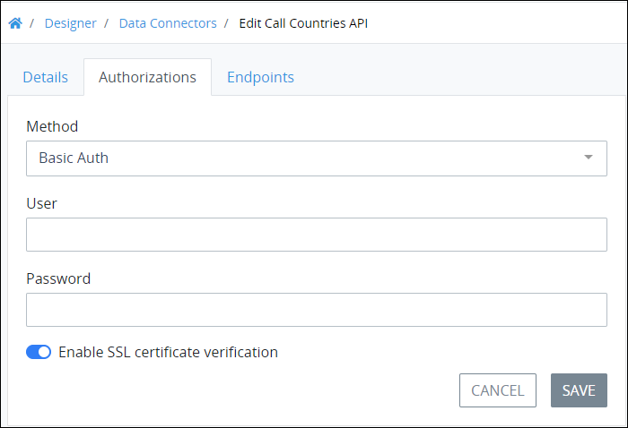
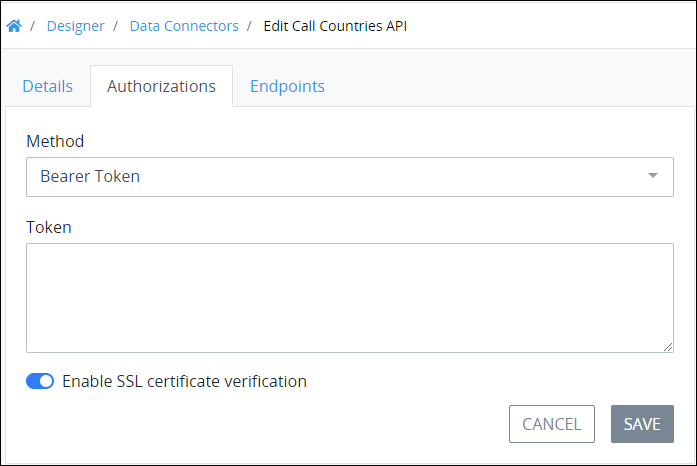
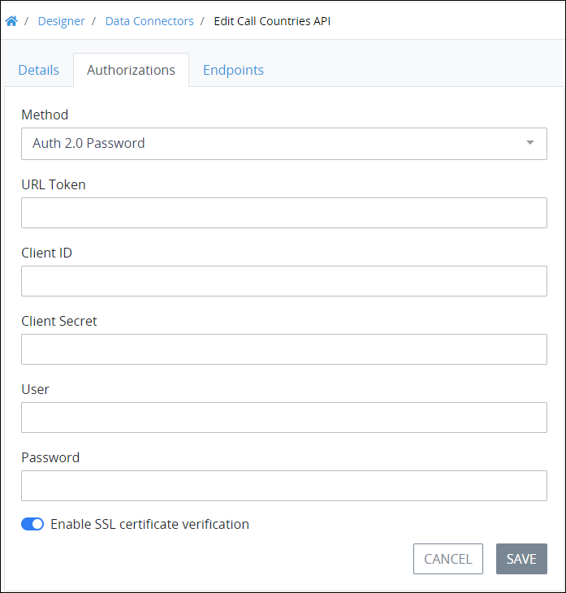
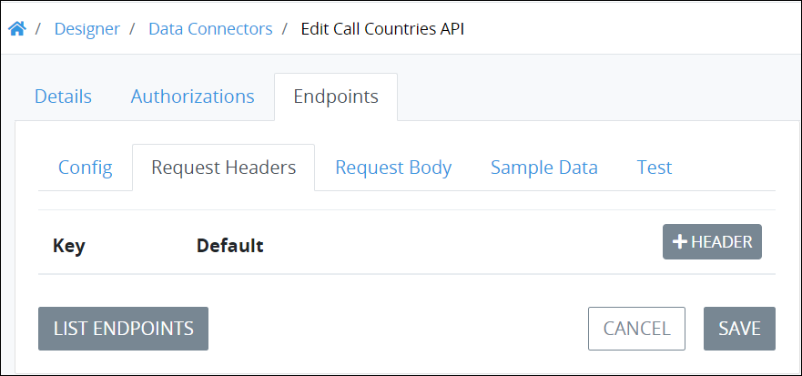
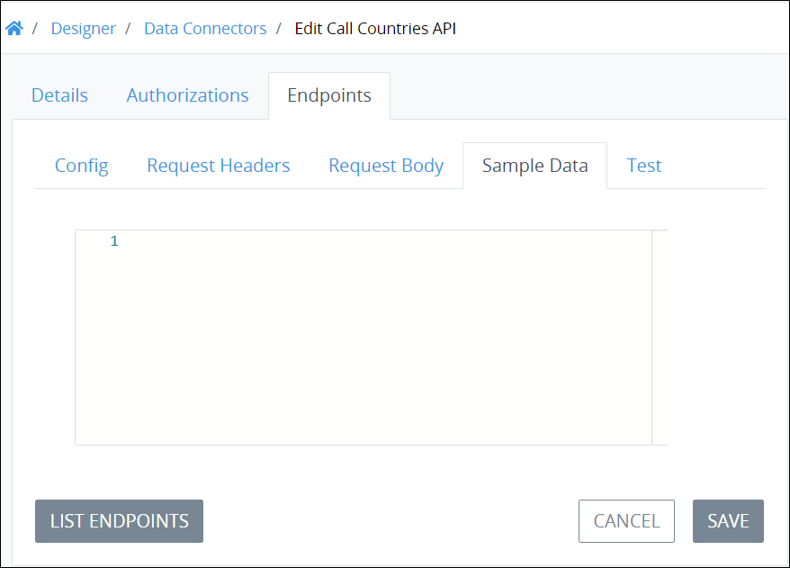
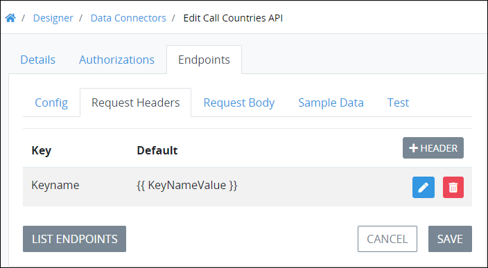
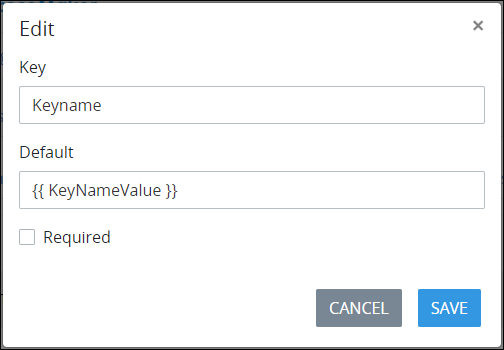
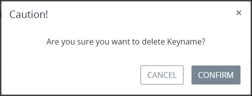
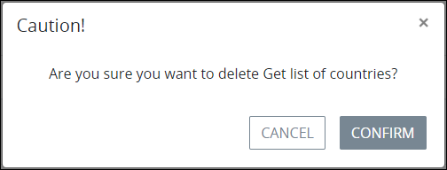

# Edit a Data Connector

## Edit Details for a ProcessMaker Data Connector


### ProcessMaker Package Required

The [Data Connector package](../../package-development-distribution/package-a-connector/data-connector-package.md) must be installed in your ProcessMaker instance. The [Data Connector](what-is-a-data-connector.md) package is not available in the ProcessMaker open-source edition. Contact [ProcessMaker Sales](https://www.processmaker.com/contact/) or ask your ProcessMaker sales representative how the Data Connectors package can be installed in your ProcessMaker instance.

### Permissions Required

Your user account or group membership must have the following permissions to edit details for a Data Connector unless your user account has the **Make this user a Super Admin** setting selected:

* Data Connectors: Edit Data Connectors
* Data Connectors: View Data Connectors

See the ProcessMaker [Data Connectors](../../processmaker-administration/permission-descriptions-for-users-and-groups.md#data-connectors) permissions or ask your ProcessMaker Administrator for assistance.


Follow these steps to edit the details for a [ProcessMaker Data Connector](what-is-a-data-connector.md):

1. [View your ProcessMaker Data Connectors](view-data-connectors.md#view-all-scripts). The **Data Connectors** tab displays.
2. Click the **Edit** iconfor the ProcessMaker Data Connector to edit. The **Details** tab displays.
3. Edit the following information about the ProcessMaker Data Connector as necessary:
   * In the **Name** setting, edit the name of the ProcessMaker Data Connector. ProcessMaker Data Connector names must be unique in your organization and can only use apostrophe characters \(`'`\) and spaces. This is a required setting.
   * In the **Description** setting, edit the description of the ProcessMaker Data Connector.
   * From the **Category** drop-down menu, select one or more Data Connector Categories to associate with this ProcessMaker Data Connector. In doing so, [Data Connector Categories](manage-data-connectors/manage-data-connector-categories/what-is-a-data-connector-category.md) may be sorted from the [**Data Connectors**](view-data-connectors.md#view-all-scripts) page. To remove a Data Connector Category that is currently selected, click theicon for that selection or press `Enter` when the drop-down is visible. This is a required setting.
4. Click **Save**. The following message displays: **The Data Connector was saved**.

## Edit Authorization


### ProcessMaker Package Required

The [Data Connector package](../../package-development-distribution/package-a-connector/data-connector-package.md) must be installed in your ProcessMaker instance. The [Data Connector](what-is-a-data-connector.md) package is not available in the ProcessMaker open-source edition. Contact [ProcessMaker Sales](https://www.processmaker.com/contact/) or ask your ProcessMaker sales representative how the Data Connectors package can be installed in your ProcessMaker instance.

### Permissions Required

Your user account or group membership must have the following permissions to edit authorization for a Data Connector unless your user account has the **Make this user a Super Admin** setting selected:

* Data Connectors: Edit Data Connectors
* Data Connectors: View Data Connectors

See the ProcessMaker [Data Connectors](../../processmaker-administration/permission-descriptions-for-users-and-groups.md#data-connectors) permissions or ask your ProcessMaker Administrator for assistance.


Follow these steps to edit the details for a ProcessMaker Data Connector:

1. [View your ProcessMaker Data Connectors](view-data-connectors.md#view-all-scripts). The **Data Connectors** page displays.
2. Click the **Edit** iconfor the ProcessMaker Data Connector to edit. The **Details** tab displays.
3. Click the **Authorization** tab. The **Authorization** tab displays the authentication method selected for this ProcessMaker Data Connector when it was [created](create-a-new-data-connector.md#create-a-new-processmaker-data-connector).
4. From the **Method** drop-down menu, select how the Data Connector authenticates with the data source:
   * **No Auth:** Select the **No Auth** option to not send authorization details when connecting to the data source. Note that there is no security using this option. No further authentication configured is required.
   * **Basic Auth:** Select the **Basic Auth** option to send only username and password credentials as authentication when connecting to the data source. See [Edit Basic Auth Settings](edit-a-data-connector.md#edit-basic-auth-authorization).
   * **Bearer Token:** Select the **Bearer Token** option to send an access token when connecting to the data source as authentication. The access token is an opaque string that represents the authorization that allows the ProcessMaker Data Connector to access the third-party data source. ProcessMaker Data Connectors that connect to ProcessMaker Collections use Bearer Token authorization method. See [Edit Bearer Token Settings](edit-a-data-connector.md#edit-bearer-token-authorization).
   * **Auth 2.0 Password:** Select the **Auth 2.0 Password** option to use Password grant type as part of the OAuth 2.0 authentication protocol to connect to the data source. In doing so, first register this ProcessMaker Data Connector with the data source host. After registering, that host provides the redirect URI, Client ID, and Client Secret for this ProcessMaker Data Connector. See [Edit Auth 2.0 Password Settings](edit-a-data-connector.md#edit-auth-2-0-password-authorization).
5. If no other changes are necessary, click **Save**. The following message displays: **The Data Connector was saved**.

### Edit Basic Auth Settings

Follow these steps to configure basic authentication settings after selecting the **Basic Auth** option from the [**Authorization** tab](edit-a-data-connector.md#edit-authorization):

1. Verify that this ProcessMaker Data Connector uses basic authentication to authenticate with the data source.  
2. In the **User** setting, enter or edit the username that authenticates with the data source host.
3. In the **Password** setting, enter or edit the password that authenticates with the data source host.
4. Verify that this ProcessMaker Data Connector authenticates using SSL certification. If the **Enable SSL certificate verification** toggle key is enabled, the ProcessMaker Data Connector connects to the data source host using HTTPS protocol for a secure connection. The **Enable SSL certificate verification** toggle key is enabled by default.
5. If no other changes are necessary, click **Save**. The following message displays: **The Data Connector was saved**.

### Edit Bearer Token Settings


If you are configuring this ProcessMaker Data Connector to interact with \(make requests to\) the ProcessMaker API associated with your ProcessMaker instance, first generate an API token for the ProcessMaker user account that contacts the ProcessMaker API before starting this procedure. See [Generate an API Token](../../processmaker-administration/add-users/manage-user-accounts/edit-a-user-account.md#generate-an-api-token), and then follow that procedure in a new Web browser tab or window so the **Authorization** tab in this ProcessMaker Data Connector remains accessible. Note that your ProcessMaker user account must have appropriate permissions to generate a ProcessMaker API token.


Follow these steps to configure bearer token settings after selecting the **Bearer Token** option from the [**Authorization** tab](edit-a-data-connector.md#edit-authorization):

1. Verify that this ProcessMaker Data Connector uses a bearer token to authenticate with the data source.  
    

   If an access token has already been entered into this ProcessMaker Data Connector, it displays in the **Token** setting.

2. If this ProcessMaker Data Connector requires a new access token, do one of the following:
   * **Use the access token to interact with \(make requests to\) the ProcessMaker API associated with your ProcessMaker instance:**
     1. Ensure that the access token for the ProcessMaker user account that contacts the ProcessMaker API is copied. If not, see [Generate an API Token](../../processmaker-administration/add-users/manage-user-accounts/edit-a-user-account.md#generate-an-api-token) before continuing. Follow that procedure in a new Web browser tab or window so the **Authorization** tab in this ProcessMaker Data Connector remains accessible.
     2. In the **Token** setting, paste the generated API token copied from the ProcessMaker user account.
   * **Use the access token to interact with \(make requests to\) a third-party data source:**
     1. Copy the access token from the third-party data source.
     2. In the **Token** setting, paste the access token.
3. Verify that this ProcessMaker Data Connector authenticates using SSL certification. If the **Enable SSL certificate verification** toggle key is enabled, the ProcessMaker Data Connector connects to the data source host using HTTPS protocol for a secure connection. The **Enable SSL certificate verification** toggle key is enabled by default.
4. If no other changes are necessary, click **Save**. The following message displays: **The Data Connector was saved**.

### Edit Auth 2.0 Password Settings

Follow these steps to configure Auth 2.0 password settings after selecting the **Auth 2.0 Password** option from the [**Authorization** tab](edit-a-data-connector.md#edit-authorization):

1. Verify that this ProcessMaker Data Connector uses Auth 2.0 password grant type to authenticate with the data source.  
2. In the **URL Token** setting, enter the redirect Universal Resource Identifier \(URI\) that the data host provides after you register this ProcessMaker Data Connector with that host. 
3. In the **Client ID** setting, enter the Client ID the data source host provides after you register this ProcessMaker Data Connector with that host.
4. In the **Client Secret** setting, enter the Client Secret the data source host provides after you register this ProcessMaker Data Connector with that host.
5. In the **User** setting, enter or edit the username that authenticates with the data source host.
6. In the **Password** setting, enter or edit the password that authenticates with the data source host.
7. Verify that the **Enable SSL certificate verification** toggle key is enabled so that the ProcessMaker Data Connector connects to the data source host using HTTPS protocol for a secure connection. SSL certification is required using Password grant type as part of Auth 2.0 authentication protocol. The **Enable SSL certificate verification** toggle key is enabled by default.
8. If no other changes are necessary, click **Save**. The following message displays: **The Data Connector was saved**.

## Endpoints


### ProcessMaker Package Required

The [Data Connector package](../../package-development-distribution/package-a-connector/data-connector-package.md) must be installed in your ProcessMaker instance. The [Data Connector](what-is-a-data-connector.md) package is not available in the ProcessMaker open-source edition. Contact [ProcessMaker Sales](https://www.processmaker.com/contact/) or ask your ProcessMaker sales representative how the Data Connectors package can be installed in your ProcessMaker instance.

### Permissions Required

Your user account or group membership must have the following permissions to edit Endpoints for a Data Connector unless your user account has the **Make this user a Super Admin** setting selected:

* Data Connectors: Edit Data Connectors
* Data Connectors: View Data Connectors

See the ProcessMaker [Data Connectors](../../processmaker-administration/permission-descriptions-for-users-and-groups.md#data-connectors) permissions or ask your ProcessMaker Administrator for assistance.


### Add an Endpoint to a ProcessMaker Data Connector

Follow these steps to add an Endpoint to a ProcessMaker Data Connector:

1. [View your ProcessMaker Data Connectors](view-data-connectors.md#view-all-scripts). The **Data Connectors** page displays.
2. Click the **Edit** iconfor the ProcessMaker Data Connector to edit. The **Details** tab displays.
3. Click the **Endpoints** tab. The **Endpoints** tab displays Endpoints configured for this ProcessMaker Data Connector.  
4. Click the **+Endpoint** button. The **Add Endpoint** screen displays.  
5. In the **Purpose** setting, optionally edit the purpose for this Endpoint and how it interacts with that data source's [resource](what-is-an-endpoint.md#what-is-a-resource). The value the **Purpose** setting displays from the ProcessMaker asset when configuring the data source from that ProcessMaker asset. For example, if a ProcessMaker designer configures a [Select List](../design-forms/screens-builder/control-descriptions/select-list-control-settings.md) control to use this Data Connector, this Endpoint would display the Endpoint's purpose entered into this setting. Therefore, provide a concise but relevant purpose for this Endpoint so other ProcessMaker designers understand its function. **List** is the default purpose for a new Endpoint.
6. In the **Description** setting, enter a description of this Endpoint.
7. From the **Method** drop-down menu, select the [method](what-is-an-endpoint.md#what-is-a-method) how this Endpoint interacts with the data source from one of the following options:
   * **GET:** The GET method retrieves a resource from the data source.
   * **POST:** The POST method creates a resource in the data source.
   * **PUT:** The PUT method does one of the following:
     * **Update:** The PUT method may update data an existing resource in the data source.
     * **Create:** The PUT method may create a resource in the data source.
   * **PATCH:** The PATCH method partially modifies an existing resource.
   * **DELETE:** The DELETE method removes an existing resource from the data source.
8. In the **URL** setting, enter the URL and any required/option parameters to interact with that data source's resource. If configuring this Endpoint to make a request \(contact\) the ProcessMaker API for your ProcessMaker instance, understand how to [make a request with your ProcessMaker API instance](../../processmaker-api-documentation/access-processmaker-api-documentation.md), and then consult the [ProcessMaker API documentation](https://staging-pm4.processmaker.net/api/documentation) to understand any parameters for the resource to which this Endpoint interacts. The **URL** setting supports [mustache syntax](https://mustache.github.io/mustache.5.html) to reference the value of a Request variable as the URL and/or parameter setting. To understand any required or optional parameters for a third-party data source's resource, consult that data source's documentation.
9. Click **Add**. The **Endpoints** tab displays the configuration settings for the new Endpoint in the **Config** sub-tab.  
10. Do one of the following:
    * Optionally, add Request headers to this Endpoint. The Request header\(s\) are sent to the data source's resource when this Endpoint interacts with that resource. See [Add Endpoint Request Headers](edit-a-data-connector.md#add-endpoint-request-headers).
    * Optionally, add a Request body to this Endpoint. The Request body is sent to the data source's resource when this Endpoint interacts with that resource. See [Add an Endpoint Request Body](edit-a-data-connector.md#add-an-endpoint-request-body).
    * Optionally, add sample Request data that is sent to the data source's resource when this Endpoint interacts with that resource. See [Add Endpoint Sample Request Data](edit-a-data-connector.md#add-endpoint-sample-request-data).
    * Click the **List Endpoints** button to display all Endpoints in this ProcessMaker Data Connector in the **Endpoints** tab.

#### Add an Endpoint Request Header

Similar to a [request body](edit-a-data-connector.md#add-an-endpoint-request-body), a request header is not be confused with a ProcessMaker [Request](../../using-processmaker/requests/what-is-a-request.md). An API request header is part of the ProcessMaker Data Connector Endpoint's interaction with a data source's resource that contains metadata regarding that interaction. A request header is included when an Endpoint makes a request to \(contacts\) the data source resource; likewise, the resource includes a response header that is included when that resource responds to that request. Headers are used to provide information to both the ProcessMaker Data Connector and the data source. Headers can be used for many purposes, including authentication and providing information about the body content of the request/response.

Headers are key-value pairs that are separated by a colon \(`:`\). For example, the `Content-Type` request header option below indicates to the data source to expect the Endpoint's content to be JSON.

```text
"Content-Type: application/json"
```


See this [list of header options](https://developer.mozilla.org/en-US/docs/Web/HTTP/Headers) that may be used in an Endpoint's request header.


Each header option added to an Endpoint is included in the request header when the Endpoint makes its request to the data source.

Follow these steps to add a request header to a ProcessMaker Data Connector's Endpoint:

1. [Add](edit-a-data-connector.md#add-an-endpoint-to-a-processmaker-data-connector) or [view](edit-a-data-connector.md#view-an-endpoint-in-a-processmaker-data-connector) the Endpoint for the ProcessMaker Data Connector to which to add a request header. The **Config** tab displays basic configuration settings for that Endpoint.
2. Click the **Request Headers** tab.  
3. Click the **+Header** button. The **Add** screen displays to add a request header for this Endpoint.  
4. In the **Key** setting, enter the key for the header request option.
5. In the **Value** setting, enter the value for that key. This setting supports [mustache syntax](https://mustache.github.io/mustache.5.html) to specify its value from Request data.
6. Select the **Required** setting if this key requires a value. If there is mustache syntax in the value and this setting is selected, then the referenced Request variable must exist in the Request data and must not be empty. This setting is not selected by default.
7. Click **Save**.
8. Click the **List Endpoints** button to view all Endpoints for this ProcessMaker Data Connector.

#### Add an Endpoint Request Body

Similar to the [request header](edit-a-data-connector.md#add-an-endpoint-request-body), a request body is not be confused with a ProcessMaker [Request](../../using-processmaker/requests/what-is-a-request.md). An API request body is part of the ProcessMaker Data Connector Endpoint's interaction with a data source's resource that contains the body or message of that interaction.


Request bodies are not required for Endpoints that use the GET method since the GET method receives data from the data source but does not send content.


Follow these steps to add a request body to a ProcessMaker Data Connector's Endpoint:

1. [Add](edit-a-data-connector.md#add-an-endpoint-to-a-processmaker-data-connector) or [view](edit-a-data-connector.md#view-an-endpoint-in-a-processmaker-data-connector) the Endpoint for the ProcessMaker Data Connector to which to add a request body. The **Config** tab displays basic configuration settings for that Endpoint.
2. Click the **Request Body** tab.  
3. Enter the request body to send when this Endpoint makes its request to the data source.
4. Click **Save**.
5. Click the **List Endpoints** button to view all Endpoints for this ProcessMaker Data Connector.

#### Add Endpoint Sample Request Data

An Endpoint may send sample ProcessMaker Request data when that Endpoint makes it request to the ProcessMaker API so that the ProcessMaker API resource may process that Request data prior to its response.


Do not send ProcessMaker Request data to data source other than the ProcessMaker API. A third-party data source cannot recognize the Request data.


Follow these steps to add sample Request data to a ProcessMaker Data Connector's Endpoint:

1. [Add](edit-a-data-connector.md#add-an-endpoint-to-a-processmaker-data-connector) or [view](edit-a-data-connector.md#view-an-endpoint-in-a-processmaker-data-connector) the Endpoint for the ProcessMaker Data Connector to which to add sample Request data. The **Config** tab displays basic configuration settings for that Endpoint.
2. Click the **Sample Data** tab.  
3. Enter the sample ProcessMaker Request data to send when this Endpoint makes its request to the data source.
4. Click **Save**.
5. Click the **List Endpoints** button to view all Endpoints for this ProcessMaker Data Connector.

#### Test an Endpoint in a ProcessMaker Data Connector

After [adding an Endpoint to a ProcessMaker Data Connector](edit-a-data-connector.md#add-an-endpoint-to-a-processmaker-data-connector), test it to determine if the Endpoint successfully makes a request to the data source resource.

Follow these steps to test a ProcessMaker Data Connector's Endpoint:

1. [Add](edit-a-data-connector.md#add-an-endpoint-to-a-processmaker-data-connector) or [view](edit-a-data-connector.md#view-an-endpoint-in-a-processmaker-data-connector) the Endpoint for the ProcessMaker Data Connector to test. The **Config** tab displays basic configuration settings for that Endpoint.
2. Click the **Test** tab.  
3. Click the **Run** button. If the Endpoint successfully interacts with the data source resource, the resource's response displays.  
4. Click the **List Endpoints** button to view all Endpoints for this ProcessMaker Data Connector.

### View or Edit an Endpoint in a ProcessMaker Data Connector

Follow these steps to view or edit a ProcessMaker Data Connector's Endpoint:

1. [View your ProcessMaker Data Connectors](view-data-connectors.md#view-all-scripts). The **Data Connectors** page displays.
2. Click the **Edit** iconfor the ProcessMaker Data Connector to edit an Endpoint. The **Details** tab displays.
3. Click the **Endpoints** tab. The **Endpoints** tab displays Endpoints configured for this ProcessMaker Data Connector.  
4. Click the **Edit** iconfor the Endpoint to view or edit. The **Config** sub-tab displays the configuration settings for the Endpoint.  
5. Edit the following Endpoint's settings as necessary:
   * In the **Purpose** setting, edit the purpose for this Endpoint and how it interacts with that data source's [resource](what-is-an-endpoint.md#what-is-a-resource). The value the **Purpose** setting contains displays from the ProcessMaker asset when configuring the data source from that ProcessMaker asset. For example, if a ProcessMaker designer configures a [Select List](../design-forms/screens-builder/control-descriptions/select-list-control-settings.md) control to use this Data Connector, this Endpoint would display the Endpoint's purpose entered into this setting. Therefore, provide a concise but relevant purpose for this Endpoint so other ProcessMaker designers understand its function. **List** is the default purpose for a new Endpoint.
   * In the **Description** setting, edit the description of this Endpoint.
   * From the **Method** drop-down menu, select the [method](what-is-an-endpoint.md#what-is-a-method) how this Endpoint interacts with the data source from one of the following options:
     * **GET:** The GET method retrieves a resource from the data source.
     * **POST:** The POST method creates a resource in the data source.
     * **PUT:** The PUT method does one of the following:
       * **Update:** The PUT method may update data an existing resource in the data source.
       * **Create:** The PUT method may create a resource in the data source.
     * **PATCH:** The PATCH method partially modifies an existing resource.
     * **DELETE:** The DELETE method removes an existing resource from the data source.
   * In the **URL** setting, enter the URL and any required/option parameters to interact with that data source's resource. If configuring this Endpoint to make a request \(contact\) the ProcessMaker API for your ProcessMaker instance, understand how to [make a request with your ProcessMaker API instance](../../processmaker-api-documentation/access-processmaker-api-documentation.md), and then consult the [ProcessMaker API documentation](https://staging-pm4.processmaker.net/api/documentation) to understand any parameters for the resource to which this Endpoint interacts. The **URL** setting supports [mustache syntax](https://mustache.github.io/mustache.5.html) to reference the value of a Request variable as the URL and/or parameter setting. To understand any required or optional parameters for a third-party data source's resource, consult that data source's documentation.
6. Do one of the following:
   * Optionally, [add](edit-a-data-connector.md#add-an-endpoint-request-header), [edit](edit-a-data-connector.md#edit-an-endpoint-request-header) or [delete](edit-a-data-connector.md#delete-an-endpoint-request-header) Request headers to this Endpoint. The Request header\(s\) are sent to the data source's resource when this Endpoint interacts with that resource.
   * Optionally, [add](edit-a-data-connector.md#add-an-endpoint-request-body) or [edit](edit-a-data-connector.md#edit-an-endpoint-request-body) the Request body to this Endpoint. The Request body is sent to the data source's resource when this Endpoint interacts with that resource.
   * Optionally, [add](edit-a-data-connector.md#add-endpoint-sample-request-data) or [edit](edit-a-data-connector.md#edit-endpoint-sample-request-data) sample Request data that is sent to the data source's resource when this Endpoint interacts with that resource.
   * Click the **List Endpoints** button to display all Endpoints in this ProcessMaker Data Connector in the **Endpoints** tab.

#### Edit an Endpoint Request Header

Headers are key-value pairs that are separated by a colon \(`:`\). For example, the `Content-Type` request header option below indicates to the data source to expect the Endpoint's content to be JSON.

```text
"Content-Type: application/json"
```


See this [list of header options](https://developer.mozilla.org/en-US/docs/Web/HTTP/Headers) that may be used in an Endpoint's request header.


Each header option added to an Endpoint is included in the request header when the Endpoint makes its request to the data source.

Follow these steps edit a request header to a ProcessMaker Data Connector's Endpoint:

1. [View](edit-a-data-connector.md#view-an-endpoint-in-a-processmaker-data-connector) the Endpoint for the ProcessMaker Data Connector to which to add a request header. The **Config** tab displays basic configuration settings for that Endpoint.
2. Click the **Request Headers** tab. Request headers for this Endpoint display.  
3. Click the **Edit**icon for the request header to edit. The **Edit** screen displays to add a request header for this Endpoint.  
4. Edit the following settings as necessary:
   * In the **Key** setting, edit the key for the header request option.
   * In the **Value** setting, edit the value for that key. This setting supports [mustache syntax](https://mustache.github.io/mustache.5.html) to specify its value from Request data.
   * Select the **Required** setting if this key requires a value. If there is mustache syntax in the value and this setting is selected, then the referenced Request variable must exist in the Request data and must not be empty. This setting is not selected by default.
5. Click **Save**.
6. Click the **List Endpoints** button to view all Endpoints for this ProcessMaker Data Connector.

#### Delete an Endpoint Request Header

Follow these steps delete a request header to a ProcessMaker Data Connector's Endpoint:

1. [View](edit-a-data-connector.md#view-an-endpoint-in-a-processmaker-data-connector) the Endpoint for the ProcessMaker Data Connector to which to delete a request header. The **Config** tab displays basic configuration settings for that Endpoint.
2. Click the **Request Headers** tab. Request headers for this Endpoint display.  
3. Click the **Delete**icon for the request header to edit. A message displays to confirm deletion of the request header.  
4. Click **Confirm**.
5. Click the **List Endpoints** button to view all Endpoints for this ProcessMaker Data Connector.

#### Edit an Endpoint Request Body

Similar to the [request header](edit-a-data-connector.md#add-an-endpoint-request-body), a request body is not be confused with a ProcessMaker [Request](../../using-processmaker/requests/what-is-a-request.md). An API request body is part of the ProcessMaker Data Connector Endpoint's interaction with a data source's resource that contains the body or message of that interaction.


Request bodies are not required for Endpoints that use the GET method since the GET method receives data from the data source but does not send content.


Follow these steps to edit a request body to a ProcessMaker Data Connector's Endpoint:

1. [Add](edit-a-data-connector.md#add-an-endpoint-to-a-processmaker-data-connector) or [view](edit-a-data-connector.md#view-an-endpoint-in-a-processmaker-data-connector) the Endpoint for the ProcessMaker Data Connector to which to edit its request body. The **Config** tab displays basic configuration settings for that Endpoint.
2. Click the **Request Body** tab.  
3. Edit the request body to send when this Endpoint makes its request to the data source.
4. Click **Save**.
5. Click the **List Endpoints** button to view all Endpoints for this ProcessMaker Data Connector.

#### Edit Endpoint Sample Request Data

An Endpoint may send sample ProcessMaker Request data when that Endpoint makes it request to the ProcessMaker API so that the ProcessMaker API resource may process that Request data prior to its response.


Do not send ProcessMaker Request data to data source other than the ProcessMaker API. A third-party data source cannot recognize the Request data.


Follow these steps to edit sample Request data to a ProcessMaker Data Connector's Endpoint:

1. [Add](edit-a-data-connector.md#add-an-endpoint-to-a-processmaker-data-connector) or [view](edit-a-data-connector.md#view-an-endpoint-in-a-processmaker-data-connector) the Endpoint for the ProcessMaker Data Connector to which to edit its sample Request data. The **Config** tab displays basic configuration settings for that Endpoint.
2. Click the **Sample Data** tab.  
3. Edit the sample ProcessMaker Request data to send when this Endpoint makes its request to the data source.
4. Click **Save**.
5. Click the **List Endpoints** button to view all Endpoints for this ProcessMaker Data Connector.

### Delete an Endpoint from a ProcessMaker Data Connector

Follow these steps to delete a ProcessMaker Data Connector's Endpoint:

1. [View your ProcessMaker Data Connectors](view-data-connectors.md#view-all-scripts). The **Data Connectors** page displays.
2. Click the **Edit** iconfor the ProcessMaker Data Connector to delete. The **Details** tab displays.
3. Click the **Endpoints** tab. The **Endpoints** tab displays Endpoints configured for this ProcessMaker Data Connector.  
4. Click the **Delete** iconfor the Endpoint to delete. A message displays to confirm deletion of the Endpoint.  
5. Click **Confirm**.

## Related Topics

















