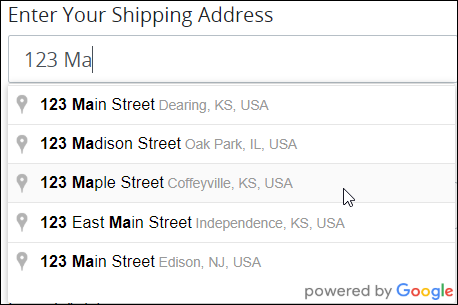
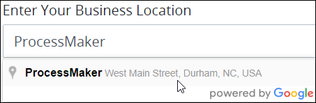
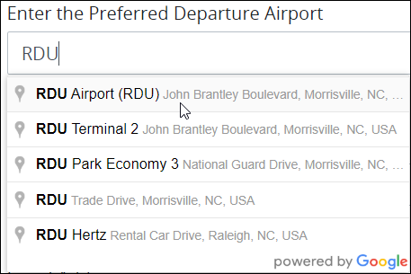
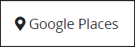
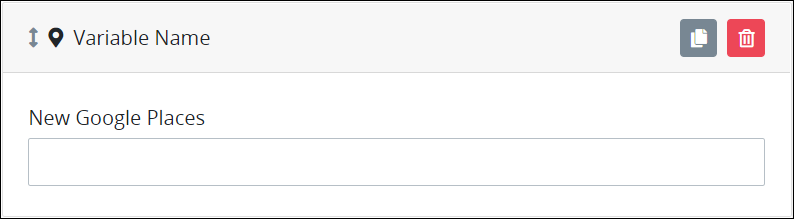
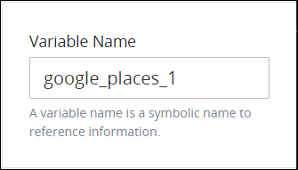
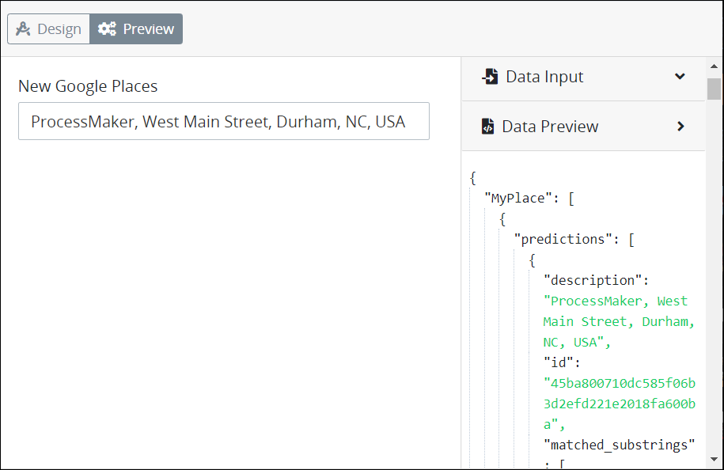
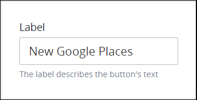

# Google Places Control Settings

## Control Description

The Google Places control is a text field the [Request](../../../../using-processmaker/requests/what-is-a-request.md) participant uses to start entering an address, location, or business name. The Google Places control uses the Google API to auto-complete that address or location. The Google Place control stores the selected address in the Request data as well as all the returned data from the Google API.


This control is not available for [Display](../types-for-screens.md#display)-type ProcessMaker Screens. See [Screen Types](../types-for-screens.md).


Below are a few ways to use the Google Places control:

* Allow Request participants to easily enter a shipping or billing address.  
* Enter a business name into the Google Places control to select a business location.  
* Enter well-known monuments or international airport names to get their addresses or locations when requesting to travel.  

## Add the Control to a ProcessMaker Screen


### ProcessMaker Package Required

To add a Google Places control to a [ProcessMaker Screen](../../what-is-a-form.md), the [Google Places package](../../../../package-development-distribution/package-a-connector/google-places-package.md) must be installed in your ProcessMaker instance. The Google Places control and the Google Places [package](../../../../package-development-distribution/first-topic.md) are not available in the ProcessMaker open-source edition. Contact [ProcessMaker Sales](mailto:sales@processmaker.com) or ask your ProcessMaker sales representative how the Google Places control can be installed in your ProcessMaker instance.

### Permissions Required

Your ProcessMaker user account or group membership must have the following permissions to add a control to a ProcessMaker Screen unless your user account has the **Make this user a Super Admin** setting selected:

* Screens: Edit Screens
* Screens: View Screens

See the ProcessMaker [Screens](../../../../processmaker-administration/permission-descriptions-for-users-and-groups.md#screens) permissions or ask your ProcessMaker Administrator for assistance.


Follow these steps to add this control to the ProcessMaker Screen:

1. [Create a new ProcessMaker Screen](../../manage-forms/create-a-new-form.md) or click the **Edit** iconto edit the selected Screen. The ProcessMaker Screen is in [Design mode](../screens-builder-modes.md#editor-mode).
2. View the ProcessMaker Screen page to which to add the control.
3. Locate the **Google Places** icon  in the panel to the left of the Screen Builder canvas.
4. Drag the **Google Places** icon into the Screen Builder canvas. Existing controls on the Screen Builder canvas adjust positioning based on where you drag the control.
5. Place into the Screen Builder canvas where you want the control to display on the ProcessMaker Screen.  
6. Configure the Google Places control. See [Settings](rich-text-control-settings.md#settings).
7. Validate that the control is configured correctly. See [Validate Your Screen](../validate-your-screen.md#validate-a-processmaker-screen).

Below is a Google Places control in [Preview mode](../screens-builder-modes.md#preview-mode).


## Move the Control on the Page


### ProcessMaker Package Required

To move a Google Places control in a [ProcessMaker Screen](../../what-is-a-form.md) page, the [Google Places package](../../../../package-development-distribution/package-a-connector/google-places-package.md) must be installed in your ProcessMaker instance. The Google Places control and the Google Places [package](../../../../package-development-distribution/first-topic.md) are not available in the ProcessMaker open-source edition. Contact [ProcessMaker Sales](mailto:sales@processmaker.com) or ask your ProcessMaker sales representative how the Google Places control can be installed in your ProcessMaker instance.

### Permissions Required

Your ProcessMaker user account or group membership must have the following permissions to move a control in a ProcessMaker Screen page unless your user account has the **Make this user a Super Admin** setting selected:

* Screens: Edit Screens
* Screens: View Screens

See the ProcessMaker [Screens](../../../../processmaker-administration/permission-descriptions-for-users-and-groups.md#screens) permissions or ask your ProcessMaker Administrator for assistance.


After [adding a control to a ProcessMaker Screen page](google-places-control-settings.md#add-the-control-to-a-processmaker-screen), you may move it to another location on that page such that it is above or below other controls placed on that page. A control cannot be moved to another [ProcessMaker Screen](../../what-is-a-form.md) page.

Follow these steps to move a control to another location on that ProcessMaker Screen page:

1. Place your cursor anywhere on the control not displaying the **Duplicate Control**or **Delete Control**buttons.
2. Hold your cursor, then drag the control above or below other controls on that ProcessMaker Screen page. Screen Builder previews where the control would display on the page based on how you position the control above or below other controls. If the control cannot be placed in a location because your cursor is above an existing control or too far to the left or right of the page, theicon displays in the preview.
3. Place the control at the location on the page you want it. The other control\(s\) on the page automatically adjust position.

## Copy the Control with its Settings


### ProcessMaker Package Required

To copy a Google Places control, the [Google Places package](../../../../package-development-distribution/package-a-connector/google-places-package.md) must be installed in your ProcessMaker instance. The Google Places control and the Google Places [package](../../../../package-development-distribution/first-topic.md) are not available in the ProcessMaker open-source edition. Contact [ProcessMaker Sales](mailto:sales@processmaker.com) or ask your ProcessMaker sales representative how the Google Places control can be installed in your ProcessMaker instance.

### Permissions Required

Your ProcessMaker user account or group membership must have the following permissions to copy a control in a ProcessMaker Screen unless your user account has the **Make this user a Super Admin** setting selected:

* Screens: Edit Screens
* Screens: View Screens

See the ProcessMaker [Screens](../../../../processmaker-administration/permission-descriptions-for-users-and-groups.md#screens) permissions or ask your ProcessMaker Administrator for assistance.


Copying a control also copies the current settings of that control. The copied control displays below other controls placed on that [ProcessMaker Screen](../../what-is-a-form.md) page.

Follow these steps to copy a control:

1. Select the control to be copied.
2. Click the **Duplicate Control** button. The control copies with its current settings, and then displays below other controls placed on that page.

## Delete the Control from a ProcessMaker Screen


### ProcessMaker Package Required

To delete a Google Places control, the [Google Places package](../../../../package-development-distribution/package-a-connector/google-places-package.md) must be installed in your ProcessMaker instance. The Google Places control and the Google Places [package](../../../../package-development-distribution/first-topic.md) are not available in the ProcessMaker open-source edition. Contact [ProcessMaker Sales](mailto:sales@processmaker.com) or ask your ProcessMaker sales representative how the Google Places control can be installed in your ProcessMaker instance.

### Permissions Required

Your ProcessMaker user account or group membership must have the following permissions to delete a control from a ProcessMaker Screen unless your user account has the **Make this user a Super Admin** setting selected:

* Screens: Edit Screens
* Screens: View Screens

See the ProcessMaker [Screens](../../../../processmaker-administration/permission-descriptions-for-users-and-groups.md#screens) permissions or ask your ProcessMaker Administrator for assistance.



Deleting a control also deletes configuration for that control. If you add another control, it will have default settings.


Follow these steps to delete a control from a [ProcessMaker Screen](../../what-is-a-form.md) page:

1. Select the control to be deleted.
2. Click the **Delete** button. The control deletes. Other controls on that ProcessMaker Screen page adjust their locations automatically.

## Settings


### ProcessMaker Package Required

To edit a Google Places control, the [Google Places package](../../../../package-development-distribution/package-a-connector/google-places-package.md) must be installed in your ProcessMaker instance. The Google Places control and the Google Places [package](../../../../package-development-distribution/first-topic.md) are not available in the ProcessMaker open-source edition. Contact [ProcessMaker Sales](mailto:sales@processmaker.com) or ask your ProcessMaker sales representative how the Google Places control can be installed in your ProcessMaker instance.

### Permissions Required

Your user account or group membership must have the following permissions to edit a ProcessMaker Screen control:

* Screens: Edit Screens
* Screens: View Screens

See the ProcessMaker [Screens](../../../../processmaker-administration/permission-descriptions-for-users-and-groups.md#screens) permissions or ask your ProcessMaker Administrator for assistance.


The Google Places control has the following panels that contain settings:

* \*\*\*\*[**Variable** panel](google-places-control-settings.md#variable-panel-settings)
* \*\*\*\*[**Configuration** panel](google-places-control-settings.md#configuration-panel-settings)
* \*\*\*\*[**Design** panel](google-places-control-settings.md#design-panel-settings)
* \*\*\*\*[**Advanced** panel](google-places-control-settings.md#advanced-panel-settings)

### Variable Panel Settings

Click the control while in [Design](../screens-builder-modes.md#design-mode) mode, and then click the **Variable** panel that is on the right-side of the Screen Builder canvas.

Below are settings for the Line Input control in the **Variable** panel:

* [Variable Name](google-places-control-settings.md#variable-name)
* [Label](google-places-control-settings.md#label)
* [Validation Rules](google-places-control-settings.md#validation-rules)

#### Variable Name

Edit the default **Variable Name** setting value for this control if necessary. The **Variable Name** setting value represents data in this control during [Requests](../../../../using-processmaker/requests/what-is-a-request.md). Ensure that the **Variable Name** setting value is a unique name from other controls in this [ProcessMaker Screen](../../what-is-a-form.md) and contains at least one letter. This is a required setting.  
 

Use the **Variable Name** setting value in the following ways:

* Reference this control by its **Variable Name** setting's value. The **Data Preview** panel in [Preview mode](../screens-builder-modes.md#preview-mode) corresponds the Google Places control's textual content with that Google Places control's **Variable Name** value. In the example below, `GooglePlacesControl` is the **Variable Name** setting's value.  
* Reference this control's value in a different Screen Builder control. To do so, use [mustache syntax](https://mustache.github.io/mustache.5.html) and reference this control's **Variable Name** value in the target control. Example: `{{ GooglePlacesControl }}`. See [Reference Request Data from the Google Places Control in Other Controls](google-places-control-settings.md#reference-request-data-from-the-google-places-control-in-other-controls).
* Reference this value in [**Visibility Rule** setting expressions](expression-syntax-components-for-show-if-control-settings.md).

#### Label

Edit the default label that displays for this control if necessary. **New Google Places** is the default value.  
 

#### Validation Rules

Enter the validation rule\(s\) the Request participant must comply with to properly enter a valid value into this control. This setting has no default value. If there are no configured validation rules the following message displays: **No validation rule\(s\)**. See [Validation Rules for "Validation" Control Settings](validation-rules-for-validation-control-settings.md).  
 

Follow these steps to add a validation rule to this control:

1. Access the [**Variable** panel for this control](google-places-control-settings.md#variable-panel-settings) while in [Design](../screens-builder-modes.md#design-mode) mode, and then locate the **Validation Rules** setting.
2. Click the **Add Rule** button. The **Select** drop-down menu displays.  
3. Select the rule that this control validates against.
4. Click **Save**. Parameters for the selected rule display. Parameter settings display which ones are required to properly configure the rule.
5. Enter the parameter settings that this control uses to validate against. See [Validation Rule Settings](validation-rules-for-validation-control-settings.md#validation-rule-settings), and then locate the validation rule for its parameters.

Follow these steps to edit a validation rule for this control:

1. Access the [**Variable** panel for this control](google-places-control-settings.md#variable-panel-settings) while in [Design](../screens-builder-modes.md#design-mode) mode, and then locate the **Validation Rules** setting.
2. Click the **Edit** iconfor the validation rule to edit if that rule can be edited. Validation rules that do not have parameters cannot be edited. The parameter settings for that validation rule displays.
3. Edit the parameter settings that this control uses to validate against. See [Validation Rule Settings](validation-rules-for-validation-control-settings.md#validation-rule-settings), and then locate the validation rule for its parameters.

Follow these steps to delete a validation rule for this control:

1. Access the [**Variable** panel for this control](google-places-control-settings.md#variable-panel-settings) while in [Design](../screens-builder-modes.md#design-mode) mode, and then locate the **Validation Rules** setting.
2. Click the **Delete** iconfor the validation rule to delete. A message displays to confirm deletion of the validation rule.
3. Click **Delete**.

### Configuration Panel Settings

Click the control while in [Design](../screens-builder-modes.md#design-mode) mode, and then click the **Configuration** panel that is on the right-side of the Screen Builder canvas.

Below are the settings for the Google Places control in the **Configuration** panel:

* [Placeholder Text](google-places-control-settings.md#placeholder-text)
* [Helper Text](google-places-control-settings.md#helper-text)

#### Placeholder Text

Enter the placeholder text that displays in this control when no value has been provided. This setting has no default value.  
 

#### Helper Text

Enter text that provides additional guidance on this control's use. This setting has no default value.  


### Design Panel Settings

Click the control while in [Design](../screens-builder-modes.md#design-mode) mode, and then click the **Design** panel that is on the right-side of the Screen Builder canvas.

Below are settings for the Google Places control in the **Design** panel:

* [Text Color](google-places-control-settings.md#text-color)
* [Background Color](google-places-control-settings.md#background-color)

#### Text Color

Select the text color that displays for this control. Optionally, click the **Clear Color Selection** option to remove the selected color.  
 

#### Background Color

Select the background color that displays for this control. Optionally, click the **Clear Color Selection** option to remove the selected color.  
 

### Advanced Panel Settings

Click the control while in [Design](../screens-builder-modes.md#design-mode) mode, and then click the **Advanced** panel that is on the right-side of the Screen Builder canvas.

Below are settings for the Google Places control in the **Advanced** panel:

* [Visibility Rule](google-places-control-settings.md#visibility-rule)
* [CSS Selector Name](google-places-control-settings.md#css-selector-name)

#### Visibility Rule

Specify an expression that indicates the condition\(s\) under which this control displays. See [Expression Syntax Components for "Visibility Rule" Control Settings](expression-syntax-components-for-show-if-control-settings.md#expression-syntax-components-for-show-if-control-settings). If this setting does not have an expression, then this control displays by default.  
 


To make this control hidden until another control contains a value, enter the **Variable Name** setting value of that control to this control's **Visibility Rule** setting.


#### CSS Selector Name

Enter the value to represent this control in custom CSS syntax when in [Custom CSS](../add-custom-css-to-a-screen.md#add-custom-css-to-a-processmaker-screen) mode. As a best practice, use the same **CSS Selector Name** value on different controls of the same type to apply the same custom CSS style to all those controls.  
 

## Reference Request Data from the Google Places Control in Other Controls


### ProcessMaker Package Required

To reference Request data from a Google Places control, the [Google Places package](../../../../package-development-distribution/package-a-connector/google-places-package.md) must be installed in your ProcessMaker instance. The Google Places control and the Google Places [package](../../../../package-development-distribution/first-topic.md) are not available in the ProcessMaker open-source edition. Contact [ProcessMaker Sales](mailto:sales@processmaker.com) or ask your ProcessMaker sales representative how the Google Places control can be installed in your ProcessMaker instance.

### Permissions Required

Your user account or group membership must have the following permissions to edit a ProcessMaker Screen control:

* Screens: Edit Screens
* Screens: View Screens

See the ProcessMaker [Screens](../../../../processmaker-administration/permission-descriptions-for-users-and-groups.md#screens) permissions or ask your ProcessMaker Administrator for assistance.


The Google Places control receives its source data from the Google API after the [Request](../../../../using-processmaker/requests/what-is-a-request.md) participant selects an address or location. The Google Places control stores the entire JSON data object that the Google API returns in the Request data.

Follow these guidelines to reference [JSON object](../../../../json-the-foundation-of-request-data/what-is-json.md#json-objects) key names and/or [arrays](../../../../json-the-foundation-of-request-data/what-is-json.md#json-arrays) from Google's returned data object in other [ProcessMaker Screen](../../what-is-a-form.md) controls.


To reference other data from the Google JSON data object that the Google API returns not documented here, see [Google's documentation on how to reference autocomplete results](https://developers.google.com/places/web-service/autocomplete#place_autocomplete_results).


### Reference the Entire Selected Address or Location

Reference the following JSON key name for the entire selected address or location that includes the entire value in the Google Places control as indicated in [JSON dot notation](../../../../json-the-foundation-of-request-data/what-is-json.md#json-dot-notation):

```text
variable_name.0.predictions.0.description
```

`variable_name` represents the [**Variable Name** setting](google-places-control-settings.md#variable-name) value for the Google Places control being referenced.

#### Example of the Entire Selected Address or Location

Below is the Google Places control selection for this example. The Google Places control's **Variable Name** setting value is the default `google_places_1`.


If a [Rich Text](rich-text-control-settings.md) control references this Google Places control's entire selected address, use the following syntax in the Rich Text control's content using [mustache syntax](https://mustache.github.io/mustache.5.html):

```text
{{ google_places_1.0.predictions.0.description }}
```

### Reference the Main Text for the Selected Address or Location

Reference the following JSON key name for the main text for the selected address or location as indicated in [JSON dot notation](../../../../json-the-foundation-of-request-data/what-is-json.md#json-dot-notation):

```text
variable_name.0.predictions.0.description.0.structured_formatting.0.main_text
```

`variable_name` represents the [**Variable Name** setting](google-places-control-settings.md#variable-name) value for the Google Places control being referenced.

The Rich Text control displays the following during a Request:

```text
"ProcessMaker"
```

#### Example of the Main Text for the Selected Address or Location

Below is the Google Places control selection for this example. The Google Places control's **Variable Name** setting value is the default `google_places_1`.


If a [Rich Text](rich-text-control-settings.md) control references this Google Places control's main text for the selected address, use the following syntax in the Rich Text control's content using [mustache syntax](https://mustache.github.io/mustache.5.html):

```text
{{ google_places_1.0.predictions.0.description.0.structured_formatting.0.main_text }}
```

The Rich Text control displays the following during a Request:

```text
"ProcessMaker"
```

### Reference the Secondary Text for the Selected Address or Location

Reference the following JSON key name for the secondary text for the selected address or location as indicated in [JSON dot notation](../../../../json-the-foundation-of-request-data/what-is-json.md#json-dot-notation):

```text
variable_name.0.predictions.0.description.0.structured_formatting.0.secondary_text
```

`variable_name` represents the [**Variable Name** setting](google-places-control-settings.md#variable-name) value for the Google Places control being referenced.

The Rich Text control displays the following during a Request:

```text
"West Main Street, Durham, NC, USA"
```

#### Example of the Secondary Text for the Selected Address or Location

Below is the Google Places control selection for this example. The Google Places control's **Variable Name** setting value is the default `google_places_1`.


If a [Rich Text](rich-text-control-settings.md) control references this Google Places control's secondary text for the selected address, use the following syntax in the Rich Text control's content using [mustache syntax](https://mustache.github.io/mustache.5.html):

```text
{{ google_places_1.0.predictions.0.description.0.structured_formatting.0.secondary_text }}
```

The Rich Text control displays the following during a Request:

```text
"West Main Street, Durham, NC, USA"
```

### Reference the Place Type\(s\) for the Selected Address or Location

Reference the following JSON array for the [place type\(s\)](https://developers.google.com/places/web-service/supported_types) for the selected address or location as indicated in [JSON dot notation](../../../../json-the-foundation-of-request-data/what-is-json.md#json-dot-notation):

```text
variable_name.0.predictions.0.description.0.types
```

`variable_name` represents the [**Variable Name** setting](google-places-control-settings.md#variable-name) value for the Google Places control being referenced.

The Rich Text control displays the following during a Request:

```text
"point_of_interest", "establishment"
```

#### Example of the Secondary Text for the Selected Address or Location

Below is the Google Places control selection for this example. The Google Places control's **Variable Name** setting value is the default `google_places_1`.


If a [Rich Text](rich-text-control-settings.md) control references this Google Places control's secondary text for the selected address, use the following syntax in the Rich Text control's content using [mustache syntax](https://mustache.github.io/mustache.5.html):

```text
{{ google_places_1.0.predictions.0.description.0.types }}
```

The Rich Text control displays the following during a Request:

```text
"point_of_interest", "establishment"
```

## Related Topics





