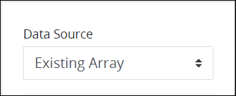

# Loop Control Settings

## Control Description

Use the Loop control to contain one or more [ProcessMaker Screen](../../what-is-a-form.md) controls to duplicate the contained set of controls a specified number of times, thereby minimizing the design work to duplicate that set of controls in a Screen. Use the Loop control when the [Request](../../../../using-processmaker/requests/what-is-a-request.md) participant must enter multiple instances of the same set of information, each of which contain multiple components.

For example, use a Loop control when a university registrar's office must enter the following information for each new university student enrolling to the university:

| Information | ProcessMaker Screen Control |
| :--- | :--- |
| First Name | [Line Input](line-input-control-settings.md) control |
| Last Name | Line Input control |
| Age | Line Input control |
| Sex | [Select List](select-list-control-settings.md) control |
| Housing Dormitory | Select List control |

During the in-progress Request, the Loop control displays the set of controls contained in the Loop control a specified number of times so that the university registrar's office may enter the same information for each new student from one ProcessMaker Screen page. The [Submit Button](submit-button-control-settings.md) control to submit the ProcessMaker Screen must be placed outside of the Loop control. Otherwise, a Submit Button control displays in each set of controls placed into the Loop control.

Do not place another Loop control inside the first Loop control.


This control is only available for [Form](../types-for-screens.md#form)-type ProcessMaker Screens. See [Screen Types](../types-for-screens.md).


### Use the `parent` JSON Key to Reference Request Data from Controls in a Loop Control


### Topic Update

This topic is updated for ProcessMaker version 4.0.3. See the [Release Notes](https://processmaker.gitbook.io/processmaker-release-notes/processmaker-4.0.x/processmaker-4.0.3-release-notes).


The Loop control uses a unique JSON key available to any control placed within the Loop control to reference Request data. Controls that are placed into a Loop control for duplication are within a container and may only access another control's data that is in the same Loop control. Use the `parent` JSON key in a control's settings placed within a Loop control to reference Request data outside of that Loop control.


The `parent` JSON key only applies to controls placed into a Loop control or [Record List](record-list-control-settings.md) control.


Consider the following examples:

* A Line Input control placed within a Loop control requires a default value to display from another Line Input control used during that Request of which its **Variable Name** setting is `Line_Input_Data`.  From the Line Input control placed within the Loop control, enter the following into the [**Default Value** setting](line-input-control-settings.md#default-value): `{{ _parent.Line_Input_Data }}`.
* A Select List control placed within a Loop control requires its options to display from another Select List control's options used during that Request of which its **Variable Name** setting is `Select_List_Options`. While configuring the Select List control placed within the Loop control to [use Request data as its data source](select-list-control-settings.md#reference-request-data), enter the following into the **Options Variable** setting: `{{ _parent.Select_List_Options }}`.

## Add the Control to a ProcessMaker Screen 


Your ProcessMaker user account or group membership must have the following permissions to add a control to a ProcessMaker Screen unless your user account has the **Make this user a Super Admin** setting selected:

* Screens: Edit Screens
* Screens: View Screens

See the ProcessMaker [Screens](../../../../processmaker-administration/permission-descriptions-for-users-and-groups.md#screens) permissions or ask your ProcessMaker Administrator for assistance.


Follow these steps to add this control to the [ProcessMaker Screen](../../what-is-a-form.md):

1. [Create a new ProcessMaker Screen](../../manage-forms/create-a-new-form.md) or click the **Edit** iconto edit the selected Screen. The ProcessMaker Screen is in [Design mode](../screens-builder-modes.md#editor-mode).
2. View the ProcessMaker Screen page to which to add the control.
3. Locate the **Loop** iconin the panel to the left of the Screen Builder canvas.
4. Drag the **Loop** icon into the Screen Builder canvas. Existing controls on the Screens Builder canvas adjust positioning based on where you drag the control.
5. Place into the Screen Builder canvas where you want the control to display on the ProcessMaker Screen. Ensure that the control's placement accounts for the set of controls you intend to this control to contain.  
6. Configure the Loop control. See [Settings](page-navigation-button-control-settings.md#inspector-settings).
7. Drag and place the ProcessMaker Screen control\(s\) into the Loop control that you intend the Request participant to enter information each time the Loop control repeats. As a best practice, do not do the following:

   * Do not place a [Submit Button](submit-button-control-settings.md) control inside the Loop control.
   * Do not place another Loop control inside the first Loop control.

   See [Control Description](loop-control-settings.md#control-description) for an example.

8. Configure each control placed into the Loop control. If a control placed into the Loop control requires to use Request data, use the `parent` JSON key. See [Use the `parent` JSON Key to Reference Request Data from Controls in a Loop Control](loop-control-settings.md#use-the-parent-json-key-to-reference-request-data-from-controls-in-a-loop-control).
9. Validate that the control is configured correctly. See [Validate Your Screen](../validate-your-screen.md#validate-a-processmaker-screen).

Below is a Loop control in [Preview mode](../screens-builder-modes.md#preview-mode).

## Move the Control on the Page


Your ProcessMaker user account or group membership must have the following permissions to move a control in a ProcessMaker Screen page unless your user account has the **Make this user a Super Admin** setting selected:

* Screens: Edit Screens
* Screens: View Screens

See the ProcessMaker [Screens](../../../../processmaker-administration/permission-descriptions-for-users-and-groups.md#screens) permissions or ask your ProcessMaker Administrator for assistance.


After [adding a control to a ProcessMaker Screen page](loop-control-settings.md#add-the-control-to-a-processmaker-screen), you may move it to another location on that page such that it is above or below other controls placed on that page. Consider when moving this control that it contains a set of controls that become duplicated during in-progress [Requests](../../../../using-processmaker/requests/what-is-a-request.md). A control cannot be moved to another [ProcessMaker Screen](../../what-is-a-form.md) page.

Follow these steps to move a control to another location on that ProcessMaker Screen page:

1. Place your cursor anywhere on the control not displaying the **Duplicate Control**or **Delete Control**buttons.
2. Hold your cursor, then drag the control above or below other controls on that ProcessMaker Screen page. Screen Builder previews where the control would display on the page based on how you position the control above or below other controls. If the control cannot be placed in a location because your cursor is above an existing control or too far to the left or right of the page, theicon displays in the preview.
3. Place the control at the location on the page you want it. The other control\(s\) on the page automatically adjust position.

## Copy the Control with its Settings


Your ProcessMaker user account or group membership must have the following permissions to copy a control in a ProcessMaker Screen unless your user account has the **Make this user a Super Admin** setting selected:

* Screens: Edit Screens
* Screens: View Screens

See the ProcessMaker [Screens](../../../../processmaker-administration/permission-descriptions-for-users-and-groups.md#screens) permissions or ask your ProcessMaker Administrator for assistance.


Copying a control also copies the current settings of that control. The copied control displays below other controls placed on that [ProcessMaker Screen](../../what-is-a-form.md) page.


As a best practice, after copying a control, change the [**Variable Name** setting](loop-control-settings.md#variable-name) value for the copied control to its own unique variable value. Otherwise, in-progress [Requests](../../../../using-processmaker/requests/what-is-a-request.md) that use this ProcessMaker Screen read from and send data to both controls.


Follow these steps to copy a control:

1. Select the control to be copied.
2. Click the **Duplicate Control** button. The control copies with its current settings, and then displays below other controls placed on that page.

## Delete the Control from a ProcessMaker Screen


Your ProcessMaker user account or group membership must have the following permissions to delete a control from a ProcessMaker Screen unless your user account has the **Make this user a Super Admin** setting selected:

* Screens: Edit Screens
* Screens: View Screens

See the ProcessMaker [Screens](../../../../processmaker-administration/permission-descriptions-for-users-and-groups.md#screens) permissions or ask your ProcessMaker Administrator for assistance.



Consider the following when deleting a configured Loop control:

* Deleting a Loop control also deletes the controls placed into it.
* Deleting a control also deletes configuration for that control. If you add another control, it will have default settings.


Follow these steps to delete a control from a [ProcessMaker Screen](../../what-is-a-form.md) page:

1. Select the control to be deleted.
2. Click the **Delete** button. The control deletes. Other controls on that ProcessMaker Screen page adjust their locations automatically.

## Settings 


### Permissions Required

Your user account or group membership must have the following permissions to edit a ProcessMaker Screen control:

* Screens: Edit Screens
* Screens: View Screens

See the ProcessMaker [Screens](../../../../processmaker-administration/permission-descriptions-for-users-and-groups.md#screens) permissions or ask your ProcessMaker Administrator for assistance.


The Loop control has the following panels that contain settings:

* \*\*\*\*[**Variable** panel](loop-control-settings.md#variable-panel-settings)
* \*\*\*\*[**Configuration** panel](loop-control-settings.md#configuration-panel-settings)
* \*\*\*\*[**Advanced** panel](loop-control-settings.md#advanced-panel-settings)

### Variable Panel Settings

Click the control while in [Design](../screens-builder-modes.md#design-mode) mode, and then click the **Variable** panel that is on the right-side of the Screen Builder canvas.

Below is the setting for the Loop control in the **Variable** panel:

* [Data Source](loop-control-settings.md#data-source)
* [Variable Name](loop-control-settings.md#variable-name)

#### Data Source

Select whether to create a new array of JSON objects designed from ProcessMaker Screen controls within the Loop control or to reference an existing JSON array of objects:

* **New array of JSON objects designed from ProcessMaker Screen controls**

  Select the **New Array of Objects** option from the **Data Source** setting to place ProcessMaker Screen controls into the Loop control while in Design mode.  
   

  When this option is selected, the [**Default Loop Count** setting](loop-control-settings.md#default-loop-count) displays to indicate how many times to repeat the control\(s\) that the Loop control contains.

* **Existing JSON array of objects**

  Select the Existing Array option from the Data Source setting to reference a JSON array from the Request data that the Loop control contains.  
   

  When this option is selected the **Default Loop Count** setting does not display since the JSON array specifies how many times to repeat the control\(s\) that the Loop control contains.

#### Variable Name

Edit the default **Variable Name** setting value for this control if necessary. The **Variable Name** setting value represents data in this control during [Requests](../../../../using-processmaker/requests/what-is-a-request.md). Ensure that the **Variable Name** setting value is a unique name from other controls in this [ProcessMaker Screen](../../what-is-a-form.md) and contains at least one letter. This is a required setting.

Use the **Variable Name** setting value in the following ways:

* Reference this control by its **Variable Name** setting's value. The **Data Preview** panel in [Preview mode](../screens-builder-modes.md#preview-mode) corresponds with the Loop control's **Variable Name** value. In the example below, `LoopControl` is the **Variable Name** setting's value.  
* Reference this control's value in a different Screen Builder control. To do so, use [mustache syntax](https://mustache.github.io/mustache.5.html) and reference this control's **Variable Name** value in the target control. Example: `{{ LoopControl }}`.
* Reference this value in [**Visibility Rule** setting expressions](expression-syntax-components-for-show-if-control-settings.md).

### Configuration Panel Settings

Click the control while in [Design](../screens-builder-modes.md#design-mode) mode, and then click the **Configuration** panel that is on the right-side of the Screen Builder canvas.

Below are settings for the Loop control in the **Configuration** panel:

* [Default Loop Count](loop-control-settings.md#default-loop-count)
* [Allow Additional Loops](loop-control-settings.md#allow-additional-loops)

#### Default Loop Count

Enter the number of times to repeat the control\(s\) that the Loop control contains. **3** is the default value.  
 

#### Allow Additional Loops

Select to allow additional loops during in-progress [Requests](../../../../using-processmaker/requests/what-is-a-request.md) if necessary.  
 

If this setting is selected, then the **Add Loop** icondisplays below the looped container of controls that allows the Request participant to add a new loop for the [Task](../../../../using-processmaker/task-management/what-is-a-task.md).

### Advanced Panel Settings

Click the control while in [Design](../screens-builder-modes.md#design-mode) mode, and then click the **Advanced** panel that is on the right-side of the Screen Builder canvas.

Below are settings for the Loop control in the **Advanced** panel:

* [Visibility Rule](loop-control-settings.md#visibility-rule)
* [CSS Selector Name](loop-control-settings.md#css-selector-name)

#### Visibility Rule

Specify an expression that indicates the condition\(s\) under which this control displays. See [Expression Syntax Components for "Visibility Rule" Control Settings](expression-syntax-components-for-show-if-control-settings.md#expression-syntax-components-for-show-if-control-settings). If this setting does not have an expression, then this control displays by default.  
 


To make this control hidden until another control contains a value, enter the **Variable Name** setting value of that control to this control's **Visibility Rule** setting.


#### CSS Selector Name

Enter the value to represent this control in custom CSS syntax when in [Custom CSS](../add-custom-css-to-a-screen.md#add-custom-css-to-a-processmaker-screen) mode. As a best practice, use the same **CSS Selector Name** value on different controls of the same type to apply the same custom CSS style to all those controls.  
 

## Upload Multiple Files Example

Use the Loop and [File Upload](file-upload-control-settings.md) controls to upload multiple files in a ProcessMaker Screen.


Download an example of this ProcessMaker Screen at the end these instructions, and then [import it into your ProcessMaker instance](../../manage-forms/import-a-screen.md).


Follow these steps to design a ProcessMaker Screen that allows multiple files for upload:

1. [Add the Loop control to the ProcessMaker Screen page](loop-control-settings.md#add-the-control-to-a-processmaker-screen) from which ProcessMaker users may upload multiple files.
2. From the **Data Source** setting, select the **New Array of Objects** option. 
3. In the **Default Loop Count** setting, enter how many files by default that may be uploaded to this ProcessMaker Screen. **3** is the default setting.  
4. Select the **Allow additional loops** option to allow additional files be uploaded to this ProcessMaker Screen. By default this setting is not selected, which would prevent additional files be uploaded.  
5. Do not enter a visibility rule in the [**Visibility Rule** setting](loop-control-settings.md#visibility-rule) so that the Loop control always remains visible.
6. [Specify other settings in the Loop control](loop-control-settings.md#inspector-settings) as necessary. These settings do not affect how this example functions.
7. Add a File Upload control to the Loop control by dragging it into the Loop control.
8. [Configure the File Upload control](file-upload-control-settings.md#inspector-settings) as necessary. These settings do not affect how this example functions.
9. [Add a Submit Button control](submit-button-control-settings.md#add-the-control-to-a-processmaker-screen) to this ProcessMaker Screen. Ensure not to add the Submit Button control inside the Loop control.
10. [Save](../save-a-screen.md#save-a-processmaker-screen) your ProcessMaker Screen.
11. Reference this ProcessMaker Screen from a Process model or as an editable ProcessMaker Screen in a ProcessMaker Collection.



## Related Topics









































