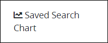
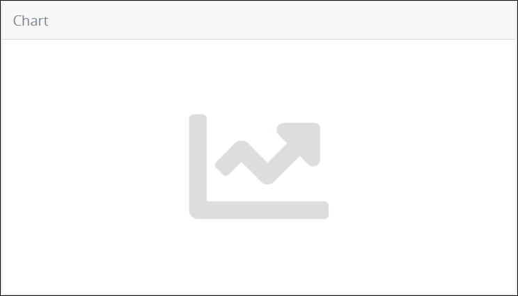
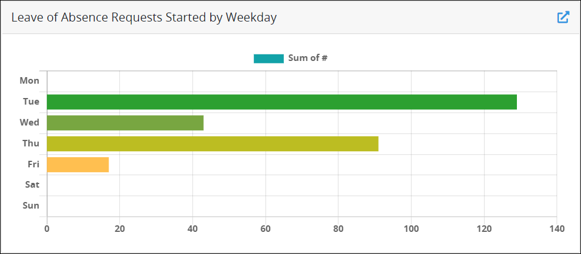
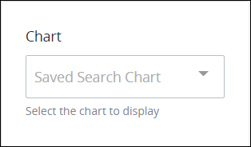
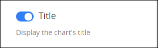

# Saved Search Chart Control Settings

## Control Description

The Saved Search Chart control embeds a [chart](../../../../using-processmaker/save-and-share-request-and-task-related-searches/create-charts-to-visualize-saved-search-results/overview-of-saved-search-charts.md) from a [Saved Search](../../../../using-processmaker/save-and-share-request-and-task-related-searches/what-is-a-saved-search.md) into a [ProcessMaker Screen](../../what-is-a-form.md). The Saved Search chart visualizes the latest Saved Search result data at the time the ProcessMaker Screen displays. The Saved Search chart is interactive as if it were in the [**Charts** tab](../../../../using-processmaker/save-and-share-request-and-task-related-searches/create-charts-to-visualize-saved-search-results/view-charts-for-a-saved-search.md#view-the-charts-for-a-type-of-saved-search) of its Saved Search. By embedding a Saved Search chart into a ProcessMaker Screen widens that chart's viewability to more stakeholders or even individuals who are not [ProcessMaker users](../../../../processmaker-administration/add-users/what-is-a-user.md) in your organization by allowing anonymous users access ProcessMaker via the [Web Entry package](../../../../package-development-distribution/package-a-connector/web-entry.md).

Use the Saved Search Chart control to visualize Saved Search results directly within ProcessMaker Screens in the following ways:

* [Request](../../../../using-processmaker/requests/what-is-a-request.md) participants can view the current chart configured for a Saved Search using the latest Request data at the time the Request participant views the ProcessMaker Screen.
* Request participants who do not have access to ProcessMaker Collections can view charts for Saved Searches based on a ProcessMaker Collection.


This control is only available for the following Screen types:

* [Form](../types-for-screens.md#form) type
* [Display](../types-for-screens.md#display) type

See [Screen Types](../types-for-screens.md).


## Add the Control to a ProcessMaker Screen


### ProcessMaker Package Required

To add a Saved Search Chart control to a [ProcessMaker Screen](../../what-is-a-form.md), the [Saved Searches package](../../../../package-development-distribution/package-a-connector/saved-searches-package.md) must be installed in your ProcessMaker instance. The Saved Search Chart control and the Saved Searches [package](../../../../package-development-distribution/first-topic.md) are not available in the ProcessMaker open-source edition. Contact [ProcessMaker Sales](mailto:sales@processmaker.com) or ask your ProcessMaker sales representative how the Saved Searches package can be installed in your ProcessMaker instance.

### Permissions Required

Your ProcessMaker user account or group membership must have the following permissions to add a control to a ProcessMaker Screen unless your user account has the **Make this user a Super Admin** setting selected:

* Screens: Edit Screens
* Screens: View Screens

See the ProcessMaker [Screens](../../../../processmaker-administration/permission-descriptions-for-users-and-groups.md#screens) permissions or ask your ProcessMaker Administrator for assistance.


Follow these steps to add this control to the ProcessMaker Screen:

1. [Create a new ProcessMaker Screen](../../manage-forms/create-a-new-form.md) or click the **Edit** iconto edit the selected Screen. The ProcessMaker Screen is in [Design mode](../screens-builder-modes.md#editor-mode).
2. View the ProcessMaker Screen page to which to add the control.
3. Locate the **Saved Search Chart** iconin the panel to the left of the Screen Builder canvas.
4. Drag the **Saved Search Chart** icon into the Screen Builder canvas. Existing controls on the Screen Builder canvas adjust positioning based on where you drag the control.
5. Place into the Screen Builder canvas where you want the control to display on the ProcessMaker Screen.  
6. Configure the Saved Search Chart control. See [Settings](saved-search-chart-control-settings.md#settings).
7. Validate that the control is configured correctly. See [Validate Your Screen](../validate-your-screen.md#validate-a-processmaker-screen).

Below is a Saved Search Chart control in [Preview mode](../screens-builder-modes.md#preview-mode).

## Move the Control on the Page


### ProcessMaker Package Required

To move a Saved Search Chart control to a [ProcessMaker Screen](../../what-is-a-form.md), the [Saved Searches package](../../../../package-development-distribution/package-a-connector/saved-searches-package.md) must be installed in your ProcessMaker instance. The Saved Search Chart control and the Saved Searches [package](../../../../package-development-distribution/first-topic.md) are not available in the ProcessMaker open-source edition. Contact [ProcessMaker Sales](mailto:sales@processmaker.com) or ask your ProcessMaker sales representative how the Saved Searches package can be installed in your ProcessMaker instance.

### Permissions Required

Your ProcessMaker user account or group membership must have the following permissions to move a control in a ProcessMaker Screen page unless your user account has the **Make this user a Super Admin** setting selected:

* Screens: Edit Screens
* Screens: View Screens

See the ProcessMaker [Screens](../../../../processmaker-administration/permission-descriptions-for-users-and-groups.md#screens) permissions or ask your ProcessMaker Administrator for assistance.


After [adding a control to a ProcessMaker Screen page](google-places-control-settings.md#add-the-control-to-a-processmaker-screen), you may move it to another location on that page such that it is above or below other controls placed on that page. A control cannot be moved to another [ProcessMaker Screen](../../what-is-a-form.md) page.

Follow these steps to move a control to another location on that ProcessMaker Screen page:

1. Place your cursor anywhere on the control not displaying the **Duplicate Control**or **Delete Control**buttons.
2. Hold your cursor, then drag the control above or below other controls on that ProcessMaker Screen page. Screen Builder previews where the control would display on the page based on how you position the control above or below other controls. If the control cannot be placed in a location because your cursor is above an existing control or too far to the left or right of the page, theicon displays in the preview.
3. Place the control at the location on the page you want it. The other control\(s\) on the page automatically adjust position.

## Copy the Control with its Settings


### ProcessMaker Package Required

To copy a Saved Search Chart control to a [ProcessMaker Screen](../../what-is-a-form.md), the [Saved Searches package](../../../../package-development-distribution/package-a-connector/saved-searches-package.md) must be installed in your ProcessMaker instance. The Saved Search Chart control and the Saved Searches [package](../../../../package-development-distribution/first-topic.md) are not available in the ProcessMaker open-source edition. Contact [ProcessMaker Sales](mailto:sales@processmaker.com) or ask your ProcessMaker sales representative how the Saved Searches package can be installed in your ProcessMaker instance.

### Permissions Required

Your ProcessMaker user account or group membership must have the following permissions to copy a control in a ProcessMaker Screen unless your user account has the **Make this user a Super Admin** setting selected:

* Screens: Edit Screens
* Screens: View Screens

See the ProcessMaker [Screens](../../../../processmaker-administration/permission-descriptions-for-users-and-groups.md#screens) permissions or ask your ProcessMaker Administrator for assistance.


Copying a control also copies the current settings of that control. The copied control displays below other controls placed on that [ProcessMaker Screen](../../what-is-a-form.md) page.

Follow these steps to copy a control:

1. Select the control to be copied.
2. Click the **Duplicate Control** button. The control copies with its current settings, and then displays below other controls placed on that page.

## Delete the Control from a ProcessMaker Screen


### ProcessMaker Package Required

To delete a Saved Search Chart control to a [ProcessMaker Screen](../../what-is-a-form.md), the [Saved Searches package](../../../../package-development-distribution/package-a-connector/saved-searches-package.md) must be installed in your ProcessMaker instance. The Saved Search Chart control and the Saved Searches [package](../../../../package-development-distribution/first-topic.md) are not available in the ProcessMaker open-source edition. Contact [ProcessMaker Sales](mailto:sales@processmaker.com) or ask your ProcessMaker sales representative how the Saved Searches package can be installed in your ProcessMaker instance.

### Permissions Required

Your ProcessMaker user account or group membership must have the following permissions to delete a control from a ProcessMaker Screen unless your user account has the **Make this user a Super Admin** setting selected:

* Screens: Edit Screens
* Screens: View Screens

See the ProcessMaker [Screens](../../../../processmaker-administration/permission-descriptions-for-users-and-groups.md#screens) permissions or ask your ProcessMaker Administrator for assistance.



Deleting a control also deletes configuration for that control. If you add another control, it will have default settings.


Follow these steps to delete a control from a [ProcessMaker Screen](../../what-is-a-form.md) page:

1. Select the control to be deleted.
2. Click the **Delete** button. The control deletes. Other controls on that ProcessMaker Screen page adjust their locations automatically.

## Settings


### ProcessMaker Package Required

To edit a Saved Search Chart control to a [ProcessMaker Screen](../../what-is-a-form.md), the [Saved Searches package](../../../../package-development-distribution/package-a-connector/saved-searches-package.md) must be installed in your ProcessMaker instance. The Saved Search Chart control and the Saved Searches [package](../../../../package-development-distribution/first-topic.md) are not available in the ProcessMaker open-source edition. Contact [ProcessMaker Sales](mailto:sales@processmaker.com) or ask your ProcessMaker sales representative how the Saved Searches package can be installed in your ProcessMaker instance.

### Permissions Required

Your user account or group membership must have the following permissions to edit a ProcessMaker Screen control:

* Screens: Edit Screens
* Screens: View Screens

See the ProcessMaker [Screens](../../../../processmaker-administration/permission-descriptions-for-users-and-groups.md#screens) permissions or ask your ProcessMaker Administrator for assistance.


The Saved Search Chart control has the following panel that contains settings:

* \*\*\*\*[**Configuration** panel](saved-search-chart-control-settings.md#configuration-panel-settings)

### Configuration Panel Settings

Click the control while in [Design](../screens-builder-modes.md#design-mode) mode, and then click the **Configuration** panel that is on the right-side of the Screen Builder canvas.

Below are the settings for the Saved Search Chart control in the **Configuration** panel:

* [Chart](saved-search-chart-control-settings.md#chart)
* [Title](saved-search-chart-control-settings.md#title)
* [Border](saved-search-chart-control-settings.md#border)
* [Enable Link](saved-search-chart-control-settings.md#enable-link)
* [Size](saved-search-chart-control-settings.md#size)

#### Chart

Select the [Saved Search chart](../../../../using-processmaker/save-and-share-request-and-task-related-searches/what-is-a-saved-search.md#create-charts-to-visualize-your-saved-search-results) to display in the [ProcessMaker Screen](../../what-is-a-form.md).  
 

#### Title

Enable the **Title** toggle key to display the Saved Search chart's title above the chart. The **Title** toggle key is enabled by default.  
 

#### Border

#### Enable Link

#### Size

## Related Topics









































