# Select List Control Settings

## Control Description

The Select List control provides either a checkbox- or multi-select drop-down menu-style control from which the [Request](../../../../using-processmaker/requests/what-is-a-request.md) participant selects one or more options.

Set options that display in this control in one of the following ways:

* **Provide each option:** For each option, enter a unique value that represents the option, and then enter the text that displays as the option. After your options are configured, sort the order in which they are to display in the control. Alternatively, provide options in the control in JSON format.
* **Reference a data source in the JSON data model:** Reference data from a [ProcessMaker Data Connector](../../../data-connector-management/what-is-a-data-connector.md) that displays in this control as its options. Specify the data name, value, and content from the Data Connector. Optionally, use a [PMQL](../../../../using-processmaker/search-processmaker-data-using-pmql.md) expression to limit which data to use as options based on the PMQL expression's criteria. The order that data objects present in the data object determines the order these options display in the control; options cannot be manually reordered.


This control is only available for [Form](../types-for-screens.md#form)-type ProcessMaker Screens. See [Screen Types](../types-for-screens.md).


### Checkbox Functional Description

When using the Select List control with checkboxes, the control functions similarly to multiple [Checkbox](checkbox-control-settings.md#control-description) controls whereby multiple options may be selected. Unlike using multiple Checkbox controls, the Select List control includes all selected options as an array in the order that options are selected. This array becomes part of the JSON data model as shown in the example below in [Preview mode](../screens-builder-modes.md#preview-mode).


### Drop-Down Menu Functional Description

When using the Select List control as the drop-down menu, multiple options may be selected one at a time. Selected options have the following attributes:

* Each selected option displays in the control.
* Each selected option displays in bold-style text in the drop-down menu. Furthermore, a red-colored highlight displays when mouse-hovering over a selected option, rather than the default green-colored highlight for deselected options.

Follow these guidelines to deselect an item from the Select List control when using the drop-down menu style:

* Click the imagefor the option to be removed.
* Select the option again from the drop-down menu.

The Select List control includes all selected options as an array in the order that options are selected. ****This array becomes part of the JSON data model as shown in the example below in [Preview mode](../screens-builder-modes.md#preview-mode).


## Add the Control to a ProcessMaker Screen


Your ProcessMaker user account or group membership must have the following permissions to add a control to a ProcessMaker Screen unless your user account has the **Make this user a Super Admin** setting selected:

* Screens: View Screens
* Screens: Edit Screens

See the ProcessMaker [Screens](../../../../processmaker-administration/permission-descriptions-for-users-and-groups.md#screens) permissions or ask your ProcessMaker Administrator for assistance.


Follow these steps to add this control to the [ProcessMaker Screen](../../what-is-a-form.md):

1. [Create a new ProcessMaker Screen](../../manage-forms/create-a-new-form.md) or click the **Edit** iconto edit the selected Screen. The ProcessMaker Screen is in [Design mode](../screens-builder-modes.md#editor-mode).
2. View the ProcessMaker Screen page to which to add the control.
3. Locate the **Select List** iconin the panel to the left of the Screen Builder canvas.
4. Drag the **Select List** icon into the Screen Builder canvas. Existing controls on the Screen Builder canvas adjust positioning based on where you drag the control.
5. Place into the Screen Builder canvas where you want the control to display on the ProcessMaker Screen.  
6. Configure the Select List control. See [Settings](select-list-control-settings.md#inspector-settings).
7. Validate that the control is configured correctly. See [Validate Your Screen](../validate-your-screen.md#validate-a-processmaker-screen).

Below is a Select List control in [Preview mode](../screens-builder-modes.md#preview-mode).


## Move the Control on the Page


Your ProcessMaker user account or group membership must have the following permissions to move a control in a ProcessMaker Screen page unless your user account has the **Make this user a Super Admin** setting selected:

* Screens: Edit Screens
* Screens: View Screens

See the ProcessMaker [Screens](../../../../processmaker-administration/permission-descriptions-for-users-and-groups.md#screens) permissions or ask your ProcessMaker Administrator for assistance.


After [adding a control to a ProcessMaker Screen page](select-list-control-settings.md#add-the-control-to-a-processmaker-screen), you may move it to another location on that page such that it is above or below other controls placed on that page. A control cannot be moved to another [ProcessMaker Screen](../../what-is-a-form.md) page.

Follow these steps to move a control to another location on that ProcessMaker Screen page:

1. Place your cursor anywhere on the control not displaying the **Duplicate Control**or **Delete Control**buttons.
2. Hold your cursor, then drag the control above or below other controls on that ProcessMaker Screen page. Screen Builder previews where the control would display on the page based on how you position the control above or below other controls. If the control cannot be placed in a location because your cursor is above an existing control or too far to the left or right of the page, theicon displays in the preview.
3. Place the control at the location on the page you want it. The other control\(s\) on the page automatically adjust position.

## Copy the Control with its Settings


Your ProcessMaker user account or group membership must have the following permissions to copy a control in a ProcessMaker Screen unless your user account has the **Make this user a Super Admin** setting selected:

* Screens: Edit Screens
* Screens: View Screens

See the ProcessMaker [Screens](../../../../processmaker-administration/permission-descriptions-for-users-and-groups.md#screens) permissions or ask your ProcessMaker Administrator for assistance.


Copying a control also copies the current settings of that control. The copied control displays below other controls placed on that [ProcessMaker Screen](../../what-is-a-form.md) page.


As a best practice, after copying a control, change the [**Variable Name** setting](select-list-control-settings.md#variable-name) value for the copied control to its own unique variable value. Otherwise, in-progress [Requests](../../../../using-processmaker/requests/what-is-a-request.md) that use this ProcessMaker Screen read from and send data to both controls.


Follow these steps to copy a control:

1. Select the control to be copied.
2. Click the **Duplicate Control** button. The control copies with its current settings, and then displays below other controls placed on that page.

## Delete the Control from a ProcessMaker Screen


Your ProcessMaker user account or group membership must have the following permissions to delete a control from a ProcessMaker Screen unless your user account has the **Make this user a Super Admin** setting selected:

* Screens: Edit Screens
* Screens: View Screens

See the ProcessMaker [Screens](../../../../processmaker-administration/permission-descriptions-for-users-and-groups.md#screens) permissions or ask your ProcessMaker Administrator for assistance.



Deleting a control also deletes configuration for that control. If you add another control, it will have default settings.


Follow these steps to delete a control from a [ProcessMaker Screen](../../what-is-a-form.md) page:

1. Select the control to be deleted.
2. Click the **Delete** button. The control deletes. Other controls on that ProcessMaker Screen page adjust their locations automatically.

## Settings <a id="inspector-settings"></a>


### Permissions Required

Your user account or group membership must have the following permissions to edit a ProcessMaker Screen control:

* Screens: Edit Screens
* Screens: View Screens

See the ProcessMaker [Screens](../../../../processmaker-administration/permission-descriptions-for-users-and-groups.md#screens) permissions or ask your ProcessMaker Administrator for assistance.


The Select List control has the following panels that contain settings:

* \*\*\*\*[**Variable** panel](select-list-control-settings.md#variable-panel-settings)
* \*\*\*\*[**Configuration** panel](select-list-control-settings.md#configuration-panel-settings)
* \*\*\*\*[**Data Source** panel](select-list-control-settings.md#data-source-panel-settings)
* \*\*\*\*[**Design** panel](select-list-control-settings.md#design-panel-settings)
* \*\*\*\*[**Advanced** panel](select-list-control-settings.md#advanced-panel-settings)

### Variable Panel Settings

Click the control while in [Design](../screens-builder-modes.md#design-mode) mode, and then click the **Variable** panel that is on the right-side of the Screen Builder canvas.

Below are settings for the Select List control in the **Variable** panel:

* [Variable Name](select-list-control-settings.md#variable-name)
* [Label](select-list-control-settings.md#label)
* [Validation Rules](select-list-control-settings.md#validation-rules)

#### Variable Name

Edit the default **Variable Name** setting value for this control if necessary. The **Variable Name** setting value represents data in this control during [Requests](../../../../using-processmaker/requests/what-is-a-request.md). Ensure that the **Variable Name** setting value is a unique name from other controls in this [ProcessMaker Screen](../../what-is-a-form.md) and contains at least one letter. This is a required setting.  
 

Use the **Variable Name** setting value in the following ways:

* Reference this control by its **Variable Name** setting's value. The **Data Preview** panel in [Preview mode](../screens-builder-modes.md#preview-mode) corresponds the option\(s\) the Request participant selects in the Select List control with that Select List control's **Variable Name** value. The **Variable Name** setting contains the selected option\(s\) as an array. In the example below, `SelectListControl` is the **Variable Name** setting's value.  
* Reference this control's value in a different Screen Builder control. To do so, use [mustache syntax](https://mustache.github.io/mustache.5.html) and reference this control's **Variable Name** value in the target control. Example: `{{ SelectListControl }}`.
* Reference this value in [**Visibility Rule** setting expressions](expression-syntax-components-for-show-if-control-settings.md).

#### Label

Edit the default label that displays for this control if necessary. **New Select List** is the default value.  
 

#### Validation Rules

Enter the validation rule\(s\) the Request participant must comply with to properly enter a valid value into this control. This setting has no default value. If there are no configured validation rules the following message displays: **No validation rule\(s\)**. See [Validation Rules for "Validation" Control Settings](validation-rules-for-validation-control-settings.md).  
 

Follow these steps to add a validation rule to this control:

1. Access the [**Variable** panel for this control](select-list-control-settings.md#variable-panel-settings) while in [Design](../screens-builder-modes.md#design-mode) mode, and then locate the **Validation Rules** setting.
2. Click the **Add Rule** button. The **Select** drop-down menu displays.  
3. Select the rule that this control validates against.
4. Click **Save**. Parameters for the selected rule display. Parameter settings display which ones are required to properly configure the rule.
5. Enter the parameter settings that this control uses to validate against. See [Validation Rule Settings](validation-rules-for-validation-control-settings.md#validation-rule-settings), and then locate the validation rule for its parameters.

Follow these steps to edit a validation rule for this control:

1. Access the [**Variable** panel for this control](select-list-control-settings.md#variable-panel-settings) while in [Design](../screens-builder-modes.md#design-mode) mode, and then locate the **Validation Rules** setting.
2. Click the **Edit** iconfor the validation rule to edit if that rule can be edited. Validation rules that do not have parameters cannot be edited. The parameter settings for that validation rule displays.
3. Edit the parameter settings that this control uses to validate against. See [Validation Rule Settings](validation-rules-for-validation-control-settings.md#validation-rule-settings), and then locate the validation rule for its parameters.

Follow these steps to delete a validation rule for this control:

1. Access the [**Variable** panel for this control](select-list-control-settings.md#variable-panel-settings) while in [Design](../screens-builder-modes.md#design-mode) mode, and then locate the **Validation Rules** setting.
2. Click the **Delete** iconfor the validation rule to delete. A message displays to confirm deletion of the validation rule.
3. Click **Delete**.

### Configuration Panel Settings

Click the control while in [Design](../screens-builder-modes.md#design-mode) mode, and then click the **Configuration** panel that is on the right-side of the Screen Builder canvas.

Below are settings for the Select List control in the **Configuration** panel:

* [Placeholder Text](select-list-control-settings.md#placeholder-text)
* [Helper Text](select-list-control-settings.md#helper-text)

#### Placeholder Text

Enter the placeholder text that displays in this control when no value has been provided. This setting has no default value.  
 

#### Helper Text

Enter text that provides additional guidance on this control's use. This setting has no default value.  
 

### Data Source Panel Settings

Click the control while in [Design](../screens-builder-modes.md#design-mode) mode, and then click the **Data Source** panel that is on the right-side of the Screen Builder canvas.

From the **Data Source** panel, select one of the following methods to specify options that display in the Select List control:

* [Provide options](select-list-control-settings.md#provide-options): Enter a unique value that represents each option, and then enter the text that displays as the option. After your options are configured, sort the order in which they are to display in this control. Alternatively, provide options in this control in JSON format.
* [Request data](select-list-control-settings.md#reference-request-data): Reference data from the in-progress Request as options in this control. This data object must be part of the Request's JSON data model. During the in-progress Request, the Select List control references a specified data array and object in the Request's JSON data model to display its values as options in that control. The order that data objects are in the Request's JSON data model determines the order these options display in the control; options cannot be manually reordered. See [Dependent Field Design Example Using Select List Controls](select-list-control-settings.md#dependent-field-design-example-using-select-list-controls).
* [ProcessMaker Data Connector](select-list-control-settings.md#reference-a-processmaker-data-connector): Reference the data from a ProcessMaker Data Connector's [Endpoint](../../../data-connector-management/what-is-a-data-connector.md#what-is-an-endpoint) as options in this control. Note that the [ProcessMaker Data Connector](../../../../package-development-distribution/package-a-connector/data-connector-package.md) package must be installed to your ProcessMaker instance for this option to be available. The Data Connector package is not available in the ProcessMaker open-source edition. Contact [ProcessMaker Sales](https://www.processmaker.com/contact/) or ask your ProcessMaker sales representative how the Data Connector package can be installed in your ProcessMaker instance.

  These Endpoints a [ProcessMaker Data Connector](../../../data-connector-management/what-is-a-data-connector.md) references may be Application Program Interface \(API\) endpoints, ProcessMaker Collection records, or other data source endpoints. During the in-progress Request, when the Select List control references data from the ProcessMaker Data Connector, the control maps the ProcessMaker Data Connector data to a specified JSON data array, variable or key name, or data object to become part of that Request's data. Data maps to the JSON data array in the same order it is retrieved from the ProcessMaker Data Connector. Optionally, use a [PMQL](../../../../using-processmaker/search-processmaker-data-using-pmql.md) expression to limit which data to use as options based on the PMQL expression's criteria. The order that data objects return from the ProcessMaker Data Connector determines the order these options display in the control; options cannot be manually reordered.

  See [Dependent Field Design Example Using Select List Controls](select-list-control-settings.md#dependent-field-design-example-using-select-list-controls).

#### Provide Options

See the following procedures how to provide options for a Select List control.



### Add an Option to This Select List Control

Follow these steps to add an option that displays in this control using the ProcessMaker interface:

1. Access the [**Data Source** panel for this control](select-list-control-settings.md#data-source-panel-settings) while in [Design](../screens-builder-modes.md#design-mode) mode, and then locate the **Data Source** setting.
2. From the **Data Source** drop-down menu, select **Provide Values** if this setting is not selected. This is the default setting.  
3. Ensure that the **Options** list label displays. If the **JSON Data** option displays, click the **Edit as Option List** option.  
4. Click the iconbeside the **Options** list label. The **Add Option** screen displays.  
5. In the **Value** setting, enter a value to represent the option in the [Request](../../../../using-processmaker/requests/what-is-a-request.md) data. This value must be unique from other values in this control. If the value is not unique to other **Value** settings in this control, the following message displays: **An item with the same key already exists**.
6. In the **Content** setting, enter the option that displays in this control.
7. Click **Save**. The option displays below the **Options** list label.  

### Edit an Option for This Select List Control

Follow these steps to edit an option that displays in this control using the ProcessMaker interface:

1. Access the [**Data Source** panel for this control](select-list-control-settings.md#data-source-panel-settings) while in [Design](../screens-builder-modes.md#design-mode) mode, and then ensure that the **Data Source** setting uses the **Provide Values** option.  
2. Ensure that the **Options** list label displays. If the **JSON Data** option displays, click the **Edit as Option List** option.  
3. Click theicon for an option to edit its settings. The **Edit Option** screen displays.  
4. In the **Value** setting, edit the value to represent the option in the JSON data model during in-progress Requests for Processes that use this ProcessMaker Screen as necessary. This value must be unique from other values in this control. If the value is not unique to other **Value** settings in this control, the following message displays: **An item with the same key already exists**.
5. In the **Content** setting, edit the option that displays in this control as necessary.
6. Click **Update**. The edited option displays below the **Options** list label.

### Delete an Option from This Select List Control

Follow these steps to delete an option from in this control using the ProcessMaker interface:

1. Access the [**Data Source** panel for this control](select-list-control-settings.md#data-source-panel-settings) while in [Design](../screens-builder-modes.md#design-mode) mode, and then ensure that the **Data Source** setting uses the **Provide Values** option.  
2. Ensure that the **Options** list label displays. If the **JSON Data** option displays, click the **Edit as Option List** option.  
3. Click theicon for the option to be deleted from this control. A message displays to confirm deletion of the option.
4. Click **Delete**.

### Sort the Order of the Options

Follow these steps to sort the order of the options that display in this control using the ProcessMaker interface:

1. Access the [**Data Source** panel for this control](select-list-control-settings.md#data-source-panel-settings) while in [Design](../screens-builder-modes.md#design-mode) mode, and then ensure that the **Data Source** setting uses the **Provide Values** option.  
2. Ensure that the **Options** list label displays. If the **JSON Data** option displays, click the **Edit as Option List** option.  
3. Drag theicon for each option up or down to sort the order they display in this control as necessary.

### Set to Allow Multiple Selections and How Options Display

Follow these steps to set whether multiple selections can be selected from this control and how the options display:

1. Access the [**Data Source** panel for this control](select-list-control-settings.md#data-source-panel-settings) while in [Design](../screens-builder-modes.md#design-mode) mode, and then ensure that the **Data Source** setting uses the **Provide Values** option.  
2. Click the **Allow multiple selections** setting to allow multiple options to be selected from this control. Otherwise, only one option can be selected.  
3. From the **Render Options As** drop-down menu, select one of the following options:
   * **Dropdown/Multiselect:** Select the **Dropdown/Multiselect** option to display the control as a drop-down menu.
   * **Radio/Checkbox Group:** Select the **Radio/Checkbox Group** option to display the control as a group of checkboxes.  



### Provide Options Using a JSON Schema to This Select List Control

Follow these steps to provide options that display in this control using a JSON schema:

1. Access the [**Data Source** panel for this control](select-list-control-settings.md#data-source-panel-settings) while in [Design](../screens-builder-modes.md#design-mode) mode, and then locate the **Data Source** setting.
2. From the **Data Source** drop-down menu, select **Provide Values** if this setting is not selected. This is the default setting.  
3. Click the **Edit as JSON** option below the **Options** list label. If the **JSON Data** setting displays, skip this step.  
    

   The **JSON Data** setting displays. If a valid JSON schema has been configured previously, the **JSON Data** setting displays the JSON. Otherwise, this setting is empty.

4. Click the iconbeside the **JSON Data** option. The **Script Config Editor** displays.  

   

5. Enter your control options in the order they are to display in this control using JSON format. Use the scroll panel to the right of the JSON to scroll to different sections of the JSON if necessary. This is useful especially when you are editing a long JSON.
6. Click **Close** or the **Close** icon. The control options are saved.

### Set to Allow Multiple Selections and How Options Display

Follow these steps to set whether multiple selections can be selected from this control and how the options display:

1. Access the [**Data Source** panel for this control](select-list-control-settings.md#data-source-panel-settings) while in [Design](../screens-builder-modes.md#design-mode) mode, and then ensure that the **Data Source** setting uses the **Provide Values** option.  
2. Click the **Allow multiple selections** setting to allow multiple options to be selected from this control. Otherwise, only one option can be selected.  
3. From the **Render Options As** drop-down menu, select one of the following options:
   * **Dropdown/Multiselect:** Select the **Dropdown/Multiselect** option to display the control as a drop-down menu.
   * **Radio/Checkbox Group:** Select the **Radio/Checkbox Group** option to display the control as a group of checkboxes.  



#### Reference Request Data


### Topic Update

This topic is updated for ProcessMaker version 4.0.4. See the [Release Notes](https://processmaker.gitbook.io/processmaker-release-notes/processmaker-4.0.x/processmaker-4.0.4-release-notes#screen-builder).


Follow these steps to reference data from the in-progress Request as options in this control:

1. Access the [**Data Source** panel for this control](select-list-control-settings.md#data-source-panel-settings) while in [Design](../screens-builder-modes.md#design-mode) mode.
2. From the **Data Source** drop-down menu, select **Request Data**.  
3. In the **Options Variable** setting, enter from which Request variable, based on its **Variable Name** setting value, to use as options for this control. The Request variable from which to use as options must be an array. The options in the Select List control display in the same order as the Request variable lists items in its array. Optionally, use [mustache syntax](https://mustache.github.io/mustache.5.html) to indicate the Request variable name, especially if each option in this control derives from combining multiple properties within an array where each of its items contains one or more objects. **response** is the default setting. See [Dependent Field Design Example Using Select List Controls](select-list-control-settings.md#dependent-field-design-example-using-select-list-controls). 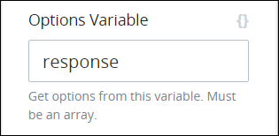
4. In the **Option Label Shown** setting, enter the JSON object key name from within the JSON array containing the Request variable from which to display as each option in this control. To use all JSON object key names in the JSON object, do not enter a value into the **Option Label Shown** setting. Use [JSON dot notation](../../../../json-the-foundation-of-request-data/what-is-json.md#json-dot-notation) as necessary. Optionally, use mustache syntax to indicate the JSON object key name from within the JSON array. **content** is the default value. 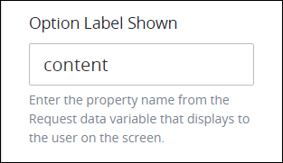 
5. From the **Show Control As** drop-down menu, select one of the following options:
   * **Dropdown/Multiselect:** Select the **Dropdown/Multiselect** option to display the control as a drop-down menu.
   * **Radio/Checkbox Group:** Select the **Radio/Checkbox Group** option to display the control as a group of checkboxes.  
6. Select the **Allow multiple selections** option to allow multiple options to be selected from this control. Otherwise, only one option can be selected.  
7. From the **Type of Value Returned** drop-down menu, select one of the following options:
   * **Single Value:** Select the **Single Value** option to indicate that only a part of the JSON object specified from the Option Label Shown displays as each option in this control.
   * **Object:** Select the **Object** option to indicate that the entire JSON object within each item of the array displays as each option in this control. 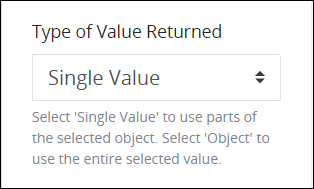 
8. If the **Single Value** option from the **Type of Value Returned** setting is selected, the **Variable Data Property** setting displays. In the **Variable Data Property** setting, enter the JSON object key name from within the JSON array containing the JSON response that this control stores in that Request's data when this ProcessMaker Screen submits. To use all items in the JSON array, do not enter a value into the **Variable Data Property** setting. Use [JSON dot notation](../../../../json-the-foundation-of-request-data/what-is-json.md#json-dot-notation) as necessary if the relevant JSON array containing the object key name is embedded in other JSON objects and/or arrays. Optionally, use mustache syntax to indicate the JSON key name from within the JSON array. **value** is the default value. See [Dependent Field Design Example Using Select List Controls](select-list-control-settings.md#dependent-field-design-example-using-select-list-controls). 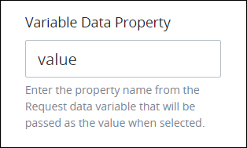 

#### Reference a ProcessMaker Data Connector


Note that the [ProcessMaker Data Connector](../../../../package-development-distribution/package-a-connector/data-connector-package.md) package must be installed to your ProcessMaker instance for this option to be available. The Data Connector package is not available in the ProcessMaker open-source edition. Contact [ProcessMaker Sales](https://www.processmaker.com/contact/) or ask your ProcessMaker sales representative how the Data Connector package can be installed in your ProcessMaker instance.


Follow these steps to reference data from a [ProcessMaker Data Connector](../../../data-connector-management/what-is-a-data-connector.md) as options in this control:

1. Access the [**Data Source** panel for this control](select-list-control-settings.md#data-source-panel-settings) while in [Design](../screens-builder-modes.md#design-mode) mode.
2. From the **Data Source** drop-down menu, select **Data Connector**.  
3. In the **Options Variable** setting, enter the name of the JSON array containing the API's JSON response from which to reference its objects as options that display in this control after the ProcessMaker Data Connector's Endpoint interacts with the API resource. The name of the JSON array is called `response` by default. Use [JSON dot notation](../../../../json-the-foundation-of-request-data/what-is-json.md#json-dot-notation) as necessary if the relevant JSON array containing the object key name is embedded in other JSON objects and/or arrays. **response** is the default value.  
4. From the **Show Control As** drop-down menu, select one of the following options:
   * **Dropdown/Multiselect:** Select the **Dropdown/Multiselect** option to display the control as a drop-down menu.
   * **Radio/Checkbox Group:** Select the **Radio/Checkbox Group** option to display the control as a group of checkboxes. 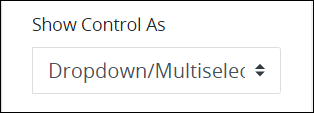 
5. Select the **Allow multiple selections** option to allow multiple selections from this control. Otherwise, only one option can be selected. 
6. From the **Type of Value Returned** drop-down menu, select one of the following options:
   * **Single Value:** Select the **Single Value** option to indicate that only a part of the JSON object specified from the Option Label Shown displays as each option in this control.
   * **Object:** Select the **Object** option to indicate that the entire JSON object within each item of the array displays as each option in this control.  
7. If the **Single Value** option from the **Type of Value Returned** setting is selected, the **Value** setting displays. In the **Value** setting, enter the JSON object key name from within the JSON array containing the JSON response that this control stores in that Request's data when this ProcessMaker Screen submits. To use all items in the JSON array, do not enter a value into the **Value** setting. Use JSON dot notation as necessary if the relevant JSON array containing the object key name is embedded in other JSON objects and/or arrays. Optionally, use [mustache syntax](https://mustache.github.io/mustache.5.html) to indicate the JSON key name from within the JSON array. **value** is the default setting. See [Dependent Field Design Example Using Select List Controls](select-list-control-settings.md#dependent-field-design-example-using-select-list-controls). 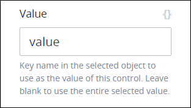 
8. In the **Content** setting, enter the JSON object key name from within the JSON array containing the JSON response to display as each option in this control. To use all JSON object key names in the JSON object, do not enter a value into the **Content** setting. Use JSON dot notation as necessary. Optionally, use mustache syntax to indicate the JSON object key name from within the JSON array.

   **content** is the default value.  
   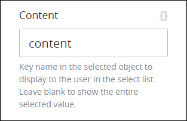 

9. From the **Data Connector** drop-down menu, select from which ProcessMaker Data Connector to reference as a data source. If a ProcessMaker Data Connector does not exist, this setting has no options.  
10. From the **Endpoint** drop-down menu, select which [Endpoint](../../../data-connector-management/what-is-a-data-connector.md#what-is-an-endpoint) to reference from the selected ProcessMaker Data Connector. These Endpoints are configured from the ProcessMaker Data Connector itself. Depending on the ProcessMaker Data Connector selected from the **Data Connector Name** drop-down menu, these Endpoints may reference API endpoints, ProcessMaker Collection records, or other data source endpoints.  
11.  In the **PMQL** setting, optionally enter a [PMQL](../../../../using-processmaker/search-processmaker-data-using-pmql.md#overview) expression to filter which data in the JSON data array to display as options in this control based on which JSON objects in that array meet the PMQL expression's criteria.  

Consider the following example of doctors who work in a clinic. 

```javascript
doctors = [
    {id: 1, name: 'Adam Ardin', gender: 'male'},
    {id: 2, name: 'Amanda Creek', gender: 'female'},
    {id: 3, name: 'Lucy Morales', gender: 'female'},
    {id: 4, name: 'Mindy Smith', gender: 'female'},
    {id: 5, name: 'Toby Tomlinson', gender: 'male'}
]
```

Use the following settings to reference this data array as options for this control:

* **Element Name:** `doctors`
* **Value:** `id`
* **Content:** `name`

Suppose that a new patient at the clinic indicates that she wants to see a female doctor. To filter doctors from this JSON data array who are female in the clinic so that only those objects display as options in a Select List control, use the following PMQL expression in the **PMQL** setting of that control:

`gender = "female"`

### Design Panel Settings

Click the control while in [Design](../screens-builder-modes.md#design-mode) mode, and then click the **Design** panel that is on the right-side of the Screen Builder canvas.

Below are settings for the Select List control in the **Design** panel:

* [Text Color](select-list-control-settings.md#text-color)
* [Background Color](select-list-control-settings.md#background-color)

#### Text Color

Select the text color that displays for this control. Optionally, click the **Clear Color Selection** option to remove the selected color.  
 

#### Background Color

Select the background color that displays for this control. Optionally, click the **Clear Color Selection** option to remove the selected color.  
 

### Advanced Panel Settings

Click the control while in [Design](../screens-builder-modes.md#design-mode) mode, and then click the **Advanced** panel that is on the right-side of the Screen Builder canvas.

Below are settings for the Select List in the **Advanced** panel:

* [Default Value](select-list-control-settings.md#default-value)
* [Visibility Rule](select-list-control-settings.md#visibility-rule)
* [CSS Selector Name](select-list-control-settings.md#css-selector-name)

#### Default Value


### Topic Update

This topic is updated for ProcessMaker version 4.0.1. See the [Release Notes](https://processmaker.gitbook.io/processmaker-release-notes/processmaker-4.0.x/processmaker-4.0.1-release-notes#screen-builder).


Enter the default value this control displays. If the **Default Value** setting has no value, then this control does not display a value when the ProcessMaker Screen displays. When the ProcessMaker Screen submits, the Request uses this control's default value unless the Request participant changes it. The **Default Value** setting supports [mustache syntax](https://mustache.github.io/mustache.5.html) as the default value. For example, if the **Default Value** setting is `{{ data.SelectList1.response.content }}`, this control displays from that control's options by default during the Request.

There are two ways to enter the default value this control displays.



Enter the default value as text.  
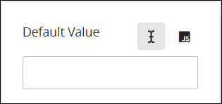 



Enter the default value as JavaScript, especially if a [Calculated Property](../manage-computed-properties/what-is-a-computed-property.md) might change this default value setting. Ensure to use the [`this.` JavaScript keyword](https://www.w3schools.com/js/js_this.asp) preceding the ProcessMaker Screen control reference. Example: `this.FullName` when `FullName` is the **Variable Value** setting value for the control to set its default value.  
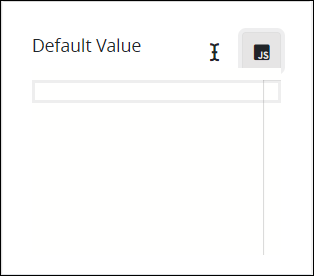 



#### Visibility Rule

#### Visibility Rule

Specify an expression that indicates the condition\(s\) under which this control displays. See [Expression Syntax Components for "Visibility Rule" Control Settings](expression-syntax-components-for-show-if-control-settings.md#expression-syntax-components-for-show-if-control-settings). If this setting does not have an expression, then this control displays by default.  
 


To make this control hidden until another control contains a value, enter the **Variable Name** setting value of that control to this control's **Visibility Rule** setting.


#### CSS Selector Name

Enter the value to represent this control in custom CSS syntax when in [Custom CSS](../add-custom-css-to-a-screen.md#add-custom-css-to-a-processmaker-screen) mode. As a best practice, use the same **CSS Selector Name** value on different controls of the same type to apply the same custom CSS style to all those controls.  
 

## Dependent Field Design Example Using Select List Controls

### Overview

The following example demonstrates dependent fields: how the options in one Select List control depend on which option is selected from a previous Select List control. This example demonstrates that after a country is selected from one Select List control, a second Select List control contains as options the states and/or provinces in that selected country.

The Select List control that contains the countries as its options gets those options from a [ProcessMaker Data Connector](../../../data-connector-management/what-is-a-data-connector.md) that uses an [Endpoint](../../../data-connector-management/what-is-an-endpoint.md) to get the list of countries and their corresponding ISO codes from a third-party application program interface \(API\). A [Watcher](../manage-watchers/what-is-a-watcher.md) monitors when a country is selected, and then another ProcessMaker Data Connector uses an Endpoint to get the list of states and/or provinces from that selected country based on that country's ISO code. The Watcher stores that list of states/provinces as a Request variable in that Request's data so that the second Select List control may access that list to display as its options. The second Select List control's options depend on the first Select List control's selection.


The [Data Connector package](../../../../package-development-distribution/package-a-connector/data-connector-package.md) must be installed in your ProcessMaker instance to do this example. The [Data Connector](../../../data-connector-management/what-is-a-data-connector.md) package is not available in the ProcessMaker open-source edition. Contact [ProcessMaker Sales](https://www.processmaker.com/contact/) or ask your ProcessMaker sales representative how the Data Connectors package can be installed in your ProcessMaker instance.


Click the video below to watch a demonstration of this example.

* **Intended audience:** Process designers, Web designers, graphic designers, software developers, coding engineers
* **Viewing time:** 21 minutes; contains narration
* **Note:** The video demonstrates how to configure the Select List controls using obsolete settings. The written form of this example documents how to configure the Select List controls using current settings.



This example refers to Request data, Request variables, and uses JSON. If you are not familiar with these ProcessMaker concepts or JSON, see the following topics for a primer:

* [What Is Request Data?](../../../../json-the-foundation-of-request-data/what-is-request-data.md)
* [What is a Request Variable?](../../../../json-the-foundation-of-request-data/what-is-a-request-variable.md)
* [What is JSON?](../../../../json-the-foundation-of-request-data/what-is-json.md)

This example contains the following procedures in this order:

1. **Create the ProcessMaker Data Connector that gets the list of countries for one Select List control:** Create the ProcessMaker Data Connector that gets a JSON array containing a JSON object for each country. One Select List control in this example uses this ProcessMaker Data Connector's API response to get the list of countries as its options. This ProcessMaker Data Connector accesses a public API that has been made available for demonstration purposes, so it does not require host authentication. As part of the ProcessMaker Data Connector's JSON array response, it includes the two-letter [International Organization for Standardization](https://www.iso.org/iso-3166-country-codes.html) \(ISO\) country code in each JSON object, which is required for the second ProcessMaker Data Connector as described below. See [Create the ProcessMaker Data Connector That Gets a JSON Array of Countries in its Response](select-list-control-settings.md#create-the-processmaker-data-connector-that-gets-a-json-array-of-countries-in-its-response).
2. **Create the ProcessMaker Data Connector that gets the list of states and/or provinces for the dependent Select List control based on the first Select List control's option selection:** After selecting a country as an option from the first Select List control, create another ProcessMaker Data Connector that gets the region for the selected country based on its two-letter International Organization for Standardization \(ISO\) country code. The [Endpoint](../../../data-connector-management/what-is-an-endpoint.md)'s URL to get the regions for the selected country requires the two-letter ISO country code to get that country's regions as described above. The Endpoint's URL gets the entire JSON object for a selected country from the [Watcher](../manage-watchers/what-is-a-watcher.md) as described below.

   This ProcessMaker Data Connector accesses an API host under [Creative Commons license](http://creativecommons.org/licenses/by/3.0.) that requires signing up for authentication. To demonstrate how to add request headers to a ProcessMaker Data Connector's Endpoint, the authentication information for this API host is configured in an Endpoint's request headers instead of the **Authentication** tab of the Data Connector. Before creating this ProcessMaker Data Connector, [read about the API host](https://rapidapi.com/wirefreethought/api/geodb-cities/details), and then [sign up to access the API](https://rapidapi.com/). This example uses this API host for demonstration purposes only since it returns only the first five JSON objects in its JSON array response for the United States that has the two-letter ISO country code of "US". Note that third-party APIs change their terms of use, so ensure that you are comfortable signing up to use this API host for this example. See [Create the ProcessMaker Data Connector That Gets a JSON Array of Regions in its Response Based on a Selected Country](select-list-control-settings.md#create-the-processmaker-data-connector-that-gets-a-json-array-of-regions-in-its-response-based-on-a-selected-country).

3. **Configure the Select List control to select a country:** From the ProcessMaker Screen to use for this example, add and configure the first Select List control from which to select a country. When a country is selected, that country's name is stored in a Request variable called `country` for the Watcher that monitors when a country has been selected. The Watcher, in turn, sends that country name to the second ProcessMaker Data Connector to get that country's regions as described below. See [Configure the Select List Control's Data Source That Gets the List of Countries](select-list-control-settings.md#configure-the-select-list-controls-data-source-that-gets-the-list-of-countries).
4. **Configure the Watcher that monitors for a country selection:** Configure the Watcher that monitors when a country is selected from the first Select List control, and then send that country's name to the second ProcessMaker Data Connector to get the regions for that country. When the Watcher sends the selected country name, it sends the entire JSON object for that selected country, including both that country's name and its two-letter ISO country code the API host requires to get the list of its regions. The second Select List control contains no options until the Watcher sends the country name to the second ProcessMaker Data Connector; this Data Connector's Endpoint URL requires that country name to successfully get the list of regions for that country. After the ProcessMaker Data Connector gets the list of regions for the selected country as a JSON array, the Watcher stores that JSON array in that Request's data in a Request variable called `regions`, from which the second Select List control's regional options are available. See [Configure the Watcher That Sends the Country Name to the ProcessMaker Data Connector to Get That Country's Regions](select-list-control-settings.md#configure-the-watcher-that-sends-the-country-name-to-the-processmaker-data-connector-to-get-that-countrys-regions).
5. **Configure the dependent Select List control to select a region based on the country selection:** Below the first Select List control, add and configure the second Select List control from which to select a region. The regional options that display in this second Select List control depend on which country is selected from the first Select List control. The regional options for this Select List control are not available until the Watcher receives them from the second ProcessMaker Data Connector, and then adds them to that Request's data as described below. See [Configure the Select List Control's Data Source That Gets the List of Regions](select-list-control-settings.md#configure-the-select-list-controls-data-source-that-gets-the-list-of-regions).
6. **Preview the ProcessMaker Screen:** Preview the ProcessMaker Screen to see how the second Select List control depends on the country selected from the first Select List control. Further, preview the JSON data model from the controls as you interact with them. See [Preview the ProcessMaker Screen](select-list-control-settings.md#preview-the-processmaker-screen).

### Create the ProcessMaker Data Connector That Gets a JSON Array of Countries in its Response

Follow these steps to create the ProcessMaker Data Connector that gets a JSON array containing the JSON objects of countries that the first Select List control uses to display a list of countries as its options as [described in this example](select-list-control-settings.md#overview):

1. [Log on](../../../../using-processmaker/log-in.md#log-in) to ProcessMaker.
2. Click the **Designer** option from the top menu. The **Processes** page displays.
3. Click the **Data Connectors** iconfrom the left sidebar. The **Data Connectors** tab displays all ProcessMaker Data Connectors in the **Data Connectors** page.
4. Verify the ProcessMaker Data Connector Category exists in which to assign this Data Connector. If this Category does not exist, see [Create a New Data Connector Category](../../../data-connector-management/manage-data-connectors/manage-data-connector-categories/create-a-new-data-connector-category.md).
5. Click the **+Data Connector** button. The **Create Data Connector** screen displays. 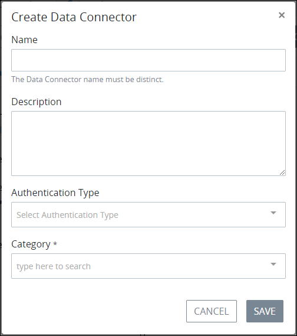 
6. In the **Name** setting, enter the name of the ProcessMaker Data Connector. This example uses the name `Call Countries API`.
7. In the **Description** setting, enter a description of this ProcessMaker Data Connector.
8. From the **Authentication Type** drop-down menu, select the **No Auth** option. This example uses this option because the host does not require authentication from its publicly accessible API.
9. From the **Category** drop-down menu, select the ProcessMaker Data Connector Category to assign this Data Connector.

   This example uses the following settings.  
   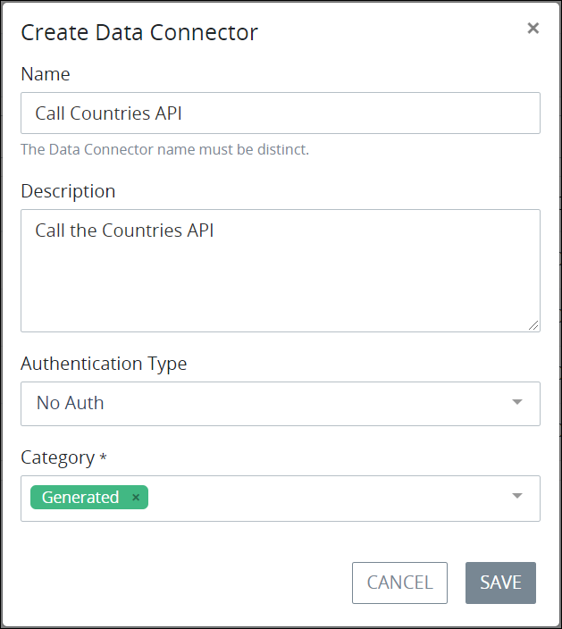 

10. Click **Save**. The **Details** tab displays to edit the settings for this ProcessMaker Data Connector.
11. Click the **Endpoints** tab. This example requires no changes to the **Authorization** tab.
12. Click the **+Endpoint** button. The **Add Endpoint** screen displays. 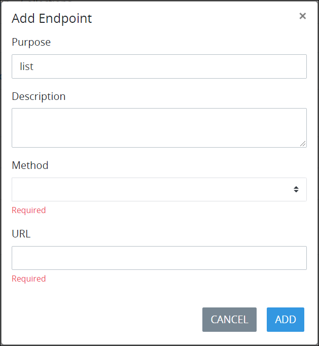 
13. In the **Purpose** setting, optionally edit the purpose for this [Endpoint](../../../data-connector-management/what-is-an-endpoint.md). The value the **Purpose** setting displays from the ProcessMaker asset when configuring the data source from that ProcessMaker asset. In this example, this setting value displays from the Select List control to select this Endpoint to get the list of countries. Therefore, provide a concise but relevant purpose for this Endpoint so other ProcessMaker designers understand its function. This example uses the default `list` for this setting.
14. In the **Description** setting, enter a description of this Endpoint. This example uses the following description: `Gets a list of countries.`.
15. From the **Method** drop-down menu, select the **GET** option. The GET method reads data.
16. In the **URL** setting, enter the following URL for this example: `https://restcountries.eu/rest/v2/all`. This URL is provided by [this host](https://restcountries.eu/).
17. Click **Add**. The new Endpoint displays in the **Endpoints** tab.  
18. Click the **Test** sub-tab in the **Endpoints** tab to verify that the Endpoint functions as intended. 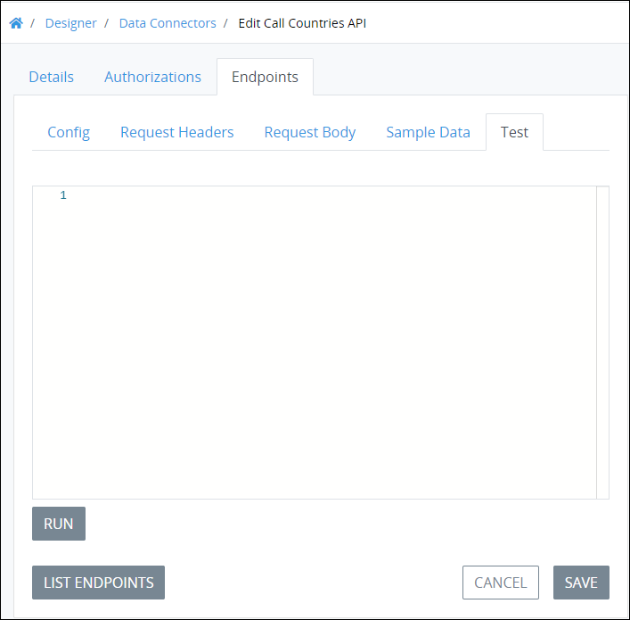 
19. Click **Run**. If configured correctly, the **Test** tab displays the Endpoint response. 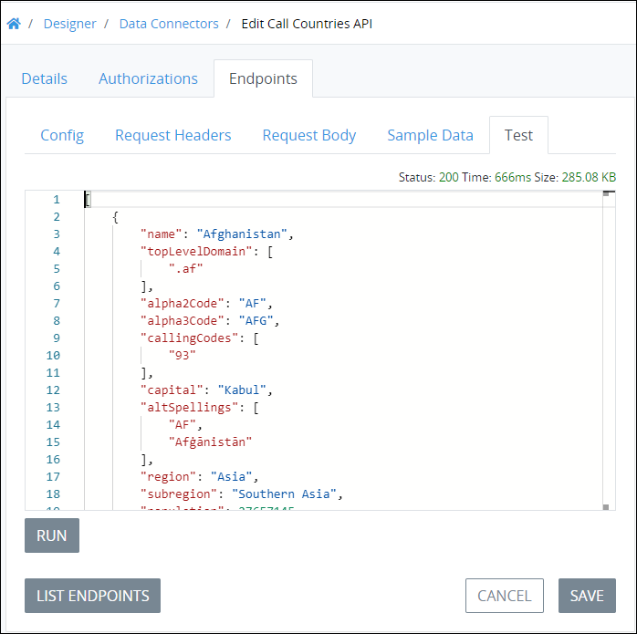 
20. Notice which element in each JSON object within the Endpoint response contains the name of the country. Look at the first JSON object. Notice the following key names in this JSON object:

    * **`name`:** Notice that the `name` key name in the JSON object contains the name of each country; the value of the `name` key name displays as each option in the Select List control from which a country name is selected.
    * **`alpha2Code`:** Notice the `alpha2Code` key name contains the two-letter [International Organization for Standardization \(ISO\) code](https://www.iso.org/iso-3166-country-codes.html) for each country; this Select List control stores the value of the `alpha2Code` key name element. In this example, a [Watcher](../manage-watchers/what-is-a-watcher.md) uses the ISO country code to determine which regions to display in the dependent Select List control.

    Make note of the relevant key name\(s\) that contains relevant data from a data source, as the ProcessMaker asset requires this element name when configuring which data that asset requires from the ProcessMaker Data Connector's Endpoint response. In this example, the ProcessMaker Screen containing the Select List control is the ProcessMaker asset. See [Example JSON Object from the Endpoint Response for the List of Countries](select-list-control-settings.md#example-json-object-from-the-endpoint-response-for-the-list-of-countries).

21. Click **Save** to save the Endpoint. The ProcessMaker Data Connector is configured for this example.

### Create the ProcessMaker Data Connector That Gets a JSON Array of Regions in its Response Based on a Selected Country

Before creating this ProcessMaker Data Connector, [read about the API host](https://rapidapi.com/wirefreethought/api/geodb-cities/details), and then [sign up to access the API](https://rapidapi.com/). Note that third-party APIs change their terms of use, so ensure that you are comfortable signing up to use this API host for this example.

Follow these steps to create the ProcessMaker Data Connector that gets a JSON array containing the JSON objects of regions for the selected country from the first Select List control as [described in this example](select-list-control-settings.md#overview):

1. [Log on](../../../../using-processmaker/log-in.md#log-in) to ProcessMaker.
2. Click the **Designer** option from the top menu. The **Processes** page displays.
3. Click the **Data Connectors** iconfrom the left sidebar. The **Data Connectors** tab displays all ProcessMaker Data Connectors in the **Data Connectors** page.
4. Verify the ProcessMaker Data Connector Category exists in which to assign this Data Connector. If this Category does not exist, see [Create a New Data Connector Category](../../../data-connector-management/manage-data-connectors/manage-data-connector-categories/create-a-new-data-connector-category.md).
5. Click the **+Data Connector** button. The **Create Data Connector** screen displays.  
6. In the **Name** setting, enter the name of the ProcessMaker Data Connector. This example uses the name `Get Regions`.
7. In the **Description** setting, enter a description of this ProcessMaker Data Connector.
8. From the **Authentication Type** drop-down menu, select the **No Auth** option. To demonstrate how to add request headers to a ProcessMaker Data Connector's [Endpoint](../../../data-connector-management/what-is-an-endpoint.md), the authentication information for this API host is configured in an Endpoint's request headers instead of the Authentication tab of the Data Connector.
9. Disable the **Enable SSL certificate verification** setting, which is enabled by default.
10. From the **Category** drop-down menu, select the ProcessMaker Data Connector Category to assign this Data Connector.

    This example uses the following settings.  
    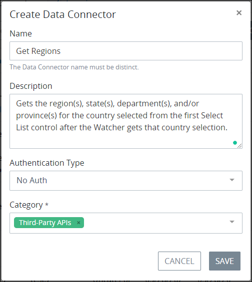 

11. Click **Save**. The **Details** tab displays to edit the settings for this ProcessMaker Data Connector.
12. Click the **Endpoints** tab since this example provides API authentication information in an Endpoint's request headers.
13. Click the **+Endpoint** button. The **Add Endpoint** screen displays.  
14. In the **Purpose** setting, optionally edit the purpose for this Endpoint. The value the **Purpose** setting displays from the ProcessMaker asset when configuring the data source from that ProcessMaker asset. In this example, this setting value displays from the Select List control to select this Endpoint to get the list of regions from the selected country from the first Select List control. Therefore, provide a concise but relevant purpose for this Endpoint so other ProcessMaker designers understand its function. This example uses the default `list` for this setting.
15. In the **Description** setting, enter a description of this Endpoint. This example uses the following description: `Gets a list of regions from the selected country.`.
16. From the **Method** drop-down menu, select the **GET** option. The GET method reads data.
17. In the **URL** setting, enter the following URL for this example: `https://wft-geo-db.p.rapidapi.com/v1/geo/countries/{{country}}/regions`. Notice how this URL contains the API resource parameter `{{country}}` within it. This URL uses [mustache syntax](https://mustache.github.io/mustache.5.html) to get the value from the [Watcher](../manage-watchers/what-is-a-watcher.md); in this example, the Watcher monitors when the Select List control of which its **Variable Name** setting value is `country` has a selected option, and then sends that country's name to this ProcessMaker Data Connector. By using mustache syntax in this Endpoint's URL, that country's name replaces `{{country}}` as an API resource parameter when this Endpoint calls that resource. See [Create the Select List Control to Select a Country](select-list-control-settings.md#create-the-select-list-control-to-select-a-country) and [Configure the Watcher That Sends the Country Name to the ProcessMaker Data Connector to Get That Country's Regions](select-list-control-settings.md#configure-the-watcher-that-sends-the-country-name-to-the-processmaker-data-connector-to-get-that-countrys-regions).
18. Click **Add**. The new Endpoint displays in the **Endpoints** tab. 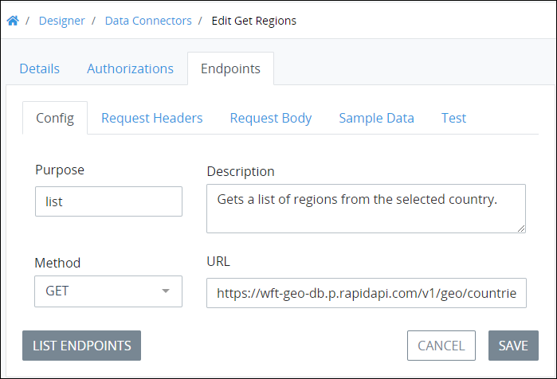 
19. Click the **Request Headers** sub-tab in the **Endpoints** tab to add request headers that contain the authentication information to access the host's API. This example requires two request headers that  provide valid authentication to access this API's endpoint.  
    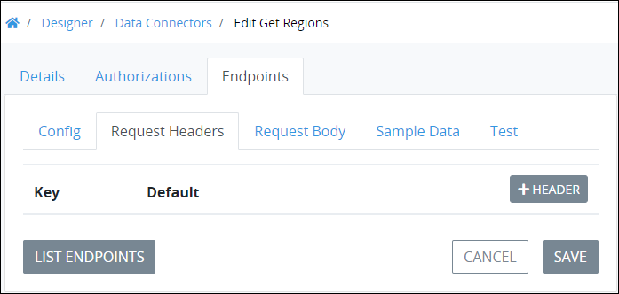 

    These request headers are required header parameters for the [`Locales` endpoint using the GET method](https://rapidapi.com/wirefreethought/api/geodb-cities): `X-RapidAPI-Host` and `X-RapidAPI-Key`. Note that the `X-RapidAPI-Key` header parameter value is unique for each person using this API for authentication.  
     

20. Click the **+Header** button to add the first request header. The **Add** screen displays. 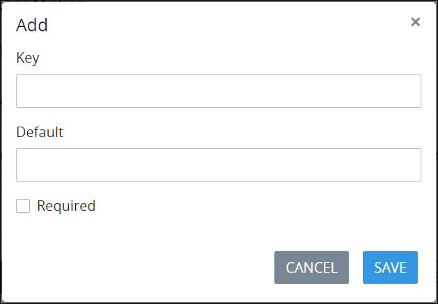 
21. In the **Key** setting for the first request header, enter `x-rapidapi-host` as specified by the API host for this request parameter.
22. In the **Default** setting for the first request header, enter `wft-geo-db.p.rapidapi.com` as specified by the API host for this request parameter.
23. Click **Save**. The first request header displays in the **Request Headers** sub-tab.
24. Click the **+Header** button to add the second request header. The **Add** screen displays.
25. In the **Key** setting for the second request header, enter `X-RapidAPI-Key` as specified by the API host for this request parameter for authentication.
26. In the **Default** setting for the second request header, enter your unique application key for authentication.
27. Click **Save**. The second request header displays in the **Request Headers** sub-tab. 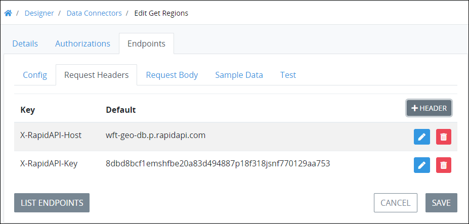 
28. Click **Save** to save the Endpoint with the two configured request headers.
29. To test if the Endpoint and its authentication application key function as intended, click the **Config** sub-tab to change the `{{country}}` in this Endpoint's **URL** setting to a real two-letter ISO country code such as `US`.
30. Click the **Test** sub-tab in the **Endpoints** tab to verify that the Endpoint functions as intended. 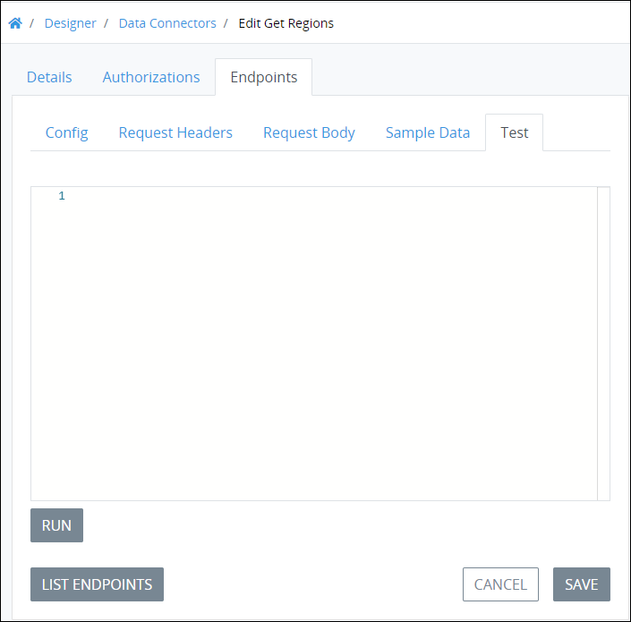 
31. Click **Run**. If configured correctly, the **Test** tab displays the Endpoint response. This example returns only the first five JSON objects in its JSON array response since this example uses this API host for demonstration purposes.
32. Notice the following:
    * **`data`:** Notice that the JSON array containing the response is called `data`. The name of this JSON array is relevant when configuring the Select List control from which to select the country's region.
    * **`name`:** Notice which element in each JSON object within the Endpoint response contains the name of the region: in this test, the states and provinces within the United States. Look at the first JSON object. Notice that the JSON key name called `name` in the JSON object contains the name of the state; the value of the JSON key name `name` displays as each option in the Select List control from which a region is selected.
33. Click the **Config** sub-tab to change `US` in this Endpoint's **URL** setting to `{{country}}`, and then click **Save**.

### Configure the Select List Control's Data Source That Gets the List of Countries

Follow these steps to configure the Select List control's data source to get the list of countries as [described in this example](select-list-control-settings.md#overview):

1. [Log on](../../../../using-processmaker/log-in.md#log-in) to ProcessMaker.
2. [Create the ProcessMaker Screen](../../manage-forms/create-a-new-form.md#create-a-new-processmaker-screen) for the example to contain the two Select List controls and [Watcher](../manage-watchers/what-is-a-watcher.md).
3. [Add the Select List control](select-list-control-settings.md#add-the-control-to-a-processmaker-screen) from which to select a country from the list of countries.
4. [Configure the settings](select-list-control-settings.md#inspector-settings) for the Select List control. This procedure only discusses how to configure this Select List control's data source settings. However, in the [**Variable Name** setting](select-list-control-settings.md#variable-name), enter `country` since both the Watcher and the [ProcessMaker Data Connector](../../../data-connector-management/what-is-a-data-connector.md) that gets the regions for the selected country from this Select List control expect this **Variable Name** setting value. 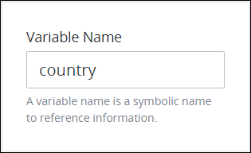 
5. Click the **Data Source** panel.
6. From the **Data Source** drop-down menu, select **Data Connector**. 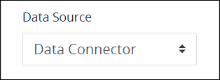 
7. From the **Options Variable** setting, do not change the default **response** value. The name of the JSON array is called `response` by default after the ProcessMaker Data Connector's Endpoint interacts with the API resource.  
8. From the **Show Control As** drop-down menu, select whether to show this Select List control's options as a drop-down menu or as a group of checkboxes. This example uses the **Dropdown/Multiselect** option.  
9. Do not select the **Allow Multiple Selections** option. In this example, only one country must be selected for this example to function because the [Watcher](../manage-watchers/what-is-a-watcher.md) that monitors when a selection is made may only send one country name to the [ProcessMaker Data Connector](../../../data-connector-management/what-is-a-data-connector.md) that gets the regions in that country.  
10. From the **Type of Value Returned** setting, do not change the default **Single Value** option since this example requires only one value from the selected JSON object and not the entire JSON object itself.  
11. From the **Value** setting, enter `alpha2Code` to get the value of the `alpha2Code` JSON object key name's value. [When testing the first ProcessMaker Data Connector that gets the list of countries](select-list-control-settings.md#create-the-processmaker-data-connector-that-gets-a-json-array-of-countries-in-its-response),

     `alpha2Code` is the JSON object key name that contains the two-letter ISO country code ~~the second ProcessMaker Data Connector uses to get that country's regions~~.  
    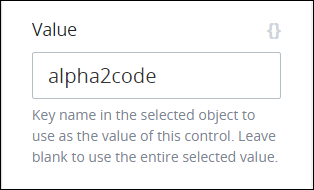 

12. From the **Content** setting, do not change the default **name** value since the content for each option this example requires is the JSON object element `name` of which its value is the country's name. [When testing the first ProcessMaker Data Connector that gets the list of countries](select-list-control-settings.md#create-the-processmaker-data-connector-that-gets-a-json-array-of-countries-in-its-response), `name` JSON object element contains the country name as its value within each JSON object of the JSON array response. 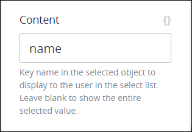 
13.  From the **Data Connector** drop-down menu, select **Call Countries API**, which is the [name of the ProcessMaker Data Connector that gets the list of countries](select-list-control-settings.md#create-the-processmaker-data-connector-that-gets-a-json-array-of-countries-in-its-response). 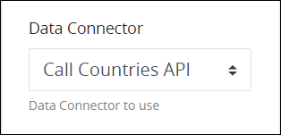 
14. From the **End Point** drop-down menu, select **list**, which is the name of the [Endpoint](../../../data-connector-management/what-is-an-endpoint.md) in the Call Countries API that gets the list of countries from the API's resource. 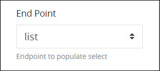 
15. [Save your ProcessMaker Screen](../save-a-screen.md#save-a-processmaker-screen), and then continue to [configure the Watcher that sends the country name to the ProcessMaker Data Connector that gets that country's regions](select-list-control-settings.md#configure-the-watcher-that-sends-the-country-name-to-the-processmaker-data-connector-to-get-that-countrys-regions).

### Configure the Watcher That Sends the Country Name to the ProcessMaker Data Connector to Get That Country's Regions

Follow these steps to configure the Watcher as [described in this example](select-list-control-settings.md#overview):

1. [Log on](../../../../using-processmaker/log-in.md#log-in) to ProcessMaker.
2. [Open](../../manage-forms/view-all-forms.md#view-all-scripts) the ProcessMaker Screen for this example. Ensure that this ProcessMaker Screen [contains the first Select List control configured for this example](select-list-control-settings.md#configure-the-select-list-controls-data-source-that-gets-the-list-of-regions).
3. Click the **Watchers** button. The **Watchers** screen displays all Watchers configured for this ProcessMaker Screen. 
4. Click the **+Watcher** button. The **Watchers** screen displays with the **Configuration** panel expanded. 
5. In the **Watcher Name** setting, enter the name of the Watcher. This example uses the name `Get Region`.
6. From the **Variable to Watch** drop-down menu, select **country**. `country` is the **Variable Name** setting value for the Select List control from which a country is selected. This Watcher monitors for when a value is selected from this control: in this example, a country name. After the monitored control has a value, then the Watcher triggers.
7. Deselect the **Run Synchronously** toggle key. For this example, the Watcher's action must not synchronously while the ProcessMaker Screen remains functional to the Screen user: the ProcessMaker Screen locks until the Watcher's action completes so the ProcessMaker Data Connector that gets the list of regions from the selected country may run, get its response, and then return that JSON array response to this Watcher.
8. Confirm the settings in the **Configuration** panel. 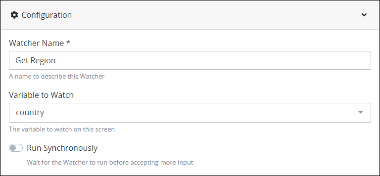 
9. Select the **Source** panel.  
10. From the **Source** drop-down menu, select **Get Regions**. `Get Regions` is the name of the ProcessMaker Data Connector that gets the list of regions from the selected country.
11. From the **Endpoint** drop-down menu, select **list**. `list` is the name of the ProcessMaker Data Connector's Endpoint that gets the list of regions from the selected country.
12. In the **Input Data** setting, replace the default curly brackets with the following JSON object that the Watcher passes to the ProcessMaker Data Connector prior to acting upon the selected Endpoint:

    `{"country": "{{country}}"}`

    This example uses `"country"` as the JSON key name from which to reference `{{country}}`, which is the **Variable Name** setting value of the Select List control from which to select a country in [mustache syntax](https://mustache.github.io/mustache.5.html). When the ProcessMaker Screen previews or opens during a Request, the selected country name in that Select List control replaces `{{country}}`. Ensure that quotation marks surround `{{country}}` since this is [JSON object is of string data type](../../../../json-the-foundation-of-request-data/what-is-json.md#json-data-types) that requires its values to be surrounded by quotation marks. This Watcher passes the entire JSON object for the selected country, including its name and its two-letter [International Organization for Standardization \(ISO\) code](https://www.iso.org/iso-3166-country-codes.html) that the API host requires to get its list of regions. This JSON object containing the list of countries and ISO codes is acquired from the first ProcessMaker Data Connector.

13. Confirm the settings in the **Source** panel. 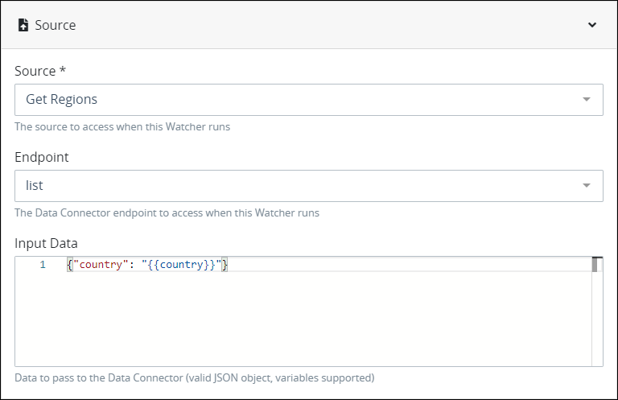 
14. Select the **Output** panel.  
15. In the **Output Variable** setting, enter either the Request variable or the control by its **Variable Name** setting value that the Watcher outputs the value of its result. This example outputs the JSON array response from the ProcessMaker Data Connector to a Request variable called `regions` so as to demonstrate how the second Select List control may use Request data as its data source from which to get its options. However, you may enter the **Variable Name** setting value for the Select List control from which to select a country region, which has not yet been added or configured yet for this example.
16. Confirm the settings in the **Output** panel. 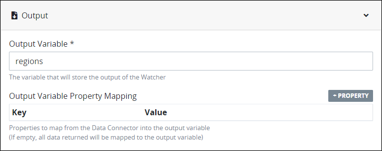 
17. Click **Save**. The Watcher displays in the **Watchers** screen. 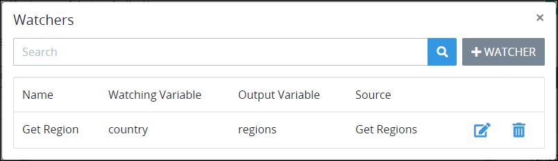 
18. Close the **Watchers** screen, and then [continue to add and configure the Select List control's data source that gets the list of regions](select-list-control-settings.md#configure-the-select-list-controls-data-source-that-gets-the-list-of-regions).

### Configure the Select List Control's Data Source That Gets the List of Regions

Follow these steps to configure the Select List control's data source to get the list of countries as [described in this example](select-list-control-settings.md#overview):

1. [Log on](../../../../using-processmaker/log-in.md#log-in) to ProcessMaker.
2. [Open](../../manage-forms/view-all-forms.md#view-all-scripts) the ProcessMaker Screen for this example. Ensure that this ProcessMaker Screen [contains the first Select List control configured for this example](select-list-control-settings.md#configure-the-select-list-controls-data-source-that-gets-the-list-of-regions).
3. [Add the Select List control](select-list-control-settings.md#add-the-control-to-a-processmaker-screen) below the first Select List control from which to select a region from the selected country.
4. [Configure the settings](select-list-control-settings.md#inspector-settings) for the Select List control. This procedure only discusses how to configure this Select List control's data source settings.
5. Click the **Data Source** panel.
6. From the **Data Source** drop-down menu, select **Request Data**. 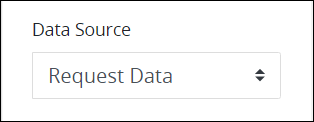 
7. In the **Options Variable** setting, enter `regions.response.data` that uses [JSON dot notation](../../../../json-the-foundation-of-request-data/what-is-json.md#json-dot-notation) for the following reasons:
   * The Watcher outputs to Request data it receives from the ProcessMaker Data Connector to the Request variable called `regions`.
   * The ProcessMaker Data Connector receives its response from the API resource in a JSON object element called `response` by default.
   * The JSON array nested in the `response` JSON object is called `data` as shown [when testing the ProcessMaker Data Connector's Endpoint to get a list of regions](select-list-control-settings.md#create-the-processmaker-data-connector-that-gets-a-json-array-of-regions-in-its-response-based-on-a-selected-country). 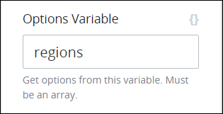 
8. In the **Option Label Shown** setting, enter `name`. [When testing the ProcessMaker Data Connector that gets the list of a country's regions](select-list-control-settings.md#create-the-processmaker-data-connector-that-gets-a-json-array-of-regions-in-its-response-based-on-a-selected-country), the key name called `name` contains the region in each JSON object of the JSON array the ProcessMaker Data Connector returns to the Watcher. The Watcher then outputs this JSON array to the Request variable `regions` from which this Select List control's options derive. 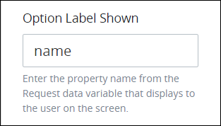 
9. From the **Show Control As** drop-down menu, select whether to show this Select List control's options as a drop-down menu or as a group of checkboxes. This example uses the **Dropdown/Multiselect** option.  
10. Select the **Allow Multiple Selections** option if you would like the Request participant to select more than one country region. This example does not use this setting. 
11. From the **Type of Value Returned** setting, do not change the default **Single Value** option since this example requires only one value from the selected JSON object and not the entire JSON object itself.  
12. From the **Variable Data Property** setting, enter `name` to store the selected country region in a JSON object key name called `name`. 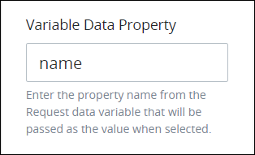 
13. [Save your ProcessMaker Screen](../save-a-screen.md#save-a-processmaker-screen). The ProcessMaker Screen is now [ready to preview](select-list-control-settings.md#preview-the-processmaker-screen) how this Select List control depends on the country selected from the first Select List control.

### Preview the ProcessMaker Screen

Follow these steps to preview the ProcessMaker Screen as [described in this example](select-list-control-settings.md#overview):

1. [Log on](../../../../using-processmaker/log-in.md#log-in) to ProcessMaker.
2. [Open](../../manage-forms/view-all-forms.md#view-all-scripts) the ProcessMaker Screen for this example.
3. Click the **Preview** button. The ProcessMaker Screen is in [Preview mode](../screens-builder-modes.md#preview-mode).
4. From the **Country** Select List control, select **United States of America** since the API host that gets the list of regions only returns five JSON objects in its JSON array response when the two-letter [International Organization for Standardization \(ISO\) code](https://www.iso.org/iso-3166-country-codes.html) is "US". After making a selection, a screen displays while the Watcher sends the selected country name to the ProcessMaker Data Connector that gets that country's regions, returns that JSON array of objects to the Watcher, and then the Watcher stores that response to the `regions` Request variable in the preview. 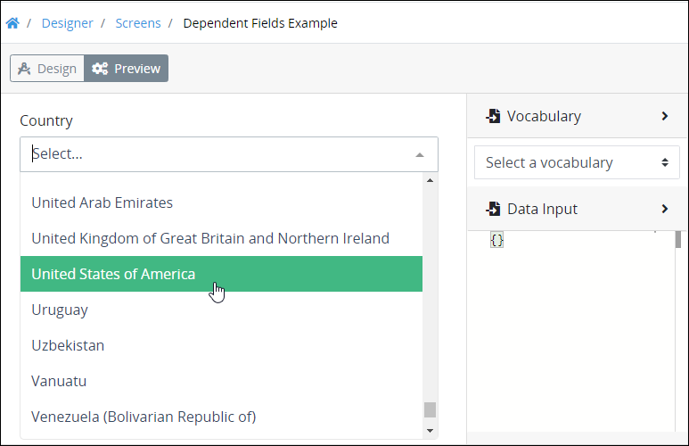 
5. Click the **Region** Select List control. The first five alphabetical states in the United States are options. There are only five options since this example uses the API host that returns only five JSON objects in the JSON array response for demonstration purposes.
6. Select one of the five states. 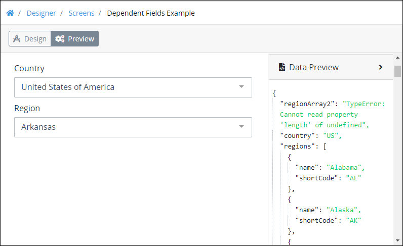 
7. Expand the **Data Preview** panel. Notice the JSON data model generated by the ProcessMaker assets used in this example:
   * **`country`:** The JSON data object with the key name `country` represents the Select List control from which the country was selected. This JSON data object contains the two-letter International Organization for Standardization \(ISO\) code for the United States \(`"US"`\).
   * **`regions`:** The JSON array called `regions` contains the JSON objects for the first five alphabetical states in the United States.

This example is complete.

### Example JSON Object from the Endpoint Response for the List of Countries

Below is one JSON object from the Endpoint response that gets the list of countries. The key names relevant in this JSON object for [this example](select-list-control-settings.md#overview) are `Call Countries API` and `alpha2Code`.

```text
{
        "name": "Afghanistan",
        "topLevelDomain": [
            ".af"
        ],
        "alpha2Code": "AF",
        "alpha3Code": "AFG",
        "callingCodes": [
            "93"
        ],
        "capital": "Kabul",
        "altSpellings": [
            "AF",
            "Afġānistān"
        ],
        "region": "Asia",
        "subregion": "Southern Asia",
        "population": 27657145,
        "latlng": [
            33,
            65
        ],
        "demonym": "Afghan",
        "area": 652230,
        "gini": 27.8,
        "timezones": [
            "UTC+04:30"
        ],
        "borders": [
            "IRN",
            "PAK",
            "TKM",
            "UZB",
            "TJK",
            "CHN"
        ],
        "nativeName": "افغانستان",
        "numericCode": "004",
        "currencies": [
            {
                "code": "AFN",
                "name": "Afghan afghani",
                "symbol": "؋"
            }
        ],
        "languages": [
            {
                "iso639_1": "ps",
                "iso639_2": "pus",
                "name": "Pashto",
                "nativeName": "پښتو"
            },
            {
                "iso639_1": "uz",
                "iso639_2": "uzb",
                "name": "Uzbek",
                "nativeName": "Oʻzbek"
            },
            {
                "iso639_1": "tk",
                "iso639_2": "tuk",
                "name": "Turkmen",
                "nativeName": "Türkmen"
            }
        ],
        "translations": {
            "de": "Afghanistan",
            "es": "Afganistán",
            "fr": "Afghanistan",
            "ja": "アフガニスタン",
            "it": "Afghanistan",
            "br": "Afeganistão",
            "pt": "Afeganistão",
            "nl": "Afghanistan",
            "hr": "Afganistan",
            "fa": "افغانستان"
        },
        "flag": "https://restcountries.eu/data/afg.svg",
        "regionalBlocs": [
            {
                "acronym": "SAARC",
                "name": "South Asian Association for Regional Cooperation",
                "otherAcronyms": [],
                "otherNames": []
            }
        ],
        "cioc": "AFG"
    },
```

## Related Topics <a id="related-topics"></a>









































