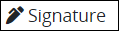
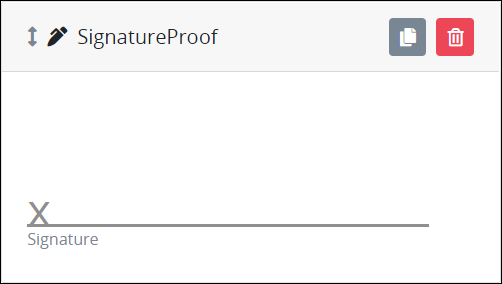
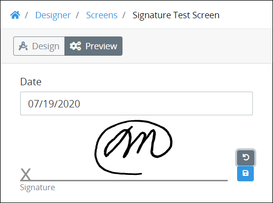
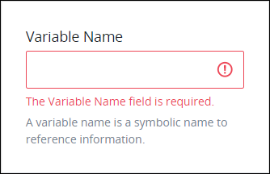
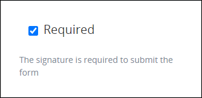

# Signature Control Settings

## Control Description 

The Image control displays an image that is PNG, GIF, or JPG file types.

This control is only available for the following Screen types:

* ​[Form](https://processmaker.gitbook.io/processmaker/designing-processes/design-forms/screens-builder/types-for-screens#form) type
* ​[Display](https://processmaker.gitbook.io/processmaker/designing-processes/design-forms/screens-builder/types-for-screens#display) type

See [Screen Types](https://processmaker.gitbook.io/processmaker/designing-processes/design-forms/screens-builder/types-for-screens).

## Add the Control to a ProcessMaker Screen 


Your ProcessMaker user account or group membership must have the following permissions to add a control to a ProcessMaker Screen unless your user account has the **Make this user a Super Admin** setting selected:

* Screens: Edit Screens
* Screens: View Screens

See the ProcessMaker [Screens](https://processmaker.gitbook.io/processmaker/processmaker-administration/permission-descriptions-for-users-and-groups#screens) permissions or ask your ProcessMaker Administrator for assistance.


Follow these steps to add this control to the ProcessMaker Screen:

1. ​[Create a new ProcessMaker Screen](https://processmaker.gitbook.io/processmaker/designing-processes/design-forms/manage-forms/create-a-new-form) or click the **Edit** iconto edit the selected Screen. The ProcessMaker Screen is in [Design mode](https://processmaker.gitbook.io/processmaker/designing-processes/design-forms/screens-builder/screens-builder-modes#editor-mode).
2. View the ProcessMaker Screen page to which to add the control.
3. Locate the **Signature** iconin the panel to the left of the Screen Builder canvas.
4. Drag the **Signature** icon into the Screen Builder canvas. Existing controls on the Screen Builder canvas adjust positioning based on where you drag the control.
5. Place into the Screen Builder canvas where you want the control to display on the ProcessMaker Screen.

​​

1. Configure the Image control. See Settings.
2. Validate that the control is configured correctly. See [Validate Your Screen](https://processmaker.gitbook.io/processmaker/designing-processes/design-forms/screens-builder/validate-your-screen#validate-a-processmaker-screen).

Below is a digital Signature added in [Preview mode](https://processmaker.gitbook.io/processmaker/designing-processes/design-forms/screens-builder/screens-builder-modes#preview-mode).

## Move the Control on the Page 


Your ProcessMaker user account or group membership must have the following permissions to move a control in a ProcessMaker Screen page unless your user account has the **Make this user a Super Admin** setting selected:

* Screens: Edit Screens
* Screens: View Screens

See the ProcessMaker [Screens](https://processmaker.gitbook.io/processmaker/processmaker-administration/permission-descriptions-for-users-and-groups#screens) permissions or ask your ProcessMaker Administrator for assistance.


After [adding a control to a ProcessMaker Screen page](https://processmaker.gitbook.io/processmaker/designing-processes/design-forms/screens-builder/control-descriptions/image-control-settings#add-the-control-to-a-processmaker-screen), you may move it to another location on that page such that it is above or below other controls placed on that page. A control cannot be moved to another [ProcessMaker Screen](https://processmaker.gitbook.io/processmaker/designing-processes/design-forms/what-is-a-form) page.

Follow these steps to move a control to another location on that ProcessMaker Screen page:

1. Place your cursor anywhere on the control not displaying the **Duplicate Control**or **Delete Control**buttons.
2. Hold your cursor, then drag the control above or below other controls on that ProcessMaker Screen page. Screen Builder previews where the control would display on the page based on how you position the control above or below other controls. If the control cannot be placed in a location because your cursor is above an existing control or too far to the left or right of the page, theicon displays in the preview.
3. Place the control at the location on the page you want it. The other control\(s\) on the page automatically adjust position.

## Copy the Control with its Settings 


Your ProcessMaker user account or group membership must have the following permissions to copy a control in a ProcessMaker Screen unless your user account has the **Make this user a Super Admin** setting selected:

* Screens: Edit Screens
* Screens: View Screens

See the ProcessMaker [Screens](https://processmaker.gitbook.io/processmaker/processmaker-administration/permission-descriptions-for-users-and-groups#screens) permissions or ask your ProcessMaker Administrator for assistance.


Copying a control also copies the current settings of that control. The copied control displays below other controls placed on that [ProcessMaker Screen](https://processmaker.gitbook.io/processmaker/designing-processes/design-forms/what-is-a-form) page.Follow these steps to copy a control:

1. Select the control to be copied.
2. Click the **Duplicate Control** button. The control copies with its current settings, and then displays below other controls placed on that page.

## Delete the Control from a ProcessMaker Screen 


Your ProcessMaker user account or group membership must have the following permissions to delete a control from a ProcessMaker Screen unless your user account has the **Make this user a Super Admin** setting selected:

* Screens: Edit Screens
* Screens: View Screens

See the ProcessMaker [Screens](https://processmaker.gitbook.io/processmaker/processmaker-administration/permission-descriptions-for-users-and-groups#screens) permissions or ask your ProcessMaker Administrator for assistance.


Deleting a control also deletes configuration for that control. If you add another control, it will have default settings.

Follow these steps to delete a control from a [ProcessMaker Screen](https://processmaker.gitbook.io/processmaker/designing-processes/design-forms/what-is-a-form) page:

1. Select the control to be deleted.
2. Click the **Delete** button. The control deletes. Other controls on that ProcessMaker Screen page adjust their locations automatically.

## Settings 


Your user account or group membership must have the following permissions to edit a ProcessMaker Screen control:

* Screens: Edit Screens
* Screens: View Screens

See the ProcessMaker [Screens](https://processmaker.gitbook.io/processmaker/processmaker-administration/permission-descriptions-for-users-and-groups#screens) permissions or ask your ProcessMaker Administrator for assistance


### Permissions Required 

The Signature control has the following panel that contain settings:

* **​Configuration** panel  

### Configuration Panel Settings 

Click the control while in [Design](https://processmaker.gitbook.io/processmaker/designing-processes/design-forms/screens-builder/screens-builder-modes#design-mode) mode, and then click the **Configuration** panel that is on the right-side of the Screen Builder canvas.

Below are settings for the Signature control in the **Variable** panel:

* ​Variable Name
* ​Required

#### Variable Name 

Enter the alphanumeric name that identifies this [ProcessMaker Screen](https://processmaker.gitbook.io/processmaker/designing-processes/design-forms/what-is-a-form). This field is required.

 

#### Required 

Select the **Required** setting to clarify that the signature is required to submit the form.

  

