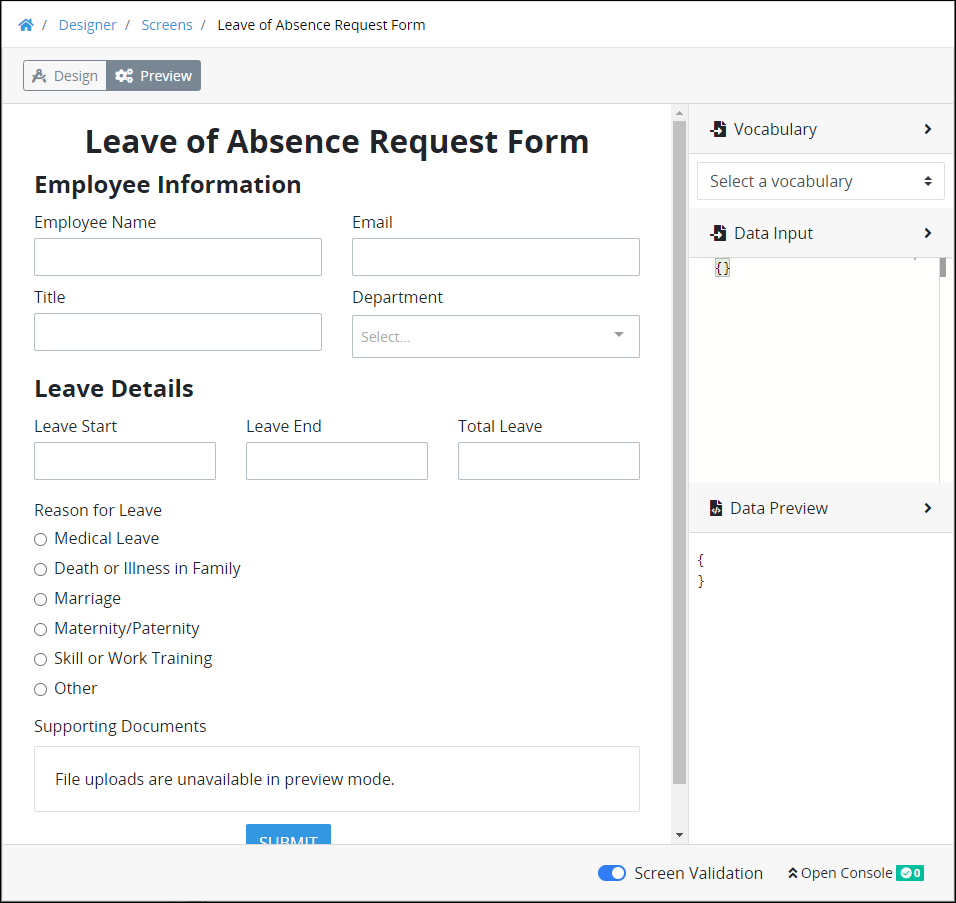
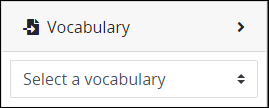
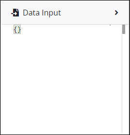
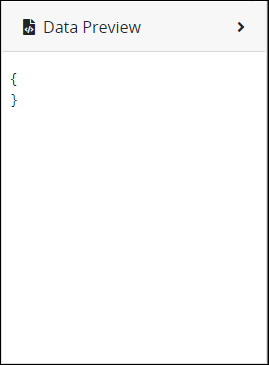

# Preview a Screen and Its JSON Data Model

## Overview

To allow [ProcessMaker Screens](../what-is-a-form.md) to be used among any [Process](../../viewing-processes/what-is-a-process.md), they are represented in [JSON](../../../json-the-foundation-of-request-data/what-is-json.md) format. Processes are also represented as JSON data models that pass [Request data](../../../json-the-foundation-of-request-data/what-is-request-data.md) to [Tasks](../../process-design/model-your-process/process-modeling-element-descriptions.md#user-task) defined in the [Process model](../../process-design/what-is-process-modeling.md). Preview, evaluate, and test how data in your ProcessMaker Screen is passed to JSON data models before using that Screen in Processes.

## Preview Your ProcessMaker Screen


Your ProcessMaker user account or group membership must have the following permissions to preview a ProcessMaker Screen unless your user account has the **Make this user a Super Admin** setting selected:

* Screens: Edit Screens
* Screens: View Screens

See the ProcessMaker [Screens](../../../processmaker-administration/permission-descriptions-for-users-and-groups.md#screens) permissions or ask your ProcessMaker Administrator for assistance.


### Select a ProcessMaker Vocabulary from Which to Evaluate Your ProcessMaker Screen's Compliance


### ProcessMaker Package Required

To use a [ProcessMaker Vocabulary](../../vocabularies-management/what-is-a-vocabulary.md) from which to preview your ProcessMaker Screen, the [Vocabularies package](../../../package-development-distribution/package-a-connector/vocabularies.md) must be installed in your ProcessMaker instance. The Vocabularies [package](../../../package-development-distribution/first-topic.md) is not available in the ProcessMaker open-source edition. Contact [ProcessMaker Sales](https://www.processmaker.com/contact/) or ask your ProcessMaker sales representative how the Vocabularies package can be installed in your ProcessMaker instance.


Optionally, use a ProcessMaker Vocabulary from which to preview your Screen to ensure that it complies with any regulatory compliance that [Tasks](../../../using-processmaker/task-management/what-is-a-task.md) using this Screen must comply. A ProcessMaker Vocabulary is a JSON schema. The JSON schema describes the data objects, types, and structure that you want in both a machine- and human-readable format. The ProcessMaker Vocabulary from which to preview your Screen must already exist.

Follow these steps to use a ProcessMaker Vocabulary during your Screen preview and testing:

1. [Open](../manage-forms/view-all-forms.md) the ProcessMaker Screen. The ProcessMaker Screen is in [Design mode](screens-builder-modes.md#editor-mode).
2. Click the **Preview** button.
3. Expand the **Vocabulary** panel that is on the right-side of the Screen Builder canvas if it is not already.  
4. From the **Select a vocabulary** drop-down menu, select the ProcessMaker Vocabulary from which to verify that your Screen complies with its JSON schema. Screen Builder loads the ProcessMaker Vocabulary, and then evaluates if it is a valid JSON schema. One of the following messages display below the **Select a vocabulary** drop-down menu:
   * **Valid JSON schema:** If the JSON schema is valid, the following message displays: **Data Valid for JSON Schema**.
   * **Invalid JSON schema**: If the JSON schema is not valid, then the **Vocabulary** panel displays the errors that render the JSON schema invalid.
5. Enter or review data in the ProcessMaker Screen controls as you would for a [Task](../../../using-processmaker/task-management/what-is-a-task.md) during a [Request](../../../using-processmaker/requests/what-is-a-request.md). Evaluate if your ProcessMaker Screen processes the Vocabulary's JSON schema appropriately.
6. During your ProcessMaker Screen evaluation, optionally do the following:
   * [Enter mock Request data into your ProcessMaker Screen to evaluate if your Screen processes expected Request data appropriately](preview-a-screen.md#enter-mock-request-data-coming-into-your-processmaker-screen)
   * [Preview the JSON data model your ProcessMaker Screen generates for Requests](preview-a-screen.md#preview-the-json-data-model-your-processmaker-screen-generates-for-requests)

### Enter Mock Request Data Coming Into Your ProcessMaker Screen

Optionally, enter mock Request data into your ProcessMaker Screen to evaluate if your Screen processes expected Request data appropriately. 

In the **Data Input** section, enter a JSON data model as your ProcessMaker Screen's data input to evaluate how JSON data models for different Processes interact with the JSON data model for your ProcessMaker Screen.

Follow these guidelines to enter mock Request data into your ProcessMaker Screen to evaluate how your Screen processes expected Request data:

1. [Open](../manage-forms/view-all-forms.md) the ProcessMaker Screen. The ProcessMaker Screen is in [Design mode](screens-builder-modes.md#editor-mode).
2. Click the **Preview** button.
3. Expand the **Data Input** panel that is on the right-side of the Screen Builder canvas if it is not already.  
4. Enter a JSON data model into the **Data Input** panel. This JSON data model may come from a Process's [Request](../../../using-processmaker/requests/what-is-a-request.md) data or another ProcessMaker Screen. As you enter a JSON data model, the **Screen Validation** indicator displays if your JSON schema has any errors that prevents validation.  

   

5. Enter or review data in the ProcessMaker Screen controls as you would for a [Task](../../../using-processmaker/task-management/what-is-a-task.md) during a [Request](../../../using-processmaker/requests/what-is-a-request.md). Evaluate if your ProcessMaker Screen processes the mock Request data appropriately.
6. During your ProcessMaker Screen evaluation, optionally do the following:
   * [Select a ProcessMaker Vocabulary from which to evaluate your ProcessMaker Screen's compliance](preview-a-screen.md#select-a-processmaker-vocabulary-from-which-to-evaluate-your-processmaker-screens-compliance)
   * [Preview the JSON data model your ProcessMaker Screen generates for Requests](preview-a-screen.md#preview-the-json-data-model-your-processmaker-screen-generates-for-requests)

### Preview the JSON Data Model Your ProcessMaker Screen Generates for Requests

Follow these guidelines to preview the JSON data model your ProcessMaker Screen generates:

1. [Open](../manage-forms/view-all-forms.md) the ProcessMaker Screen. The ProcessMaker Screen is in [Design mode](screens-builder-modes.md#editor-mode).
2. Click the **Preview** button.
3. Expand the **Data Preview** panel that is on the right-side of the Screen Builder canvas if it is not already.  
4. Enter or review data in the ProcessMaker Screen controls as you would for a [Task](../../../using-processmaker/task-management/what-is-a-task.md) during a [Request](../../../using-processmaker/requests/what-is-a-request.md). When data is entered into each control, the **Data Preview** panel adds that control value into a JSON data model using the **Variable Name** setting value of that control. During an in-progress Request, this JSON data model would incorporate into that Request's data model.
5. Evaluate if your ProcessMaker Screen generates data appropriately.
6. During your ProcessMaker Screen evaluation, optionally do the following:
   * [Select a ProcessMaker Vocabulary from which to evaluate your ProcessMaker Screen's compliance](preview-a-screen.md#select-a-processmaker-vocabulary-from-which-to-evaluate-your-processmaker-screens-compliance)
   * [Enter mock Request data into your ProcessMaker Screen to evaluate if your Screen processes expected Request data appropriately](preview-a-screen.md#enter-mock-request-data-coming-into-your-processmaker-screen)


Calculated properties also display in the **Data Preview** panel as part of the JSON data model. See [Manage Calculated Properties](manage-computed-properties/).


## Related Topics

































