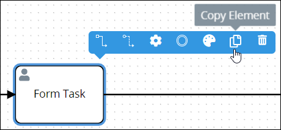

# Copy Process Model Elements or Connectors

## Copy a Start Event Element

Copying a Start Event element copies the original along with its current settings, making it easier and faster to continue designing without adding default elements or [connectors](model-processes-using-connectors/what-is-a-connector.md) with their default settings.

The copied Start Event element displays below the original. Any [Sequence Flow](model-your-process/process-modeling-element-descriptions.md#sequence-flow) and/or [Message Flow](model-your-process/process-modeling-element-descriptions.md#message-flow) elements incoming to or outgoing from the original are not copied.


Permissions are required to do this.


Follow these steps to copy a Start Event element in your Process model:

1. ​[View your Processes](https://processmaker.gitbook.io/processmaker-4-community/-LPblkrcFWowWJ6HZdhC/~/drafts/-LRhVZm0ddxDcGGdN5ZN/primary/designing-processes/viewing-processes/view-the-list-of-processes/view-your-processes#view-all-processes). The **Processes** page displays.
2. Click the **Open Modeler** iconto edit the selected Process model. Process Modeler displays.
3. Select the non-Pool element or connector to copy. Available options display above the selected element/connector.  
4. Click the **Copy Element** icon. The Process model element copies.

## Related Topics





