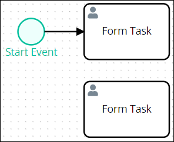
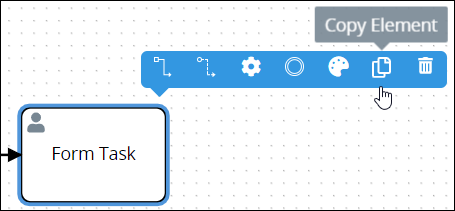

# Copy Process Model Elements or Connectors

## Overview

Copying a Process model element or a [connector](model-processes-using-connectors/what-is-a-connector.md) copies the original element/connector along with its current settings. Copying Process model elements or connectors in your Process model makes it easier to design your model without adding default elements/connectors with their default settings.

The copied Process model element or connector displays below the original. Any [Sequence Flow](model-your-process/process-modeling-element-descriptions.md#sequence-flow) and/or [Message Flow](model-your-process/process-modeling-element-descriptions.md#message-flow) elements incoming to or outgoing from the original are not copied.

The Form Task element is below the original in the following example.

[Pool](model-your-process/process-modeling-element-descriptions.md#pool) elements cannot be copied since they contain other elements and/or connectors.

### Copy Restrictions

The following elements cannot be copied:

* [Boundary Timer Event](model-your-process/process-modeling-element-descriptions.md#boundary-timer-event) elements
* [Boundary Error Event](model-your-process/process-modeling-element-descriptions.md#boundary-error-event) elements
* [Boundary Signal Event](model-your-process/process-modeling-element-descriptions.md#boundary-signal-event) elements
* [Boundary Message Event](model-your-process/process-modeling-element-descriptions.md#boundary-message-event) elements
* [Pool](model-your-process/process-modeling-element-descriptions.md#pool) elements
* [Lane](model-your-process/process-modeling-element-descriptions.md#lane) elements
* [Text Annotation](model-your-process/process-modeling-element-descriptions.md#text-annotation) elements
* [Association](model-your-process/process-modeling-element-descriptions.md#association) elements
* [Sequence Flow](model-your-process/process-modeling-element-descriptions.md#sequence-flow) elements
* [Message Flow](model-your-process/process-modeling-element-descriptions.md#message-flow) elements

## Copy Process Model Elements or Connectors


### Don't Know What Process Model Elements Are?

See [Process Modeling Element Descriptions](model-your-process/process-modeling-element-descriptions.md).

### Don't Know What a Connector Is?

See [What is a Connector?](model-processes-using-connectors/what-is-a-connector.md).

### Permissions Required

Your ProcessMaker user account or group membership must have the following permissions to copy elements or connectors from the Process model unless your user account has the **Make this user a Super Admin** setting selected:

* Processes: Edit Processes
* Processes: View Processes

See the [Process](../../processmaker-administration/permission-descriptions-for-users-and-groups.md#processes) permissions or ask your ProcessMaker Administrator for assistance.


Follow these steps to copy an element or connector in your Process model:

1. ​[View your Processes](https://processmaker.gitbook.io/processmaker-4-community/-LPblkrcFWowWJ6HZdhC/~/drafts/-LRhVZm0ddxDcGGdN5ZN/primary/designing-processes/viewing-processes/view-the-list-of-processes/view-your-processes#view-all-processes). The **Processes** page displays.
2. Click the **Open Modeler** iconto edit the selected Process model. Process Modeler displays.
3. Select the non-Pool element or connector to copy. Available options display above the selected element/connector.  
4. Click the **Copy Element** icon. The Process model element/connector copies.

## Related Topics



