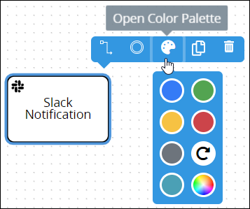
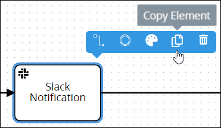
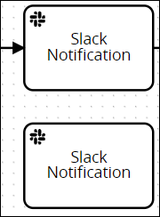
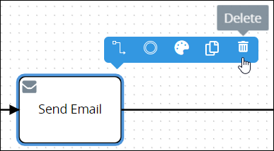

# Slack Notification Connector

## Overview

The [Slack](https://slack.com/) Notification [connector](../what-is-a-connector.md) is part of the [Slack Notification package](../../../../package-development-distribution/package-a-connector/slack-notification-package.md). When you add the Slack Notification connector to your Process model and then select to which Slack channel to send a notification, ProcessMaker can automatically send the notification during [Requests](../../../../using-processmaker/requests/what-is-a-request.md).

## Grant ProcessMaker Access to Your Slack Workspace

Before using the Slack Notification connector in your Process models, your ProcessMaker instance must be granted access to your Slack workspace by building a [Slack App](https://api.slack.com/start/overview). Ask your Slack administrator to help you with the following:

* [Build a Slack app](https://api.slack.com/apps).
* [Install the Slack app to your Slack workspace](https://api.slack.com/authentication).
* [Verify requests from Slack](https://api.slack.com/authentication/verifying-requests-from-slack).

Otherwise, when configuring the Slack Notification connector, the following ProcessMaker error displays: **Request failed with status code 404**.

## Package and Permissions Required

The Send Email connector requires that the [ProcessMaker Send Email package](../../../../package-development-distribution/package-a-connector/email.md) be installed in your ProcessMaker instance. The Send Email connector and the Send Email [package](../../../../package-development-distribution/first-topic.md) are not available in the ProcessMaker open-source edition. Contact [ProcessMaker Sales](https://www.processmaker.com/contact/) or ask your ProcessMaker sales representative how the Send Email connector can be installed in your ProcessMaker instance.

Furthermore, your ProcessMaker user account or group membership must have the following permissions to configure a Send Email connector to the Process model unless your user account has the **Make this user a Super Admin** setting selected:

* Processes: Edit Processes
* Processes: View Processes

See the [Process](../../../../processmaker-administration/permission-descriptions-for-users-and-groups.md#processes) permissions or ask your ProcessMaker Administrator for assistance.

## Add a Slack Notification Connector to the Process Model


[A package and permissions are required to do this](slack-notification-connector.md). Furthermore, [your ProcessMaker instance must be granted access to your Slack workspace](slack-notification-connector.md#grant-processmaker-access-to-your-slack-workspace).


Follow these steps to add a Slack Notification connector to the Process model:

1. [View your Processes](../../../viewing-processes/view-the-list-of-processes/view-your-processes.md#view-all-active-processes). The **Processes** page displays.
2. [Create a new Process](../../../viewing-processes/view-the-list-of-processes/create-a-process.md) or click the **Open Modeler** iconto edit the selected Process model. Process Modeler displays.
3. Locate the **Slack Notification** connector in the **Elements and Connectors** palette that is to the left of the Process Modeler canvas. If the [**Hide Menus** button](../../navigate-around-your-process-model.md#maximize-the-process-modeler-canvas-view)is enabled, the **Elements and Connectors** palette displays the **Slack Notification** connector's icon.  
4. Drag the connector into the Process model canvas where you want to place it. If a Pool element is in your Process model, the Slack Notification connector cannot be placed outside of the Pool element.


After adding the Slack Notification connector, consider adding either of the following Boundary-type Process model elements to design business solutions when your best-case scenarios don't happen:

* [Boundary Timer Event](../../model-your-process/add-and-configure-boundary-timer-event-elements.md#add-a-boundary-timer-event-element) element \([Don't know what that is?](../../model-your-process/process-modeling-element-descriptions.md#boundary-timer-event)\)
* [Boundary Error Event](../../model-your-process/add-and-configure-boundary-error-event-elements.md#add-a-boundary-error-event-element) element \([Don't know what that is?](../../model-your-process/process-modeling-element-descriptions.md#boundary-error-event)\)
* [Boundary Signal Event](../../model-your-process/add-and-configure-boundary-signal-event-elements.md) element \([Don't know what that is?](../../model-your-process/process-modeling-element-descriptions.md#boundary-signal-event)\)


After the connector is placed into the Process model, you may adjust its location in the following ways:

* Move the connector by dragging it to a new location.
* [Select the connector with other elements and/or connectors](../../select-multiple-process-model-elements-and-connectors.md#select-multiple-process-model-objects), and then move them collectively by dragging them to new locations in relation to one another.
* [Align](../../align-and-distribute-process-model-elements-and-connectors.md#align-process-model-objects) and/or [distribute](../../align-and-distribute-process-model-elements-and-connectors.md#distribute-process-model-objects) the connector in relation to other selected elements and/or connectors.


Moving a Slack Notification connector has the following limitations in regards to the following Process model elements:

* **Pool element:** If the Slack Notification connector is inside of a [Pool](../../model-your-process/process-modeling-element-descriptions.md#pool) element, it cannot be moved outside of the Pool element. If you attempt to do so, Process Modeler places the Slack Notification connector inside the Pool element closest to where you attempt to move it.
* **Lane element:** If the Slack Notification connector is inside of a Lane element, it can be moved to another Lane element in the same Pool element. However, the Slack Notification connector cannot be moved outside of the Pool element.


## Change the Color of a Slack Notification Connector

The Slack Notification [connector](../what-is-a-connector.md) and label are black-colored by default. After a Slack Notification connector is [added to a Process model](slack-notification-connector.md#add-a-slack-notification-connector-to-the-process-model), its shape and label color can be changed. Element and connector colors may only be changed individually.


[A package and permissions are required to do this](slack-notification-connector.md#package-and-permissions-required).


Follow these steps to change the color and label for a Slack Notification connector:

1. [View your Processes](https://processmaker.gitbook.io/processmaker-4-community/-LPblkrcFWowWJ6HZdhC/~/drafts/-LRhVZm0ddxDcGGdN5ZN/primary/designing-processes/viewing-processes/view-the-list-of-processes/view-your-processes#view-all-processes). The **Processes** page displays.
2. Click the **Open Modeler** iconto edit the selected Process model. Process Modeler displays.
3. Select the Slack Notification connector to change its color. Available options display above the selected connector.  
4. Click the **Open Color Palette** icon. The color palette displays.
5. Do one of the following:
   * **Select a color swatch:** Select one of the color swatches from the color palette. The Slack Notification connector and label change to that color.
   * **Specify a custom color:** Click theicon to display the color selector, and then select a color, enter the [Hex color code](https://www.color-hex.com/), or enter the red, green, blue, and alpha color values for the custom color. The Slack Notification connector and label change to that color.  
   * **Reset to the default color:** Click theicon to reset the Slack Notification connector and label to its default color.

## Copy a Slack Notification Connector

Copying a Slack Notification [connector](../what-is-a-connector.md) copies the original along with its current settings, making it easier and faster to continue designing without adding default elements or connectors with their default settings.

The copied Slack Notification connector displays below the original. Any [Sequence Flow](../../model-your-process/process-modeling-element-descriptions.md#sequence-flow) and/or [Message Flow](../../model-your-process/process-modeling-element-descriptions.md#message-flow) elements incoming to or outgoing from the original are not copied.


[A package and permissions are required to do this](slack-notification-connector.md).


Follow these steps to copy a Slack Notification connector in your Process model:

1. ​[View your Processes](https://processmaker.gitbook.io/processmaker-4-community/-LPblkrcFWowWJ6HZdhC/~/drafts/-LRhVZm0ddxDcGGdN5ZN/primary/designing-processes/viewing-processes/view-the-list-of-processes/view-your-processes#view-all-processes). The **Processes** page displays.
2. Click the **Open Modeler** iconto edit the selected Process model. Process Modeler displays.
3. Select the Slack Notification connector to copy. Available options display above the selected connector.  
4. Click the **Copy Element** icon. The Process model connector copies.   

## Delete a Slack Notification Connector

Deleting a Process model [connector](../what-is-a-connector.md) also deletes any [Sequence Flow](../../model-your-process/process-modeling-element-descriptions.md#sequence-flow) and/or [Message Flow](../../model-your-process/process-modeling-element-descriptions.md#message-flow) elements incoming to or outgoing from that element. For example, if a Process model connector is deleted that has both incoming and outgoing Sequence Flow elements, the Sequence Flow elements must be reconnected for the remaining elements/connectors.


[A package and permissions are required to do this](slack-notification-connector.md).


Follow these steps to delete a Slack Notification connector from your Process model:

1. ​[View your Processes](https://processmaker.gitbook.io/processmaker-4-community/-LPblkrcFWowWJ6HZdhC/~/drafts/-LRhVZm0ddxDcGGdN5ZN/primary/designing-processes/viewing-processes/view-the-list-of-processes/view-your-processes#view-all-processes). The **Processes** page displays.
2. Click the **Open Modeler** iconto edit the selected Process model. Process Modeler displays.
3. Select the Slack Notification connector to delete. Available options display above the selected connector.  
4. Click the **Delete** icon. The Process model connector deletes.

## Settings

The Slack Notification connector has the following panels that contain settings:

* **Configuration** panel
  * [Edit the connector name](slack-notification-connector.md#edit-the-connector-name)
  * [Select the Slack channel to send the notification](slack-notification-connector.md#select-the-slack-channel-to-send-the-notification)
  * [Enter the Slack notification message to send](slack-notification-connector.md#enter-the-slack-notification-message-to-send)

### Configuration Panel Settings

The Slack Notification connector has the following settings in the **Configuration** panel:

* [Edit the connector name](slack-notification-connector.md#edit-the-connector-name)
* [Select the Slack channel to send the notification](slack-notification-connector.md#select-the-slack-channel-to-send-the-notification)
* [Enter the Slack notification message to send](slack-notification-connector.md#enter-the-slack-notification-message-to-send)

#### Edit the Connector Name

A connector name is a human-readable reference for a Process model control. Process Modeler automatically assigns the name of a Process model connector with its connector type. However, a connector's name can be changed.


[A package and permissions are required to do this](slack-notification-connector.md). Furthermore, [your ProcessMaker instance must be granted access to your Slack workspace](slack-notification-connector.md#grant-processmaker-access-to-your-slack-workspace).


Follow these steps to edit the name for a Data Connector connector:

1. Ensure that the **Hide Menus** buttonis not enabled. See [Maximize the Process Modeler Canvas View](../../navigate-around-your-process-model.md#maximize-the-process-modeler-canvas-view).
2. Select the Slack Notification connector from the Process model in which to edit its name. Panels to configure this connector display.
3. Expand the **Configuration** panel if it is not presently expanded. The **Name** setting displays. This is a required setting.  
4. In the **Name** setting, edit the selected connector's name and then press **Enter**.

#### Select the Slack Channel to Send the Notification

Select to which Slack channel to send the notification. Slack channels are only available for the [Slack workspace that your ProcessMaker instance is granted access](slack-notification-connector.md#grant-processmaker-access-to-your-slack-workspace).


[A package and permissions are required to do this](slack-notification-connector.md). Furthermore, [your ProcessMaker instance must be granted access to your Slack workspace](slack-notification-connector.md#grant-processmaker-access-to-your-slack-workspace).


Follow these steps to select to which Slack channel to send the notification:

1. Ensure that the **Hide Menus** buttonis not enabled. See [Maximize the Process Modeler Canvas View](../../navigate-around-your-process-model.md#maximize-the-process-modeler-canvas-view).
2. Select the Slack Notification connector from the Process model in which to edit its name. Panels to configure this connector display.
3. Expand the **Configuration** panel if it is not presently expanded, and then locate the **Select a Slack Channel** setting.  
4. From the **Select a Slack Channel** drop-down menu, select the Slack channel to send the notification.

#### Enter the Slack Notification Message to Send


[A package and permissions are required to do this](slack-notification-connector.md). Furthermore, [your ProcessMaker instance must be granted access to your Slack workspace](slack-notification-connector.md#grant-processmaker-access-to-your-slack-workspace).


Follow these steps to enter the Slack notification message to send:

1. Ensure that the **Hide Menus** buttonis not enabled. See [Maximize the Process Modeler Canvas View](../../navigate-around-your-process-model.md#maximize-the-process-modeler-canvas-view).
2. Select the Slack Notification connector from the Process model in which to edit its name. Panels to configure this connector display.
3. Expand the **Configuration** panel if it is not presently expanded, and then locate the **Input Your Message** setting.  
4. In the **Input Your Message** setting, enter the notification message and then press **Enter**.

## Related Topics







