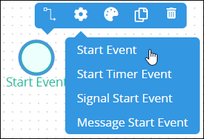
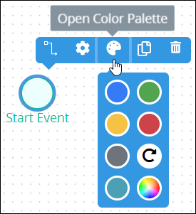
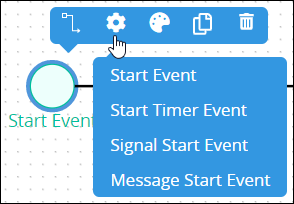
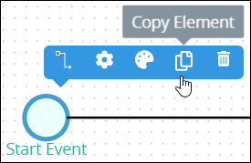
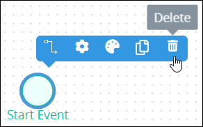

# Start Event Element

## Permissions Required


### Don't Know What a Start Event Element Is?

See [Process Modeling Element Descriptions](process-modeling-element-descriptions.md) for a description of the [Start Event](process-modeling-element-descriptions.md#start-event) element.


Your ProcessMaker user account or group membership must have the following permissions to configure a Start Event element in the Process model unless your user account has the **Make this user a Super Admin** setting selected:

* Processes: Edit Processes
* Processes: View Processes

See the [Process](../../../processmaker-administration/permission-descriptions-for-users-and-groups.md#processes) permissions or ask your ProcessMaker Administrator for assistance.

## Add a Start Event Element


[Permissions are required to do this.](add-and-configure-an-event-element.md#permissions-required)


Follow these steps to add a Start Event element to the Process model:

1. [View your Processes](../../viewing-processes/view-the-list-of-processes/view-your-processes.md#view-all-active-processes). The **Processes** page displays.
2. [Create a new Process](../../viewing-processes/view-the-list-of-processes/create-a-process.md) or click the **Open Modeler** iconto edit the selected Process model. Process Modeler displays.
3. Locate the **Start Event** element in the **Elements and Connectors** palette that is to the left of the Process Modeler canvas. If the [**Hide Menus** button](../navigate-around-your-process-model.md#maximize-the-process-modeler-canvas-view)is enabled, the **Elements and Connectors** palette displays the **Start Event** element's icon.

   

4. Drag the element into the Process model canvas where you want to place it. If a Pool element is in your Process model, the Start Event element cannot be placed outside of the Pool element.
5. Do one of the following:
   * From the **Elements** drop-down menu, select the **Start Event** option.  
   * Click anywhere in the Process model. The Start Event element selects by default.

After the element is placed into the Process model, you may adjust its location in the following ways:

* Move the element by dragging it to a new location.
* [Select the element with other elements and/or connectors](../select-multiple-process-model-elements-and-connectors.md#select-multiple-process-model-objects), and then move them collectively by dragging them to new locations in relation to one another.
* [Align](../align-and-distribute-process-model-elements-and-connectors.md#align-process-model-objects) and/or [distribute](../align-and-distribute-process-model-elements-and-connectors.md#distribute-process-model-objects) the element in relation to other selected elements and/or [connectors](../model-processes-using-connectors/what-is-a-connector.md).


Moving a Start Event element has the following limitations in regards to the following Process model elements:

* **Pool element:** If the Start Event element is inside of a [Pool](process-modeling-element-descriptions.md#pool) element, it cannot be moved outside of the Pool element. If you attempt to do so, Process Modeler places the Start Event element inside the Pool element closest to where you attempt to move it.
* **Lane element:** If the Start Event element is inside of a Lane element, it can be moved to another Lane element in the same Pool element. However, the Start Event element cannot be moved outside of the Pool element.


## Change the Color of a Start Event Element

The Start Event element and label have a default green color to indicate that this element is a starting [Request](../../../using-processmaker/requests/what-is-a-request.md) event. After a Start Event element is [added to a Process model](add-and-configure-an-event-element.md#add-a-start-event-element), its shape and label color can be changed. Element and [connector](../model-processes-using-connectors/what-is-a-connector.md) colors may only be changed individually.


[Permissions are required to do this](add-and-configure-an-event-element.md#permissions-required).


Follow these steps to change the color and label for a Start Event element:

1. [View your Processes](https://processmaker.gitbook.io/processmaker-4-community/-LPblkrcFWowWJ6HZdhC/~/drafts/-LRhVZm0ddxDcGGdN5ZN/primary/designing-processes/viewing-processes/view-the-list-of-processes/view-your-processes#view-all-processes). The **Processes** page displays.
2. Click the **Open Modeler** iconto edit the selected Process model. Process Modeler displays.
3. Select the Start Event element to change its color. Available options display above the selected element.  
4. Click the **Open Color Palette** icon. The color palette displays.
5. Do one of the following:
   * **Select a color swatch:** Select one of the color swatches from the color palette. The Start Event element and label change to that color.
   * **Specify a custom color:** Click theicon to display the color selector, and then select a color, enter the [Hex color code](https://www.color-hex.com/), or enter the red, green, blue, and alpha color values for the custom color. The Start Event element and label change to that color.  
   * **Reset to the default color:** Click theicon to reset the Start Event element and label to its default color.

## Change to a Different Starting Request Event Element

After a Start Event element is [added to a Process model](add-and-configure-an-event-element.md#add-a-start-event-element), you may replace it with a different starting [Request](../../../using-processmaker/requests/what-is-a-request.md) event element:

* [Start Timer Event](process-modeling-element-descriptions.md#start-timer-event) element
* [Signal Start Event](process-modeling-element-descriptions.md#signal-start-event) element
* [Message Start Event](process-modeling-element-descriptions.md#message-start-event) element

Changing to a different starting Request event element replaces the selected Start Event element with the default settings and color of the replacing element.


[Permissions are required to do this](add-and-configure-an-event-element.md#permissions-required).


Follow these steps to change a Start Event element to a different starting Request event element:

1. ​[View your Processes](https://processmaker.gitbook.io/processmaker-4-community/-LPblkrcFWowWJ6HZdhC/~/drafts/-LRhVZm0ddxDcGGdN5ZN/primary/designing-processes/viewing-processes/view-the-list-of-processes/view-your-processes#view-all-processes). The **Processes** page displays.
2. Click the **Open Modeler** iconto edit the selected Process model. Process Modeler displays.
3. Select the Start Event element to change to another starting Request event element. Available options display above the selected element.
4. Click the **Elements** icon. The **Elements** drop-down menu displays the starting Request event elements.  
5. Select the element to replace the Start Event element. The **Change Type** screen displays to confirm replacing the currently selected element.  
6. Click **Confirm**. The new element replaces the Start Event element with its default settings and color.

## Copy a Start Event Element

Copying a Start Event element copies the original along with its current settings, making it easier and faster to continue designing without adding default elements or [connectors](../model-processes-using-connectors/what-is-a-connector.md) with their default settings.

The copied Start Event element displays below the original. Any [Sequence Flow](process-modeling-element-descriptions.md#sequence-flow) and/or [Message Flow](process-modeling-element-descriptions.md#message-flow) elements incoming to or outgoing from the original are not copied.


[Permissions are required to do this](add-and-configure-an-event-element.md#permissions-required).


Follow these steps to copy a Start Event element in your Process model:

1. ​[View your Processes](https://processmaker.gitbook.io/processmaker-4-community/-LPblkrcFWowWJ6HZdhC/~/drafts/-LRhVZm0ddxDcGGdN5ZN/primary/designing-processes/viewing-processes/view-the-list-of-processes/view-your-processes#view-all-processes). The **Processes** page displays.
2. Click the **Open Modeler** iconto edit the selected Process model. Process Modeler displays.
3. Select the Start Event element to copy. Available options display above the selected element.  
4. Click the **Copy Element** icon. The Process model element copies.  

## Delete a Start Event Element

Deleting a Process model element also deletes any [Sequence Flow](process-modeling-element-descriptions.md#sequence-flow) and/or [Message Flow](process-modeling-element-descriptions.md#message-flow) elements incoming to or outgoing from that element. For example, if a Process model element is deleted that has both incoming and outgoing Sequence Flow elements, the Sequence Flow elements must be reconnected for the remaining elements/[connectors](../model-processes-using-connectors/what-is-a-connector.md).


[Permissions are required to do this.](add-and-configure-an-event-element.md#permissions-required)


Follow these steps to delete a Start Event element from your Process model:

1. ​[View your Processes](https://processmaker.gitbook.io/processmaker-4-community/-LPblkrcFWowWJ6HZdhC/~/drafts/-LRhVZm0ddxDcGGdN5ZN/primary/designing-processes/viewing-processes/view-the-list-of-processes/view-your-processes#view-all-processes). The **Processes** page displays.
2. Click the **Open Modeler** iconto edit the selected Process model. Process Modeler displays.
3. Select the Start Event element to delete. Available options display above the selected element.  
4. Click the **Delete** icon. The Process model element deletes.

## Settings

The Start Event element has the following panels that contain settings:

* **Configuration** panel
  * [Edit the element name](add-and-configure-an-event-element.md#edit-the-element-name)
* **Start Permissions** panel
  * [Select the ProcessMaker user that can start a Request](add-and-configure-an-event-element.md#select-the-processmaker-user-that-can-start-a-request)
  * [Select the ProcessMaker group that can start a Request](add-and-configure-an-event-element.md#select-the-processmaker-group-that-can-start-a-request)
* **Web Entry** panel \(available when the [Web Entry package](../../../package-development-distribution/package-a-connector/web-entry.md) is installed\)
  * [Select who can start a Request via a Web Entry](add-and-configure-an-event-element.md#select-who-can-start-a-request-via-a-web-entry)
* **Vocabularies** panel \(available when the [Vocabularies package](../../../package-development-distribution/package-a-connector/vocabularies.md) is installed\)
  * [Assign ProcessMaker Vocabularies that validate Request data from this element](add-and-configure-an-event-element.md#assign-processmaker-vocabularies-that-validate-request-data-from-this-element)
* **Advanced** panel
  * [Edit the element's identifier value](add-and-configure-an-event-element.md#edit-the-elements-identifier-value)

### Configuration Panel Settings

#### Edit the Element Name

An element name is a human-readable reference for a Process element. Process Modeler automatically assigns the name of a Process element with its element type. However, an element's name can be changed.


[Permissions are required to do this.](add-and-configure-an-event-element.md#permissions-required)


Follow these steps to edit the name for a Start Event element:

1. Ensure that the **Hide Menus** buttonis not enabled. See [Maximize the Process Modeler Canvas View](../navigate-around-your-process-model.md#maximize-the-process-modeler-canvas-view).
2. Select the Start Event element from the Process model in which to edit its name. Panels to configure this element display.
3. Expand the **Configuration** panel if it is not presently expanded. The **Name** setting displays. This is a required setting.  

   

4. In the **Name** setting, edit the selected element's name and then press **Enter**.

### Start Permissions Panel Settings

Select whether a [ProcessMaker user](../../../processmaker-administration/add-users/what-is-a-user.md) or any member of a [ProcessMaker group](../../../processmaker-administration/assign-groups-to-users/what-is-a-group.md) may start a [Request](../../../using-processmaker/requests/what-is-a-request.md):

* [Select the ProcessMaker user that can start a Request](add-and-configure-an-event-element.md#select-the-processmaker-user-that-can-start-a-request)
* [Select the ProcessMaker Group that can start a Request](add-and-configure-an-event-element.md#select-the-processmaker-group-that-can-start-a-request)

#### Select the ProcessMaker User That Can Start a Request

When a Start Event element is placed into a Process model, it is not configured to indicate how a Request can start via that Start Event element. Therefore, it must be configured.


[Permissions are required to do this.](add-and-configure-an-event-element.md#permissions-required)


Follow these steps to select which ProcessMaker [user](../../../processmaker-administration/add-users/what-is-a-user.md) can start a Request via this Start Event element:

1. Ensure that the **Hide Menus** buttonis not enabled. See [Maximize the Process Modeler Canvas View](../navigate-around-your-process-model.md#maximize-the-process-modeler-canvas-view).
2. Select the Start Event element from the Process model in which to select the ProcessMaker user that may start a Request. Panels to configure this element display.
3. Expand the **Start Permissions** panel if it is not presently expanded. The **Type** setting displays.  

   

4. From the **Type** drop-down menu, select the **User** option. The **User** drop-down menu displays below the **Start Permission** drop-down menu.  

   

5. From the **User** drop-down menu, select which ProcessMaker user can start a Request via the Start Event element. That ProcessMaker user may start a Request.

#### Select the ProcessMaker Group That Can Start a Request

When a Start Event element is placed into a Process model, it is not configured to indicate how a Request can start via that Start Event element. Therefore, it must be configured.


[Permissions are required to do this.](add-and-configure-an-event-element.md#permissions-required)


Follow these steps to select which ProcessMaker [group](../../../processmaker-administration/assign-groups-to-users/what-is-a-group.md) members can start a Request via this Start Event element:

1. Ensure that the **Hide Menus** buttonis not enabled. See [Maximize the Process Modeler Canvas View](../navigate-around-your-process-model.md#maximize-the-process-modeler-canvas-view).
2. Select the Start Event element from the Process model in which to select the ProcessMaker group that may start a Request. The **Configuration** setting section displays.
3. Expand the **Start Permissions** panel if it is not presently expanded. The **Type** setting displays.

   

4. From the **Type** drop-down menu, select the **Group** option. The **Group** drop-down menu displays below the **Start Permission** drop-down menu.  

   

5. From the **Group** drop-down menu, select which ProcessMaker group can start a Request via the Start Event element. Any member of that ProcessMaker group may start a Request.

### Web Entry Panel Settings

#### Select Who Can Start a Request via a Web Entry

When a Start Event element is placed into a Process model, Web Entry settings for that element are disabled. Therefore, even if the [Web Entry](../../../package-development-distribution/package-a-connector/web-entry.md) package is installed in your ProcessMaker instance, it must be configured for use.


### ProcessMaker Package Required

Your ProcessMaker instance must have the [Web Entry package](../../../package-development-distribution/package-a-connector/web-entry.md) installed to select who can start a Request via a Web entry. The Web Entry package allows anonymous or authenticated ProcessMaker users to start or participate in Requests via a published URL.

The Web Entry package is not available in the ProcessMaker open-source edition. Contact [ProcessMaker Sales](mailto:sales@processmaker.com) or ask your ProcessMaker sales representative how the Web Entry package can be installed in your ProcessMaker instance.



[Permissions are required to do this.](add-and-configure-an-event-element.md#permissions-required)


Follow these steps to select who can start a Request via a Web Entry URL via this Start Event element:

1. Ensure that the **Hide Menus** buttonis not enabled. See [Maximize the Process Modeler Canvas View](../navigate-around-your-process-model.md#maximize-the-process-modeler-canvas-view).
2. Select the Start Event element from the Process model in which to select who may start a Request via a Web Entry URL. Panels to configure this element display.
3. Expand the **Web Entry** panel if it is not presently expanded. The **Web Entry** setting displays.  

   

4. From the **Mode** drop-down menu, select one of the following options:
   * **Anonymous:** Select the **Anonymous** option to allow any person who has access to the Web Entry's URL to start a Request. This person is not authenticated as a ProcessMaker user. Note that if an anonymous person starts a Request and a later Task element or [Manual Task](process-modeling-element-descriptions.md#manual-task) element is assigned to the requester, then the following Request error occurs: **This process was started by an anonymous user so this task can not be assigned to the requester**. Therefore, use this option cautiously.  

     

   * **Authenticated:** Select the **Authenticated** option to require an authenticated ProcessMaker user or group member to start a Request via the Web Entry's URL.  

     

     Select whether a ProcessMaker user or group member may start a Request via the Web Entry's URL. To do so, follow these guidelines:

     **ProcessMaker User**

     1. From the **Web Entry Start Permission** drop-down menu, select the **User** option. The **User** drop-down menu displays below the **Web Entry Start Permission** drop-down menu.  

        

     2. From the **User** drop-down menu, select which ProcessMaker user may start a Request via the Web Entry's URL.

     **ProcessMaker Group**

     1. From the **Web Entry Start Permission** drop-down menu, select the **Group** option. The **Group** drop-down menu displays below the **Web Entry Start Permission** drop-down menu.  

        

     2. From the **Group** drop-down menu, select which ProcessMaker group may start a Request via the Web Entry's URL. Any member of that ProcessMaker group may start a Request via the Web Entry's URL.
5. From the **Screen Associated** drop-down menu, select the [ProcessMaker Screen](../../design-forms/what-is-a-form.md) that displays when the Web Entry URL is accessed. This drop-down menu displays only [Form](../../design-forms/screens-builder/types-for-screens.md#form) types so the Requester can interact with information in the ProcessMaker Screen. This is a required setting.  

   

6. From the **Completed Action** drop-down menu, select one of the following options:
   * **Screen:** Select the **Screen** option to indicate that a ProcessMaker Screen displays after the Requester submits the ProcessMaker Screen selected from the **Screen Associated** drop-down menu. **Screen** is the default setting.  

     

     After the **Screen** option is selected, the **Screen For Completed** drop-down menu displays below the **Completed Action** drop-down menu. From the **Screen For Completed** drop-down menu, select the ProcessMaker Screen that displays after the Requester submits the ProcessMaker Screen selected from the **Screen Associated** drop-down menu. This drop-down menu displays only [Display](../../design-forms/screens-builder/types-for-screens.md#display) types to display a message to the Requester. This is a required setting.  

     

   * **Url:** Select the **Url** option to indicate that the Requester is redirected to a URL after the Requester submits the ProcessMaker Screen selected from the **Screen Associated** drop-down menu.  

     

     After the **Url** option is selected, the **Url to redirect to** setting displays below the **Completed Action** drop-down menu to redirect the Requester after the Requester submits the ProcessMaker Screen selected from the Screen Associated drop-down menu. The redirect URL supports [mustache syntax](https://mustache.github.io/mustache.5.html) to reference the value of a Request variable as the URL. In the **Url to redirect to** setting, enter the URL to redirect the Requester, and then press **Enter**. This is a required setting.  

     
7. The **Web Entry URL** displays the Web Entry URL from which the Requester accesses the ProcessMaker Screen selected from the **Screen Associated** drop-down menu. The **Web Entry URL** value cannot be changed. The Web Entry package generates this URL using the following structure: _`ProcessMaker instance domain`_`/webentry/`_`Web Entry numerical instance`_`/`_`Identifier Value of this Start Event element`_. If necessary, click the **Copy to clipboard** link to copy the **Web Entry URL** value so that it is available in your clipboard.  

   

### Vocabularies Panel Settings

#### Assign ProcessMaker Vocabularies That Validate Request Data from This Element

Assign [ProcessMaker Vocabularies](../../vocabularies-management/what-is-a-vocabulary.md) that validate Request data complies with a specific JSON schema. This is often mandatory for many types of business sectors including banking and healthcare. Ensure the quality and compliance of Request data. For example, during a Loan Application process, ensure that personal information has been included in the Request to that moment in that in-progress Request. The Vocabularies package must be installed in your ProcessMaker instance to make this configuration.

Use a ProcessMaker Vocabulary on a Start Event element when using the [Web Entry package](../../../package-development-distribution/package-a-connector/web-entry.md). After the Request data is submitted from the Web Entry, ProcessMaker Vocabularies assigned to the Start Event element validate the Request data complies with the Vocabulary's JSON schema. See [What is a Vocabulary?](../../vocabularies-management/what-is-a-vocabulary.md) for more information. See [Select Who Can Start a Request via a Web Entry](add-and-configure-an-event-element.md#select-who-can-start-a-request-via-a-web-entry) for information how to use the Web Entry package on a Start Event element.

Each moment ProcessMaker evaluates workflow routing for an in-progress Request, ProcessMaker also evaluates the Request data's conformity to the ProcessMaker Vocabularies applied to the Process and/or a specific BPMN 2.0 element in the Process model. The Request's JSON data model must conform to the ProcessMaker Vocabulary's JSON schema.

During an in-progress Request, if ProcessMaker evaluates that the Request data no longer complies with all ProcessMaker Vocabularies to that moment, the Request status changes from In Progress to Error. The error displays in the [Request summary](../../../using-processmaker/requests/request-details/summary-for-requests-with-errors.md). ProcessMaker Vocabularies are cumulative in an in-progress Request: as the Request progresses, if Request data does not conform with any Vocabulary's JSON schema to that moment in the Request, the Request errors.

If no ProcessMaker Vocabularies are assigned, ProcessMaker does not validate Request data complies with a specific JSON schema prior to continuing workflow for that Request.

One or more ProcessMaker Vocabularies must be created to your ProcessMaker instance before assigning a Vocabulary. See [Create a New Vocabulary](../../vocabularies-management/manage-your-vocabularies/create-a-new-vocabulary.md#create-a-new-processmaker-vocabulary). Multiple ProcessMaker Vocabularies can be assigned to a Start Event element.


### ProcessMaker Package Required

Your ProcessMaker instance must have the [Vocabularies package](../../../package-development-distribution/package-a-connector/vocabularies.md) installed to assign which ProcessMaker Vocabularies validate Request data at a Start Event element. Use the Vocabularies package to maintain uniform JSON schemas across all assets in your organization. These assets include [Processes](../../viewing-processes/what-is-a-process.md), [ProcessMaker Screens](../../design-forms/what-is-a-form.md), and [ProcessMaker Scripts](../../scripts/what-is-a-script.md).

A ProcessMaker Vocabulary is a JSON schema. The JSON schema describes the data objects, types, and structure that you want in both a machine and human readable format. Apply one or more ProcessMaker Vocabularies to your Processes and/or specific BPMN 2.0 elements in your Process models to ensure the JSON data model in Request data complies with the data structure outlined in the JSON schema that you need to meet regulatory specifications or ensure Request data contains required information.

The Vocabularies package is not available in the ProcessMaker open-source edition. Contact [ProcessMaker Sales](mailto:sales@processmaker.com) or ask your ProcessMaker sales representative how the Vocabularies package can be installed in your ProcessMaker instance.



[Permissions are required to do this.](add-and-configure-an-event-element.md#permissions-required)


Follow these steps to assign ProcessMaker Vocabularies that validate Request data from a Start Event element:

1. Ensure that the **Hide Menus** buttonis not enabled. See [Maximize the Process Modeler Canvas View](../navigate-around-your-process-model.md#maximize-the-process-modeler-canvas-view).
2. Select the Start Event element from the Process model in which to assign ProcessMaker Vocabularies that validate Request data prior to when this element completes. Panels to configure this element display.
3. Expand the **Vocabularies** panel if it is not presently expanded. The **Assigned** setting displays.
4. Click theicon to add a ProcessMaker Vocabulary. The **Assign Vocabulary** option displays.  
5. From the **Select Vocabulary** drop-down menu, select a ProcessMaker Vocabulary from which to validate Request data complies with its JSON schema.

   If no ProcessMaker Vocabularies are configured in your ProcessMaker instance, then the following message displays: **List is empty.** Create at least one ProcessMaker Vocabulary. See [Create a New Vocabulary](../../vocabularies-management/manage-your-vocabularies/create-a-new-vocabulary.md#create-a-new-processmaker-vocabulary).

6. Click **Save**.
7. Repeat Steps 3 through 6 as necessary for each ProcessMaker Vocabulary required to validate Request data complies with its JSON schema.


Click the **Remove** iconfrom the **Vocabularies** setting to remove a ProcessMaker Vocabulary from assignment to this element.


After one or more ProcessMaker Vocabularies are assigned to a Start Event element, the Vocabulary icon displays above that element.

### Advanced Panel Settings

#### Edit the Element's Identifier Value

Process Modeler automatically assigns a unique value to each Process element added to a Process model. However, an element's identifier value can be changed if it is unique to all other elements in the Process model, including the Process model's identifier value.


[Permissions are required to do this.](add-and-configure-an-event-element.md#permissions-required)



All identifier values for all elements in the Process model must be unique.


Follow these steps to edit the identifier value for a Start Event element:

1. Ensure that the **Hide Menus** buttonis not enabled. See [Maximize the Process Modeler Canvas View](../navigate-around-your-process-model.md#maximize-the-process-modeler-canvas-view).
2. Select the Start Event element from the Process model in which to edit its identifier value. Panels to configure this element display.
3. Expand the **Advanced** panel if it is not presently expanded. The **Node Identifier** setting displays. This is a required setting.  

   

4. In the **Node Identifier** setting, edit the Start Event element's identifier to a unique value from all elements in the Process model and then press **Enter**.

## Related Topics

























