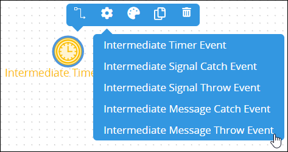
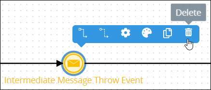

# Intermediate Message Throw Event Element

## Permissions Required


### Don't Know What an Intermediate Message Throw Event Element Is?

See [Process Modeling Element Descriptions](process-modeling-element-descriptions.md) for a description of the [Intermediate Message Throw Event](process-modeling-element-descriptions.md#intermediate-message-throw-event) element.


Your ProcessMaker user account or group membership must have the following permissions to configure an Intermediate Message Throw Event element in the Process model unless your user account has the **Make this user a Super Admin** setting selected:

* Processes: Edit Processes
* Processes: View Processes

See the [Process](../../../processmaker-administration/permission-descriptions-for-users-and-groups.md#processes) permissions or ask your ProcessMaker Administrator for assistance.

## Add an Intermediate Message Throw Event Element


[Permissions are required to do this](add-and-configure-intermediate-message-throw-event-elements.md#permissions-required).


Follow these steps to add an Intermediate Message Throw Event element to the Process model:

1. [View your Processes](../../viewing-processes/view-the-list-of-processes/view-your-processes.md#view-all-active-processes). The **Processes** page displays.
2. [Create a new Process](../../viewing-processes/view-the-list-of-processes/create-a-process.md) or click the **Open Modeler** iconto edit the selected Process model. Process Modeler displays.
3. Locate the **Intermediate Event** element in the **Elements and Connectors** palette that is to the left of the Process Modeler canvas. If the [**Hide Menus** button](../navigate-around-your-process-model.md#maximize-the-process-modeler-canvas-view)is enabled, the **Elements and Connectors** palette displays the **Intermediate Event** element's icon.  
4. Drag the element into the Process model canvas where you want to place it. If a Pool element is in your Process model, the Intermediate Message Throw Event element cannot be placed outside of the Pool element.
5. From the **Elements** drop-down menu, select the **Intermediate Message Throw Event** option. The Intermediate Message Throw Event element displays.  

After the element is placed into the Process model, you may move it by dragging it to the new location.


Moving an Intermediate Message Throw Event element has the following limitations in regards to the following Process model elements:

* **Pool element:** If the Intermediate Message Throw Event element is inside of a [Pool](process-modeling-element-descriptions.md#pool) element, it cannot be moved outside of the Pool element. If you attempt to do so, Process Modeler places the Intermediate Message Throw Event element inside the Pool element closest to where you attempt to move it.
* **Lane element:** If the Intermediate Message Throw Event element is inside of a Lane element, it can be moved to another Lane element in the same Pool element. However, the Intermediate Message Throw Event element cannot be moved outside of the Pool element.


## Delete an Intermediate Message Throw Event Element

Deleting a Process model element also deletes any [Sequence Flow](process-modeling-element-descriptions.md#sequence-flow) and/or [Message Flow](process-modeling-element-descriptions.md#message-flow) elements incoming to or outgoing from that element. For example, if a Process model element is deleted that has both incoming and outgoing Sequence Flow elements, the Sequence Flow elements must be reconnected for the remaining elements/[connectors](../model-processes-using-connectors/what-is-a-connector.md).


[Permissions are required to do this](add-and-configure-intermediate-message-catch-event-elements.md#permissions-required).


Follow these steps to delete an Intermediate Message Throw Event element from your Process model:

1. ​[View your Processes](https://processmaker.gitbook.io/processmaker-4-community/-LPblkrcFWowWJ6HZdhC/~/drafts/-LRhVZm0ddxDcGGdN5ZN/primary/designing-processes/viewing-processes/view-the-list-of-processes/view-your-processes#view-all-processes). The **Processes** page displays.
2. Click the **Open Modeler** iconto edit the selected Process model. Process Modeler displays.
3. Select the Intermediate Message Throw Event element to delete. Available options display above the selected element.  
4. Click the **Delete** icon. The Process model element deletes.

## Settings

The Intermediate Message Throw Event element has the following panels that contain settings:

* **Configuration** panel
  * [Edit the element name](add-and-configure-intermediate-message-throw-event-elements.md#edit-the-element-name)
  * [Edit the message name](add-and-configure-intermediate-message-throw-event-elements.md#edit-the-message-name)
* **Advanced** panel
  * [Edit the element's identifier value](add-and-configure-intermediate-message-throw-event-elements.md#edit-the-elements-identifier-value)

### Configuration Panel Settings

#### Edit the Element Name

An element name is a human-readable reference for a Process element. Process Modeler automatically assigns the name of a Process element with its element type. However, an element's name can be changed.


[Permissions are required to do this](add-and-configure-intermediate-message-throw-event-elements.md#permissions-required).


Follow these steps to edit the name for an Intermediate Message Throw Event element:

1. Ensure that the **Hide Menus** buttonis not enabled. See [Maximize the Process Modeler Canvas View](../navigate-around-your-process-model.md#maximize-the-process-modeler-canvas-view).
2. Select the Intermediate Message Throw Event element from the Process model in which to edit its name. Panels to configure this element display.
3. Expand the **Configuration** panel if it is not presently expanded. The **Name** setting displays. This is a required setting.  
4. In the **Name** setting, edit the selected element's name and then press **Enter**.

#### Edit the Message Name

The Intermediate Message Throw Event element uses a message name as a placeholder for the Request data that this element sends to a catching element. When a [Message Start Event](process-modeling-element-descriptions.md#message-start-event) element or an [Intermediate Message Catch Event](process-modeling-element-descriptions.md#intermediate-message-catch-event) element listens for a message, it references the Intermediate Message Throw Event element's message name.


[Permissions are required to do this](add-and-configure-intermediate-message-throw-event-elements.md#permissions-required).


Follow these steps to configure the message name for an Intermediate Message Throw Event element:

1. Ensure that the **Hide Menus** buttonis not enabled. See [Maximize the Process Modeler Canvas View](../navigate-around-your-process-model.md#maximize-the-process-modeler-canvas-view).
2. Select the Intermediate Message Throw Event element from the Process model in which to configure its message name. Panels to configure this element display.
3. Expand the **Configuration** panel if it is not presently expanded, and then locate the **Message Name** setting. 
4. In the **Message Name** setting, edit the message name that a catching element references to listen for the Intermediate Message Throw Event's message.

### Advanced Panel Settings

#### Edit the Element's Identifier Value

Process Modeler automatically assigns a unique value to each Process element added to a Process model. However, an element's identifier value can be changed if it is unique to all other elements in the Process model, including the Process model's identifier value.


[Permissions are required to do this](add-and-configure-intermediate-message-throw-event-elements.md#permissions-required).



All identifier values for all elements in the Process model must be unique.


Follow these steps to edit the identifier value for an Intermediate Message Throw Event element:

1. Ensure that the **Hide Menus** buttonis not enabled. See [Maximize the Process Modeler Canvas View](../navigate-around-your-process-model.md#maximize-the-process-modeler-canvas-view).
2. Select the Intermediate Message Throw Event element from the Process model in which to edit its identifier value. Panels to configure this element display.
3. Expand the **Advanced** panel if it is not presently expanded. The **Node Identifier** setting displays. This is a required setting.  
4. In the **Node Identifier** setting, edit the Intermediate Message Throw Event element's identifier to a unique value from all elements in the Process model and then press **Enter**.

## Related Topics











