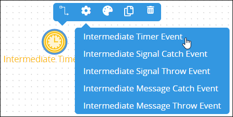
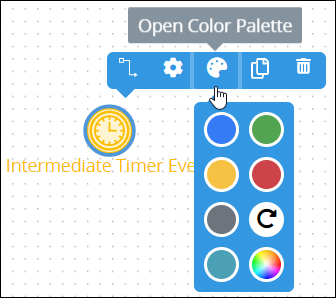
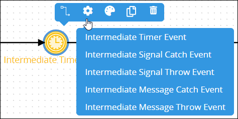
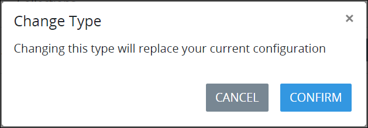
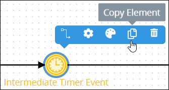
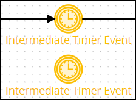
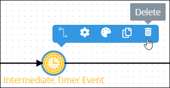

# Intermediate Timer Event Element

## Permissions Required


### Don't Know What an Intermediate Timer Event Element Is?

See [Process Modeling Element Descriptions](process-modeling-element-descriptions.md) for a description of the [Intermediate Timer Event](process-modeling-element-descriptions.md#intermediate-timer-event) element.


Your ProcessMaker user account or group membership must have the following permissions to configure an Intermediate Timer Event element in the Process model unless your user account has the **Make this user a Super Admin** setting selected:

* Processes: Edit Processes
* Processes: View Processes

See the [Process](../../../processmaker-administration/permission-descriptions-for-users-and-groups.md#processes) permissions or ask your ProcessMaker Administrator for assistance.

## Add an Intermediate Timer Event Element


[Permissions are required to do this](add-and-configure-intermediate-timer-event-elements.md#permissions-required).


Follow these steps to add an Intermediate Timer Event element to the Process model:

1. [View your Processes](../../viewing-processes/view-the-list-of-processes/view-your-processes.md#view-all-active-processes). The **Processes** page displays.
2. [Create a new Process](../../viewing-processes/view-the-list-of-processes/create-a-process.md) or click the **Open Modeler** iconto edit the selected Process model. Process Modeler displays.
3. Locate the **Intermediate Event** element in the **Elements and Connectors** palette that is to the left of the Process Modeler canvas. If the [**Hide Menus** button](../navigate-around-your-process-model.md#maximize-the-process-modeler-canvas-view)is enabled, the **Elements and Connectors** palette displays the **Intermediate Event** element's icon.  
4. Drag the element into the Process model canvas where you want to place it. If a Pool element is in your Process model, the Intermediate Timer Event element cannot be placed outside of the Pool element.
5. Do one of the following:
   * From the **Elements** drop-down menu, select the **Intermediate Timer Event** option.  
   * Click anywhere in the Process model. The Intermediate Timer Event element selects by default.

After the element is placed into the Process model, you may adjust its location in the following ways:

* Move the element by dragging it to a new location.
* [Select the element with other elements and/or connectors](../select-multiple-process-model-elements-and-connectors.md#select-multiple-process-model-objects), and then move them collectively by dragging them to new locations in relation to one another.
* [Align](../align-and-distribute-process-model-elements-and-connectors.md#align-process-model-objects) and/or [distribute](../align-and-distribute-process-model-elements-and-connectors.md#distribute-process-model-objects) the element in relation to other selected elements and/or [connectors](../model-processes-using-connectors/what-is-a-connector.md).


Moving an Intermediate Timer Event element has the following limitations in regards to the following Process model elements:

* **Pool element:** If the Intermediate Timer Event element is inside of a [Pool](process-modeling-element-descriptions.md#pool) element, it cannot be moved outside of the Pool element. If you attempt to do so, Process Modeler places the Intermediate Timer Event element inside the Pool element closest to where you attempt to move it.
* **Lane element:** If the Intermediate Timer Event element is inside of a Lane element, it can be moved to another Lane element in the same Pool element. However, the Intermediate Timer Event element cannot be moved outside of the Pool element.


## Change the Color of an Intermediate Timer Event Element

The Intermediate Timer Event element and label have a default yellow color to indicate that this element is an intermediate [Request](../../../using-processmaker/requests/what-is-a-request.md) event. After an Intermediate Timer Event element is [added to a Process model](add-and-configure-intermediate-timer-event-elements.md#add-an-intermediate-timer-event-element), its shape and label color can be changed. Element and [connector](../model-processes-using-connectors/what-is-a-connector.md) colors may only be changed individually.


[Permissions are required to do this](add-and-configure-intermediate-timer-event-elements.md#permissions-required).


Follow these steps to change the color and label for an Intermediate Timer Event element:

1. [View your Processes](https://processmaker.gitbook.io/processmaker-4-community/-LPblkrcFWowWJ6HZdhC/~/drafts/-LRhVZm0ddxDcGGdN5ZN/primary/designing-processes/viewing-processes/view-the-list-of-processes/view-your-processes#view-all-processes). The **Processes** page displays.
2. Click the **Open Modeler** iconto edit the selected Process model. Process Modeler displays.
3. Select the Intermediate Timer Event element to change its color. Available options display above the selected element.  
4. Click the **Open Color Palette** icon. The color palette displays.
5. Do one of the following:
   * **Select a color swatch:** Select one of the color swatches from the color palette. The Intermediate Timer Event element and label change to that color.
   * **Specify a custom color:** Click theicon to display the color selector, and then select a color, enter the [Hex color code](https://www.color-hex.com/), or enter the red, green, blue, and alpha color values for the custom color. The Intermediate Timer Event element and label change to that color.  
   * **Reset to the default color:** Click theicon to reset the Intermediate Timer Event element and label to its default color.

## Replace an Intermediate Timer Event Element with a Different Intermediate Request Event Element

After an Intermediate Timer Event element is [added to a Process model](add-and-configure-intermediate-timer-event-elements.md#add-an-intermediate-timer-event-element), you may replace it with a different intermediate [Request](../../../using-processmaker/requests/what-is-a-request.md) event element:

* [Intermediate Signal Catch Event](process-modeling-element-descriptions.md#intermediate-signal-catch-event) element
* [Intermediate Signal Throw Event](process-modeling-element-descriptions.md#intermediate-signal-throw-event) element
* [Intermediate Message Catch Event](process-modeling-element-descriptions.md#intermediate-message-catch-event) element
* [Intermediate Message Throw Event](process-modeling-element-descriptions.md#intermediate-message-throw-event) element

The selected Intermediate Timer Event element is replaced by the default settings and color of the replacing element.


[Permissions are required to do this](add-and-configure-intermediate-timer-event-elements.md#permissions-required).


Follow these steps to replace an Intermediate Timer Event element with a different intermediate Request event element:

1. ​[View your Processes](https://processmaker.gitbook.io/processmaker-4-community/-LPblkrcFWowWJ6HZdhC/~/drafts/-LRhVZm0ddxDcGGdN5ZN/primary/designing-processes/viewing-processes/view-the-list-of-processes/view-your-processes#view-all-processes). The **Processes** page displays.
2. Click the **Open Modeler** iconto edit the selected Process model. Process Modeler displays.
3. Select the Intermediate Timer Event element to change to another intermediate Request event element. Available options display above the selected element.
4. Click the **Elements** icon. The **Elements** drop-down menu displays the intermediate Request event elements.  
5. Select the element to replace the Intermediate Timer Event element. The **Change Type** screen displays to confirm replacing the currently selected element.  
6. Click **Confirm**. The new element replaces the Intermediate Timer Event element with its default settings and color.

## Copy an Intermediate Timer Event Element

Copying an Intermediate Timer Event element copies the original along with its current settings, making it easier and faster to continue designing without adding default elements or [connectors](../model-processes-using-connectors/what-is-a-connector.md) with their default settings.

The copied Intermediate Timer Event element displays below the original. Any [Sequence Flow](process-modeling-element-descriptions.md#sequence-flow) and/or [Message Flow](process-modeling-element-descriptions.md#message-flow) elements incoming to or outgoing from the original are not copied.


[Permissions are required to do this](add-and-configure-intermediate-timer-event-elements.md#permissions-required).


Follow these steps to copy an Intermediate Timer Event element in your Process model:

1. ​[View your Processes](https://processmaker.gitbook.io/processmaker-4-community/-LPblkrcFWowWJ6HZdhC/~/drafts/-LRhVZm0ddxDcGGdN5ZN/primary/designing-processes/viewing-processes/view-the-list-of-processes/view-your-processes#view-all-processes). The **Processes** page displays.
2. Click the **Open Modeler** iconto edit the selected Process model. Process Modeler displays.
3. Select the Intermediate Timer Event element to copy. Available options display above the selected element.  
4. Click the **Copy Element** icon. The Process model element copies.  

## Delete an Intermediate Timer Event Element

Deleting a Process model element also deletes any [Sequence Flow](process-modeling-element-descriptions.md#sequence-flow) and/or [Message Flow](process-modeling-element-descriptions.md#message-flow) elements incoming to or outgoing from that element. For example, if a Process model element is deleted that has both incoming and outgoing Sequence Flow elements, the Sequence Flow elements must be reconnected for the remaining elements/[connectors](../model-processes-using-connectors/what-is-a-connector.md).


[Permissions are required to do this](add-and-configure-intermediate-timer-event-elements.md#permissions-required).


Follow these steps to delete an Intermediate Timer Event element from your Process model:

1. ​[View your Processes](https://processmaker.gitbook.io/processmaker-4-community/-LPblkrcFWowWJ6HZdhC/~/drafts/-LRhVZm0ddxDcGGdN5ZN/primary/designing-processes/viewing-processes/view-the-list-of-processes/view-your-processes#view-all-processes). The **Processes** page displays.
2. Click the **Open Modeler** iconto edit the selected Process model. Process Modeler displays.
3. Select the Intermediate Timer Event element to delete. Available options display above the selected element.  
4. Click the **Delete** icon. The Process model element deletes.

## Settings

The Intermediate Timer Event element has the following panels that contain settings:

* **Configuration** panel
  * [Edit the element name](add-and-configure-intermediate-timer-event-elements.md#edit-the-element-name)
* **Timing Control** panel
  * [Set the timing controls](add-and-configure-intermediate-timer-event-elements.md#set-the-timing-controls)
* **Advanced** panel
  * [Edit the element's identifier value](add-and-configure-intermediate-timer-event-elements.md#edit-the-elements-identifier-value)

### Configuration Panel Settings

#### Edit the Element Name

An element name is a human-readable reference for a Process element. Process Modeler automatically assigns the name of a Process element with its element type. However, an element's name can be changed.


[Permissions are required to do this](add-and-configure-intermediate-timer-event-elements.md#permissions-required).


Follow these steps to edit the name for an Intermediate Timer Event element:

1. Ensure that the **Hide Menus** buttonis not enabled. See [Maximize the Process Modeler Canvas View](../navigate-around-your-process-model.md#maximize-the-process-modeler-canvas-view).
2. Select the Intermediate Timer Event element from the Process model in which to edit its name. Panels to configure this element display.
3. Expand the **Configuration** panel if it is not presently expanded. The **Name** setting displays. This is a required setting.  

   

4. In the **Name** setting, edit the selected element's name and then press **Enter**.

### Timing Control Panel Settings

#### Set the Timing Controls

When an Intermediate Timer Event element is placed into a Process model, it is set to delay one \(1\) hour before it triggers. If this is not the timing control setting you want, the Intermediate Timer Event element must be configured. Set the timer controls for an Intermediate Timer Event element using one of the following methods:

* Set an interval in which to delay triggering the Intermediate Time Event element in a specified number of days, weeks, months, or years.
* Set the date and hour when the trigger the Intermediate Timer Event element.


[Permissions are required to do this](add-and-configure-intermediate-timer-event-elements.md#permissions-required).


Follow these steps to set the timer controls for an Intermediate Timer Event element:

1. Ensure that the **Hide Menus** buttonis not enabled. See [Maximize the Process Modeler Canvas View](../navigate-around-your-process-model.md#maximize-the-process-modeler-canvas-view).
2. Select the Intermediate Timer Event element from the Process model in which to set its timer controls. Panels to configure this element display.
3. Expand the **Timing Control** panel if it is not presently expanded. The **Type** setting displays.

   

4. Do one of the following to set the timer control:
   * **Delay the timer:** From the **Type** drop-down menu, select the **Delay** option. **Delay** is the default setting. From the **Delay** setting, select at which interval of time to trigger the Intermediate Timer Event element. **1 hour** is the default setting. Then select one of the following time periods for that element to trigger:
     * Minute
     * Hour \(default setting\)
     * Day
     * Month
   * **Set date and time to trigger the Intermediate Timer Event element:** From the **Type** drop-down menu, select the **Date/Time** option. The **Wait until specific date/time** setting displays.  

     

     From the **Wait until specific date/time** setting, use the date control to select the date and time to trigger the Intermediate Timer Event element. If this setting has not been previously set, the current date is the default.  

     

   * **Set a recurring interval of time in which the Intermediate Timer Event element triggers:** From the **Type** drop-down menu, select the **Cycle** option. The **Recurring loop repeats at time interval set below** setting displays.  
      

     From the **Recurring loop repeats at time interval set below** setting, select at which interval of time to trigger the Intermediate Timer Event element. **1 hour** is the default setting. Then select one of the following time periods for that element to trigger:

     * Minute
     * Hour \(default setting\)
     * Day
     * Month

### Advanced Panel Settings

#### Edit the Element's Identifier Value

Process Modeler automatically assigns a unique value to each Process element added to a Process model. However, an element's identifier value can be changed if it is unique to all other elements in the Process model, including the Process model's identifier value.


[Permissions are required to do this](add-and-configure-intermediate-timer-event-elements.md#permissions-required).



All identifier values for all elements in the Process model must be unique.


Follow these steps to edit the identifier value for an Intermediate Timer Event element:

1. Ensure that the **Hide Menus** buttonis not enabled. See [Maximize the Process Modeler Canvas View](../navigate-around-your-process-model.md#maximize-the-process-modeler-canvas-view).
2. Select the Intermediate Timer Event element from the Process model in which to edit its identifier value. Panels to configure this element display.
3. Expand the **Advanced** panel if it is not presently expanded. The **Node Identifier** setting displays. This is a required setting.  

   

4. In the **Node Identifier** setting, edit the Intermediate Timer Event element's identifier to a unique value from all elements in the Process model and then press **Enter**.

## Related Topics









