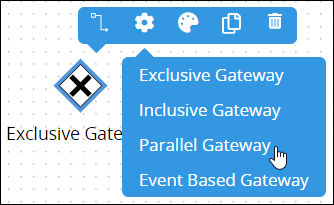
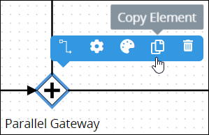
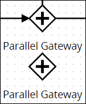
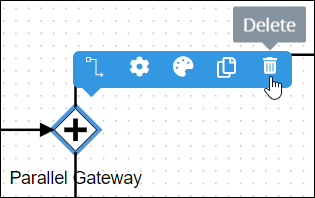
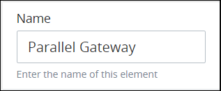
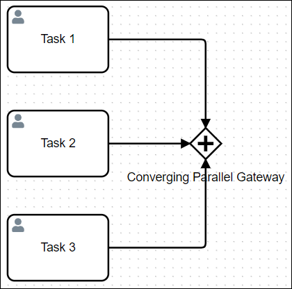
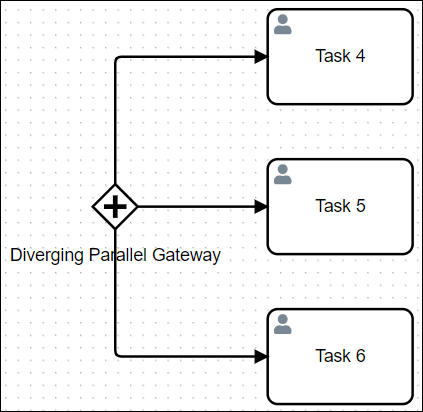
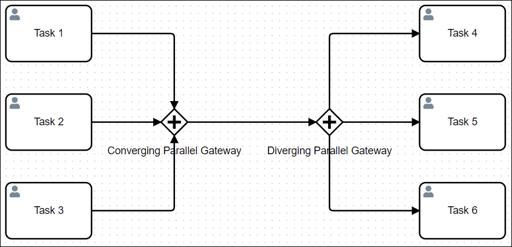

# Parallel Gateway Element

## Permissions Required


### Don't Know What a Parallel Gateway Element Is?

See [Process Modeling Element Descriptions](process-modeling-element-descriptions.md) for a description of the [Parallel Gateway](process-modeling-element-descriptions.md#parallel-gateway) element.


Your ProcessMaker user account or group membership must have the following permissions to configure a Parallel Gateway element in the Process model unless your user account has the **Make this user a Super Admin** setting selected:

* Processes: Edit Processes
* Processes: View Processes

See the [Process](../../../processmaker-administration/permission-descriptions-for-users-and-groups.md#processes) permissions or ask your ProcessMaker Administrator for assistance.

## Add a Parallel Gateway Element


[Permissions are required to do this](add-and-configure-parallel-gateway-elements.md#permissions-required).


Follow these steps to add a Parallel Gateway element to the Process model:

1. [View your Processes](../../viewing-processes/view-the-list-of-processes/view-your-processes.md#view-all-active-processes). The **Processes** page displays.
2. [Create a new Process](../../viewing-processes/view-the-list-of-processes/create-a-process.md) or click the **Open Modeler** iconto edit the selected Process model. Process Modeler displays.
3. Locate the **Gateway** element in the **Elements and Connectors** palette that is to the left of the Process Modeler canvas. If the [**Hide Menus** button](../navigate-around-your-process-model.md#maximize-the-process-modeler-canvas-view)is enabled, the **Elements and Connectors** palette displays the **Gateway** element's icon.  
4. Drag the element into the Process model canvas where you want to place it. If a Pool element is in your Process model, the Parallel Gateway element cannot be placed outside of the Pool element.
5. From the **Elements** drop-down menu, select the **Parallel Gateway** option. The Parallel Gateway element displays.  

After the element is placed into the Process model, you may move it by dragging it to the new location.


Moving a Parallel Gateway element has the following limitations in regards to the following Process model elements:

* **Pool element:** If the Parallel Gateway element is inside of a [Pool](process-modeling-element-descriptions.md#pool) element, it cannot be moved outside of the Pool element. If you attempt to do so, Process Modeler places the Parallel Gateway element inside the Pool element closest to where you attempt to move it.
* **Lane element:** If the Parallel Gateway element is inside of a Lane element, it can be moved to another Lane element in the same Pool element. However, the Parallel Gateway element cannot be moved outside of the Pool element.


## Copy a Parallel Gateway Element

Copying a Parallel Gateway element copies the original along with its current settings, making it easier and faster to continue designing without adding default elements or [connectors](../model-processes-using-connectors/what-is-a-connector.md) with their default settings.

The copied Parallel Gateway element displays below the original. Any [Sequence Flow](process-modeling-element-descriptions.md#sequence-flow) and/or [Message Flow](process-modeling-element-descriptions.md#message-flow) elements incoming to or outgoing from the original are not copied.


[Permissions are required to do this](add-and-configure-parallel-gateway-elements.md#permissions-required).


Follow these steps to copy a Parallel Gateway element in your Process model:

1. ​[View your Processes](https://processmaker.gitbook.io/processmaker-4-community/-LPblkrcFWowWJ6HZdhC/~/drafts/-LRhVZm0ddxDcGGdN5ZN/primary/designing-processes/viewing-processes/view-the-list-of-processes/view-your-processes#view-all-processes). The **Processes** page displays.
2. Click the **Open Modeler** iconto edit the selected Process model. Process Modeler displays.
3. Select the Parallel Gateway element to copy. Available options display above the selected element.  
4. Click the **Copy Element** icon. The Process model element copies.  

## Delete a Parallel Gateway Element

Deleting a Process model element also deletes any [Sequence Flow](process-modeling-element-descriptions.md#sequence-flow) and/or [Message Flow](process-modeling-element-descriptions.md#message-flow) elements incoming to or outgoing from that element. For example, if a Process model element is deleted that has both incoming and outgoing Sequence Flow elements, the Sequence Flow elements must be reconnected for the remaining elements/[connectors](../model-processes-using-connectors/what-is-a-connector.md).


[Permissions are required to do this](add-and-configure-parallel-gateway-elements.md#permissions-required).


Follow these steps to delete a Parallel Gateway element from your Process model:

1. ​[View your Processes](https://processmaker.gitbook.io/processmaker-4-community/-LPblkrcFWowWJ6HZdhC/~/drafts/-LRhVZm0ddxDcGGdN5ZN/primary/designing-processes/viewing-processes/view-the-list-of-processes/view-your-processes#view-all-processes). The **Processes** page displays.
2. Click the **Open Modeler** iconto edit the selected Process model. Process Modeler displays.
3. Select the Parallel Gateway element to delete. Available options display above the selected element.  
4. Click the **Delete** icon. The Process model element deletes.

## Settings

The Parallel Gateway element has the following panels that contain settings:

* **Configuration** panel
  * [Edit the element name](add-and-configure-parallel-gateway-elements.md#edit-the-element-name)
  * [Indicate workflow direction](add-and-configure-parallel-gateway-elements.md#indicate-workflow-direction)
* **Advanced** panel
  * [Edit the element's identifier value](add-and-configure-parallel-gateway-elements.md#edit-the-elements-identifier-value)

### Configuration Panel Settings

#### Edit the Element Name

An element name is a human-readable reference for a Process element. Process Modeler automatically assigns the name of a Process element with its element type. However, an element's name can be changed.


[Permissions are required to do this](add-and-configure-parallel-gateway-elements.md#permissions-required).


Follow these steps to edit the name for a Parallel Gateway element:

1. Ensure that the **Hide Menus** buttonis not enabled. See [Maximize the Process Modeler Canvas View](../navigate-around-your-process-model.md#maximize-the-process-modeler-canvas-view).
2. Select the Parallel Gateway element from the Process model in which to edit its name. Panels to configure this element display.
3. Expand the **Configuration** panel if it is not presently expanded. The **Name** setting displays. This is a required setting. 
4. In the **Name** setting, edit the selected element's name and then press **Enter**.

#### Indicate Workflow Direction

Indicate if the workflow direction for the Parallel Gateway is converging or diverging:

* **Converging:** Converging workflow represents two or more incoming [Sequence Flow](process-modeling-element-descriptions.md#sequence-flow) elements to the Parallel Gateway element. All incoming Sequence Flow elements converging to the Parallel Gateway element must trigger before the Parallel Gateway element triggers, thereby synchronizing a [Request's](../../../using-processmaker/requests/what-is-a-request.md) workflow. Use this coordinate workflow.

  

* **Diverging:** Diverging workflow represents two or more outgoing Sequence Flow elements from the Parallel Gateway element. When a Parallel Gateway triggers, all outgoing Sequence Flow elements from the gateway element trigger simultaneously without exception. Conditions cannot be placed on any outgoing Sequence Flow elements from the Parallel Gateway element. Use this when multiple workflow routes must occur simultaneously.

  

One Parallel Gateway element can only converge or diverge parallel workflow, but not both. Use two Parallel Gateway elements to synchronize both converging and diverging parallel workflow.


[Permissions are required to do this](add-and-configure-parallel-gateway-elements.md#permissions-required).


Follow these steps to indicate the workflow direction for a Parallel Gateway element:

1. Ensure that the **Hide Menus** buttonis not enabled. See [Maximize the Process Modeler Canvas View](../navigate-around-your-process-model.md#maximize-the-process-modeler-canvas-view).
2. Select the Parallel Gateway element from the Process model in which indicate the workflow direction. Panels to configure this element display.
3. Expand the **Configuration** panel if it is not presently expanded, and then locate the **Direction** setting. 
4. From the **Direction** drop-down menu, select from one of the following options:
   * **Diverging:** Select the **Diverging** option to indicate that the workflow direction is for outgoing Sequence Flow elements. When this option is selected, all outgoing Sequence Flow elements from the Parallel Gateway element trigger simultaneously without exception. This is the default option.
   * **Converging:** Select the **Converging** option to indicate the workflow direction is for incoming Sequence Flow elements. All incoming Sequence Flow elements to the Parallel Gateway element must trigger before the Parallel Gateway element triggers.

### Advanced Panel Settings

#### Edit the Element's Identifier Value

Process Modeler automatically assigns a unique value to each Process element added to a Process model. However, an element's identifier value can be changed if it is unique to all other elements in the Process model, including the Process model's identifier value.


[Permissions are required to do this](add-and-configure-parallel-gateway-elements.md#permissions-required).



All identifier values for all elements in the Process model must be unique.


Follow these steps to edit the identifier value for a Parallel Gateway element:

1. Ensure that the **Hide Menus** buttonis not enabled. See [Maximize the Process Modeler Canvas View](../navigate-around-your-process-model.md#maximize-the-process-modeler-canvas-view).
2. Select the Parallel Gateway element from the Process model in which to edit its identifier value. Panels to configure this element display.
3. Expand the **Advanced** panel if it is not presently expanded. The **Node Identifier** setting displays. This is a required setting. 
4. In the **Node Identifier** setting, edit the Parallel Gateway element's identifier to a unique value from all elements in the Process model and then press **Enter**.

## Related Topics









