# Signal Start Event Element

## Permissions Required


### Don't Know What a Signal Start Event Element Is?

See [Process Modeling Element Descriptions](process-modeling-element-descriptions.md) for a description of the [Signal Start Event](process-modeling-element-descriptions.md#signal-start-event) element.


Your ProcessMaker user account or group membership must have the following permissions to configure a Signal Start Event element in the Process model unless your user account has the **Make this user a Super Admin** setting selected:

* Processes: Edit Processes
* Processes: View Processes

See the [Process](../../../processmaker-administration/permission-descriptions-for-users-and-groups.md#processes) permissions or ask your ProcessMaker Administrator for assistance.

## Add a Signal Start Event Element


[Permissions are required to do this](add-and-configure-signal-start-event-elements.md#permissions-required).


Follow these steps to add a Signal Start Event element to the Process model:

1. [View your Processes](../../viewing-processes/view-the-list-of-processes/view-your-processes.md#view-all-active-processes). The **Processes** page displays.
2. [Create a new Process](../../viewing-processes/view-the-list-of-processes/create-a-process.md) or click the **Open Modeler** iconto edit the selected Process model. Process Modeler displays.
3. Locate the **Start Event** element in the **Elements and Connectors** palette that is to the left of the Process Modeler canvas. If the [**Hide Menus** button](../navigate-around-your-process-model.md#maximize-the-process-modeler-canvas-view)is enabled, the **Elements and Connectors** palette displays the **Start Event** element's icon.

   

4. Drag the element into the Process model canvas where you want to place it. If a Pool element is in your Process model, the Signal Start Event element cannot be placed outside of the Pool element.
5. From the **Elements** drop-down menu, select the **Start Timer Event** option. The Signal Start Event element displays. 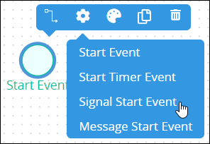 

After the element is placed into the Process model, you may adjust its location in the following ways:

* Move the element by dragging it to a new location.
* [Select the element with other elements and/or connectors](../select-multiple-process-model-elements-and-connectors.md#select-multiple-process-model-objects), and then move them collectively by dragging them to new locations in relation to one another.
* [Align](../align-and-distribute-process-model-elements-and-connectors.md#align-process-model-objects) and/or [distribute](../align-and-distribute-process-model-elements-and-connectors.md#distribute-process-model-objects) the element in relation to other selected elements and/or [connectors](../model-processes-using-connectors/what-is-a-connector.md).


Moving a Signal Start Event element has the following limitations in regards to the following Process model elements:

* **Pool element:** If the Signal Start Event element is inside of a [Pool](process-modeling-element-descriptions.md#pool) element, it cannot be moved outside of the Pool element. If you attempt to do so, Process Modeler places the Signal Start Event element inside the Pool element closest to where you attempt to move it.
* **Lane element:** If the Signal Start Event element is inside of a Lane element, it can be moved to another Lane element in the same Pool element. However, the Signal Start Event element cannot be moved outside of the Pool element.


## Change the Color of a Signal Start Event Element

The Signal Start Event element and label have a default green color to indicate that this element is a starting [Request](../../../using-processmaker/requests/what-is-a-request.md) event. After a Signal Start Event element is [added to a Process model](add-and-configure-signal-start-event-elements.md#add-a-signal-start-event-element), its shape and label color can be changed. Element and [connector](../model-processes-using-connectors/what-is-a-connector.md) colors may only be changed individually.


[Permissions are required to do this](add-and-configure-signal-start-event-elements.md#permissions-required).


Follow these steps to change the color and label for a Signal Start Event element:

1. [View your Processes](https://processmaker.gitbook.io/processmaker-4-community/-LPblkrcFWowWJ6HZdhC/~/drafts/-LRhVZm0ddxDcGGdN5ZN/primary/designing-processes/viewing-processes/view-the-list-of-processes/view-your-processes#view-all-processes). The **Processes** page displays.
2. Click the **Open Modeler** iconto edit the selected Process model. Process Modeler displays.
3. Select the Signal Start Event element to change its color. Available options display above the selected element. 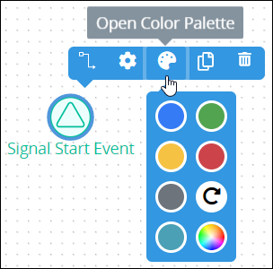 
4. Click the **Open Color Palette** icon. The color palette displays.
5. Do one of the following:
   * **Select a color swatch:** Select one of the color swatches from the color palette. The Signal Start Event element and label change to that color.
   * **Specify a custom color:** Click theicon to display the color selector, and then select a color, enter the [Hex color code](https://www.color-hex.com/), or enter the red, green, blue, and alpha color values for the custom color. The Signal Start Event element and label change to that color.  
   * **Reset to the default color:** Click theicon to reset the Signal Start Event element and label to its default color.

## Replace a Signal Start Event Element with a Different Starting Request Event Element

After a Signal Start Event element is [added to a Process model](add-and-configure-signal-start-event-elements.md#add-a-signal-start-event-element), you may replace it with a different starting [Request](../../../using-processmaker/requests/what-is-a-request.md) event element:

* [Start Event](process-modeling-element-descriptions.md#start-event) element
* [Start Timer Event](process-modeling-element-descriptions.md#start-timer-event) element
* [Message Start Event](process-modeling-element-descriptions.md#message-start-event) element

The selected Signal Start Event element is replaced by the default settings and color of the replacing element.


[Permissions are required to do this](add-and-configure-signal-start-event-elements.md#permissions-required).


Follow these steps to change a Signal Start Event element to a different starting Request event element:

1. ​[View your Processes](https://processmaker.gitbook.io/processmaker-4-community/-LPblkrcFWowWJ6HZdhC/~/drafts/-LRhVZm0ddxDcGGdN5ZN/primary/designing-processes/viewing-processes/view-the-list-of-processes/view-your-processes#view-all-processes). The **Processes** page displays.
2. Click the **Open Modeler** iconto edit the selected Process model. Process Modeler displays.
3. Select the Signal Start Event element to change to another starting Request event element. Available options display above the selected element.
4. Click the **Elements** icon. The **Elements** drop-down menu displays the starting Request event elements. 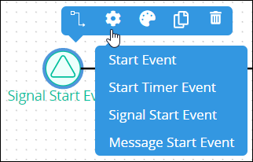 
5. Select the element to replace the Signal Start Event element. The **Change Type** screen displays to confirm replacing the currently selected element.  
6. Click **Confirm**. The new element replaces the Signal Start Event element with its default settings and color.

## Copy a Signal Start Event Element

Copying a Signal Start Event element copies the original along with its current settings, making it easier and faster to continue designing without adding default elements or [connectors](../model-processes-using-connectors/what-is-a-connector.md) with their default settings.

The copied Signal Start Event element displays below the original. Any [Sequence Flow](process-modeling-element-descriptions.md#sequence-flow) and/or [Message Flow](process-modeling-element-descriptions.md#message-flow) elements incoming to or outgoing from the original are not copied.


[Permissions are required to do this](add-and-configure-signal-start-event-elements.md#permissions-required).


Follow these steps to copy a Signal Start Event element in your Process model:

1. ​[View your Processes](https://processmaker.gitbook.io/processmaker-4-community/-LPblkrcFWowWJ6HZdhC/~/drafts/-LRhVZm0ddxDcGGdN5ZN/primary/designing-processes/viewing-processes/view-the-list-of-processes/view-your-processes#view-all-processes). The **Processes** page displays.
2. Click the **Open Modeler** iconto edit the selected Process model. Process Modeler displays.
3. Select the Signal Start Event element to copy. Available options display above the selected element. 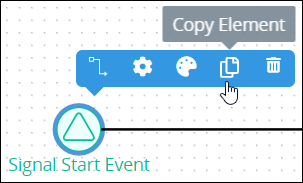 
4. Click the **Copy Element** icon. The Process model element copies. 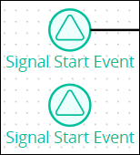 

## Delete a Signal Start Event Element

Deleting a Process model element also deletes any [Sequence Flow](process-modeling-element-descriptions.md#sequence-flow) and/or [Message Flow](process-modeling-element-descriptions.md#message-flow) elements incoming to or outgoing from that element. For example, if a Process model element is deleted that has both incoming and outgoing Sequence Flow elements, the Sequence Flow elements must be reconnected for the remaining elements/[connectors](../model-processes-using-connectors/what-is-a-connector.md).


[Permissions are required to do this](add-and-configure-signal-start-event-elements.md#permissions-required).


Follow these steps to delete a Signal Start Event element from your Process model:

1. ​[View your Processes](https://processmaker.gitbook.io/processmaker-4-community/-LPblkrcFWowWJ6HZdhC/~/drafts/-LRhVZm0ddxDcGGdN5ZN/primary/designing-processes/viewing-processes/view-the-list-of-processes/view-your-processes#view-all-processes). The **Processes** page displays.
2. Click the **Open Modeler** iconto edit the selected Process model. Process Modeler displays.
3. Select the Signal Start Event element to delete. Available options display above the selected element. 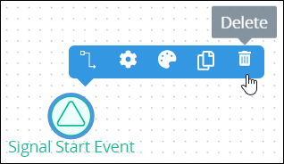 
4. Click the **Delete** icon. The Process model element deletes.

## Settings

The Signal Start Event element has the following panels that contain settings:

* **Configuration** panel
  * [Edit the element name](add-and-configure-signal-start-event-elements.md#edit-the-element-name)
  * [Select the signal to trigger the element](add-and-configure-signal-start-event-elements.md#select-the-signal-to-trigger-the-element)
  * [Edit the name of a signal](add-and-configure-signal-start-event-elements.md#edit-the-name-of-a-signal)
  * [Delete a signal from the ProcessMaker instance](add-and-configure-signal-start-event-elements.md#delete-a-signal-from-the-processmaker-instance)
* **Advanced** panel
  * [Edit the element's identifier value](add-and-configure-signal-start-event-elements.md#edit-the-elements-identifier-value)

### Configuration Panel Settings

#### Edit the Element Name

An element name is a human-readable reference for a Process element. Process Modeler automatically assigns the name of a Process element with its element type. However, an element's name can be changed.


[Permissions are required to do this](add-and-configure-signal-start-event-elements.md#permissions-required).


Follow these steps to edit the name for a Signal Start Event element:

1. Ensure that the **Hide Menus** buttonis not enabled. See [Maximize the Process Modeler Canvas View](../navigate-around-your-process-model.md#maximize-the-process-modeler-canvas-view).
2. Select the Signal Start Event element from the Process model in which to edit its name. Panels to configure this element display.
3. Expand the **Configuration** panel if it is not presently expanded. The **Name** setting displays. This is a required setting. 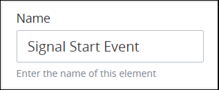 
4. In the **Name** setting, edit the selected element's name and then press **Enter**.

#### Select the Signal to Trigger the Element

A Signal Start Event element starts a Request for a Process when it triggers by receiving a specific broadcast signal from a broadcasting element in any other Request in that ProcessMaker instance. The element that broadcasts the signal does not need to be in the same Process model as the Signal Start Event element that receives the broadcast. Select the signal that triggers this element.

You may create a signal from this setting. This signal becomes available throughout your ProcessMaker instance for all Process designers to use after you [save your Process model](../toolboxes.md#save-your-process-model). Therefore, the attributes that define a signal, the signal ID and signal name, must be unique.

However, ensure to configure one of the following elements from any Process model to broadcast this signal when it triggers; otherwise, the signal you create from this setting never broadcasts during any Request:

* [Intermediate Signal Throw Event](process-modeling-element-descriptions.md#intermediate-signal-throw-event) element
* [Signal End Event](process-modeling-element-descriptions.md#signal-end-event) element


[Permissions are required to do this](add-and-configure-signal-start-event-elements.md#permissions-required).


Follow these steps to select the signal that triggers the Signal Start Event element:

1. Ensure that the **Hide Menus** buttonis not enabled. See [Maximize the Process Modeler Canvas View](../navigate-around-your-process-model.md#maximize-the-process-modeler-canvas-view).
2. Select the Signal Start Event element from the Process model in which to select the signal that triggers it. Panels to configure this element display.
3. Expand the **Configuration** panel if it is not presently expanded, and then locate the **Signal** setting. 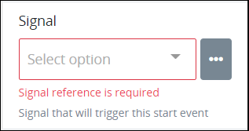 
4. Do one of the following:
   * **The signal to trigger this element exists:**
     1. From the **Signal** drop-down menu, select the signal that triggers this element. This setting is required.
   * **The signal to trigger this element does not exist:**
     1. Click the menu iconbeside the **Signal** drop-down menu. The **+Signal** button displays.
     2. Click the **+Signal** button. The **ID** and **Name** settings display to configure the new signal's ID and name, respectively. 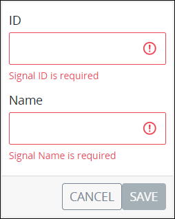 
     3. In the **ID** setting, enter the unique ID of this signal. The signal ID may only contain non-special characters and without spaces. This signal ID must be unique from all other signal IDs in this ProcessMaker instance. If the entered signal ID already exists, the following text displays below the setting: **Signal ID is duplicated**. Note that the signal ID cannot be edited after the signal is created. This is a required setting.
     4. In the **Name** setting, enter the unique alphanumeric name of this signal. This signal name must be unique from all other signal names in this ProcessMaker instance. This signal name displays when selecting a signal from other elements that can broadcast or listen for a signal. If the entered signal name already exists, the following text displays below the setting: **Signal Name is duplicated**. This is a required setting.
     5. Click **Save**. The signal is created.
     6. From the **Signal** drop-down menu, select the new signal that triggers this element. This setting is required.

#### Edit the Name of a Signal

Editing the name of a signal changes that signal's name in your ProcessMaker instance. This signal name displays when selecting a signal from other elements that can broadcast or listen for a signal.


[Permissions are required to do this](add-and-configure-signal-start-event-elements.md#permissions-required).


Follow these steps to edit the name of a signal:

1. Ensure that the **Hide Menus** buttonis not enabled. See [Maximize the Process Modeler Canvas View](../navigate-around-your-process-model.md#maximize-the-process-modeler-canvas-view).
2. Select any element from the Process model that broadcasts or listens for a signal. Panels to configure this element display.
3. Expand the **Configuration** panel if it is not presently expanded, and then locate the **Signal** setting. The **Signal** setting may have a selection unlike the image below indicates.  
4. Click the menu iconbeside the **Signal** drop-down menu. All signals configured in your ProcessMaker instance display below the **+Signal** button. The signal ID displays in a gray border; the signal name displays to the right of the signal ID.  
5. Click the **Edit** iconthat displays beside each signal to edit that signal. The **Name** setting displays the name of that signal. 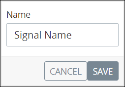 
6. In the **Name** setting, edit the name of the signal as necessary.
7. Click **Save**.
8. [Save your Process model](../toolboxes.md#save-your-process-model).

#### Delete a Signal from the ProcessMaker Instance


[Permissions are required to do this](add-and-configure-signal-start-event-elements.md#permissions-required).



Carefully consider whether to delete a signal. Deleting a signal makes that signal unavailable when configuring all elements that broadcast or listen to signals throughout your ProcessMaker instance. However, those elements already configured with a deleted signal are not affected, nor are any started Requests affected.

Deleting a signal from the ProcessMaker instance cannot be undone.


Follow these steps to delete a signal from the ProcessMaker instance:

1. Ensure that the **Hide Menus** buttonis not enabled. See [Maximize the Process Modeler Canvas View](../navigate-around-your-process-model.md#maximize-the-process-modeler-canvas-view).
2. Select any element from the Process model that broadcasts or listens for a signal. Panels to configure this element display.
3. Expand the **Configuration** panel if it is not presently expanded, and then locate the **Signal** setting. The **Signal** setting may have a selection unlike the image below indicates.  
4. Click the menu iconbeside the **Signal** drop-down menu. All signals configured in your ProcessMaker instance display below the **+Signal** button. The signal ID displays in a gray border; the signal name displays to the right of the signal ID.  
5. Click the **Delete** iconthat displays beside each signal to delete that signal. A message displays to confirm deletion of this signal. 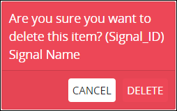 
6. Click **Delete**.
7. [Save your Process model](../toolboxes.md#save-your-process-model).

### Advanced Panel Settings

#### Edit the Element's Identifier Value

Process Modeler automatically assigns a unique value to each Process element added to a Process model. However, an element's identifier value can be changed if it is unique to all other elements in the Process model, including the Process model's identifier value.


[Permissions are required to do this](add-and-configure-signal-start-event-elements.md#permissions-required).



All identifier values for all elements in the Process model must be unique.


Follow these steps to edit the identifier value for a Signal Start Event element:

1. Ensure that the **Hide Menus** buttonis not enabled. See [Maximize the Process Modeler Canvas View](../navigate-around-your-process-model.md#maximize-the-process-modeler-canvas-view).
2. Select the Signal Start Event element from the Process model in which to edit its identifier value. Panels to configure this element display.
3. Expand the **Advanced** panel if it is not presently expanded. The **Node Identifier** setting displays. This is a required setting. 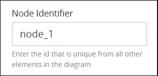 
4. In the **Node Identifier** setting, edit the Signal Start Event element's identifier to a unique value from all elements in the Process model and then press **Enter**.

## Related Topics









