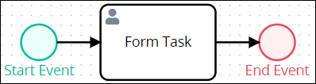
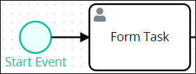
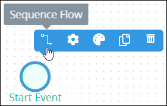
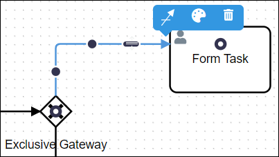
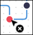
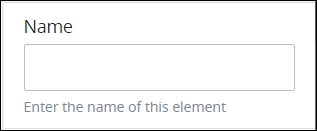
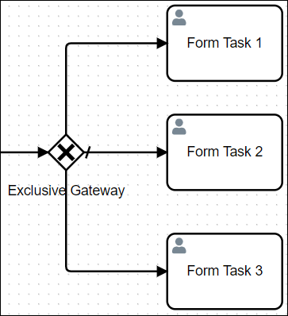

# Sequence Flow Elements

## Overview

Use a Sequence Flow element to indicate workflow routing between the connected elements. The direction in which the Sequence Flow points implies how [Request](../../../using-processmaker/requests/what-is-a-request.md) data is conveyed and utilized in the Process model. As a best practice, indicate a consistent direction of Sequence Flow elements: either left to right or top to bottom, to make Process models easier to understand.

Sequence Flow elements are not to be confused with [Message Flow](process-modeling-element-descriptions.md#message-flow) elements.

Sequence Flow elements have the following attributes in regards to specific Process model elements:

* From the context of a Process model element associated with a Sequence Flow element, that Sequence Flow element can be "incoming" or "outgoing." Consider the following Process model example to demonstrate their differences.  

  

  * **Incoming:** An incoming Sequence Flow element comes from its connecting element. In the example, the Sequence Flow element is incoming to the Form Task element.  

    

  * **Outgoing:** An outgoing Sequence Flow goes to the connecting element. In the example, the Sequence Flow element is outgoing from the Form Task element.  

    

* Text annotation elements and Pool elements do not participate in sequence flow.
* Sequence Flow elements cannot connect workflow between Process model elements within different Pool elements. Use [Message Flow](set-and-delete-message-flow-between-elements.md) elements to indicate messaging between elements in different Pool elements.
* Start Event type elements begin the flow of a Request for that Process. Therefore, the following elements cannot have an incoming Sequence Flow element:
  * [Start Event](process-modeling-element-descriptions.md#start-event) element
  * [Start Timer](process-modeling-element-descriptions.md#start-timer-event) Event element
  * [Signal Start Event](process-modeling-element-descriptions.md#signal-start-event) element
  * [Message Start Event](process-modeling-element-descriptions.md#message-start-event) element
* End Event type elements terminate the flow of a Request for that Process. Therefore, the following elements cannot have an outgoing Sequence Flow element:
  * [End Event](process-modeling-element-descriptions.md#end-event) element
  * [Message End Event](process-modeling-element-descriptions.md#message-end-event) element
  * [Error End Event](process-modeling-element-descriptions.md#error-end-event) element
  * [Signal End Event](process-modeling-element-descriptions.md#signal-end-event) element
  * [Terminate End Event](process-modeling-element-descriptions.md#terminate-end-event) element
* Sequence Flow elements from [Exclusive Gateway](process-modeling-element-descriptions.md#exclusive-gateway) and [Inclusive Gateway](process-modeling-element-descriptions.md#inclusive-gateway) elements can be configured to specify under which condition a Request routes through that Sequence Flow element. See [Configure an Outgoing Sequence Flow Element from an Exclusive Gateway or Inclusive Gateway Element](the-quick-toolbar.md#configure-an-outgoing-sequence-flow-element-from-an-exclusive-gateway-or-inclusive-gateway-element).

## Permissions Required

Your ProcessMaker user account or group membership must have the following permissions to configure Sequence Flow elements in the Process model unless your user account has the **Make this user a Super Admin** setting selected:

* Processes: Edit Processes
* Processes: View Processes

See the [Process](../../../processmaker-administration/permission-descriptions-for-users-and-groups.md#processes) permissions or ask your ProcessMaker Administrator for assistance.

## Connect the Sequence Flow Element to Another Element or Connector


[Permissions are required to do this](the-quick-toolbar.md#permissions-required).


Follow these steps to set the Sequence Flow element from one connecting element/[connector](../model-processes-using-connectors/what-is-a-connector.md) to another:

1. [​View your Processes](../../viewing-processes/view-the-list-of-processes/view-your-processes.md#view-all-active-processes). The **Processes** page displays.
2. Click the **Open Modeler** iconto edit the selected Process model. Process Modeler displays.
3. Select the Process model element from which you want to set the workflow routing. Available options display to the right of the selected element. The solid-line Flow indicator is for Sequence Flow elements \(highlighted below\).  

   

4. Click the **Sequence Flow** icon.
5. Click the Process model element or connector to which to set the workflow routing. The Sequence Flow element connects between the two \(2\) elements to indicate workflow routing.  

## Adjust How a Sequence Flow Element Bends Using Anchors

Use anchors in a Sequence Flow element to adjust how that Sequence Flow element bends between its connecting elements/[connectors](../model-processes-using-connectors/what-is-a-connector.md). There are two \(2\) types of Sequence Flow anchors:

* [Adjust a straight line within a Sequence Flow element](the-quick-toolbar.md#adjust-a-straight-line-within-a-sequence-flow-element) by dragging the placement of an oblong anchor.
* [Adjust where a Sequence Flow element bends](the-quick-toolbar.md#adjust-where-a-sequence-flow-element-bends) by placing, then dragging round anchors.

### Adjust a Straight Line Within a Sequence Flow Element


[Permissions are required to do this](the-quick-toolbar.md#permissions-required).


Follow these steps to adjust a straight line within a Sequence Flow element:

1. ​[View your Processes](https://processmaker.gitbook.io/processmaker-4-community/-LPblkrcFWowWJ6HZdhC/~/drafts/-LRhVZm0ddxDcGGdN5ZN/primary/designing-processes/viewing-processes/view-the-list-of-processes/view-your-processes#view-all-processes). The **Processes** page displays.
2. Click the **Open Modeler** iconto edit the selected Process model. Process Modeler displays.
3. [Connect a Sequence Flow element](the-quick-toolbar.md#connect-the-sequence-flow-element-to-another-element-or-connector) from one element/connector to another.
4. Select the Sequence Flow element so that available options display above the selected element. Sequence Flow elements that have immediately been connected require two clicks of the Sequence Flow element for anchors to display.
5. Drag the oblong anchorperpendicularly with the straight line of the Sequence Flow element.

### Adjust Where a Sequence Flow Element Bends


[Permissions are required to do this](the-quick-toolbar.md#permissions-required).


Follow these steps to adjust where a Sequence Flow element bends:

1. ​[View your Processes](https://processmaker.gitbook.io/processmaker-4-community/-LPblkrcFWowWJ6HZdhC/~/drafts/-LRhVZm0ddxDcGGdN5ZN/primary/designing-processes/viewing-processes/view-the-list-of-processes/view-your-processes#view-all-processes). The **Processes** page displays.
2. Click the **Open Modeler** iconto edit the selected Process model. Process Modeler displays.
3. [Connect a Sequence Flow element](the-quick-toolbar.md#connect-the-sequence-flow-element-to-another-element-or-connector) from one element/connector to another.
4. Select the Sequence Flow element so that available options display above the selected element. Sequence Flow elements that have immediately been connected require two clicks of the Sequence Flow element for anchors to display.
5. Do one of the following:
   * Drag an existing round anchorto place where to bend that Sequence Flow element.
   * Click, and then drag, on a straight line of the Sequence Flow element to add a round anchor, then place where to add a bend in that Sequence Flow element.
   * Click an existing round anchor to delete it, thereby removing that bend in that Sequence Flow element.  

## Delete a Sequence Flow Element


[Permissions are required to do this](the-quick-toolbar.md#permissions-required).


Follow these steps to delete a Sequence Flow element from your Process model:

1. ​[View your Processes](https://processmaker.gitbook.io/processmaker-4-community/-LPblkrcFWowWJ6HZdhC/~/drafts/-LRhVZm0ddxDcGGdN5ZN/primary/designing-processes/viewing-processes/view-the-list-of-processes/view-your-processes#view-all-processes). The **Processes** page displays.
2. Click the **Open Modeler** iconto edit the selected Process model. Process Modeler displays.
3. Select the Sequence Flow element between the connected element/[connector](../model-processes-using-connectors/what-is-a-connector.md) to delete. Available options display above the selected element.  
4. Click the **Delete** icon. The Process model element deletes.

## Settings

The Sequence Flow element has the following panels that contain settings:

* **Configuration** panel
  * [Edit the element name](the-quick-toolbar.md#edit-the-element-name)
  * [Edit the expression to indicate Workflow routing](the-quick-toolbar.md#edit-the-expression-to-indicate-workflow-routing) \(available only for Exclusive Gateway and Inclusive Gateway elements\)
* **Advanced** panel
  * [Edit the element's identifier value](the-quick-toolbar.md#edit-the-elements-identifier-value)

### Configuration Panel Settings

#### Edit the Element Name

An element name is a human-readable reference for a Process element.


[Permissions are required to do this](the-quick-toolbar.md#permissions-required).


Follow these steps to enter or edit the name for a Sequence Flow element:

1. Ensure that the **Hide Menus** buttonis not enabled. See [Maximize the Process Modeler Canvas View](../navigate-around-your-process-model.md#maximize-the-process-modeler-canvas-view).
2. Select the Sequence Flow element from the Process model in which to edit its name. Panels to configure this element display.
3. Expand the **Configuration** panel if it is not presently expanded. The **Name** setting displays. 
4. In the **Name** setting, enter or edit the selected element's name and then press **Enter**.

#### Edit the Expression to Indicate Workflow Routing


This Sequence Flow element setting is available only for [Exclusive Gateway](process-modeling-element-descriptions.md#exclusive-gateway) and [Inclusive Gateway](process-modeling-element-descriptions.md#inclusive-gateway) elements. See [Configure an Outgoing Sequence Flow Element from an Exclusive Gateway or Inclusive Gateway Element](the-quick-toolbar.md#configure-an-outgoing-sequence-flow-element-from-an-exclusive-gateway-or-inclusive-gateway-element) for information how this setting affects workflow routing.


Outgoing Sequence Flow elements from Exclusive Gateway and Inclusive Gateway elements have an additional setting from which to configure under which Request condition\(s\) that Sequence Flow element triggers to route that Request's workflow to its connecting element or [connector](../model-processes-using-connectors/what-is-a-connector.md).


[Permissions are required to do this](the-quick-toolbar.md#permissions-required).


Follow these steps to edit the expression that indicates under which Request condition\(s\) that Sequence Flow element triggers to route that Request's workflow to its connecting element:

1. Ensure that the **Hide Menus** buttonis not enabled. See [Maximize the Process Modeler Canvas View](../navigate-around-your-process-model.md#maximize-the-process-modeler-canvas-view).
2. Select the outgoing Sequence Flow element from the Exclusive Gateway or Inclusive Gateway element from which dictate conditions under which workflow routes through that Sequence Flow element. Panels to configure this element display.
3. Expand the **Configuration** panel if it is not presently expanded. The **Expression** setting displays.  
4. In the **Expression** setting, enter the expression that dictates under which condition\(s\) that Sequence Flow element triggers to route a Request's workflow to its connecting element, and then press **Enter**. See the following sections for more information:
   * [Configure an Outgoing Sequence Flow Element from an Exclusive Gateway or Inclusive Gateway Element](the-quick-toolbar.md#configure-an-outgoing-sequence-flow-element-from-an-exclusive-gateway-or-inclusive-gateway-element)
   * [Expression Syntax Components to Specify Request Conditions That Trigger an Outgoing Sequence Flow Element](the-quick-toolbar.md#expression-syntax-components-to-specify-request-conditions-that-trigger-an-outgoing-sequence-flow-element)

### Advanced Panel Settings

#### Edit the Element's Identifier Value

Process Modeler automatically assigns a unique value to each Process element added to a Process model. However, an element's identifier value can be changed if it is unique to all other elements in the Process model, including the Process model's identifier value.


[Permissions are required to do this](the-quick-toolbar.md#permissions-required).



All identifier values for all elements in the Process model must be unique.


Follow these steps to edit the identifier value for a Sequence Flow element:

1. Ensure that the **Hide Menus** buttonis not enabled. See [Maximize the Process Modeler Canvas View](../navigate-around-your-process-model.md#maximize-the-process-modeler-canvas-view).
2. Select the Sequence Flow element from the Process model in which to edit its name. Panels to configure this element display.
3. Expand the **Advanced** panel if it is not presently expanded. The **Node Identifier** setting displays. 
4. In the **Node Identifier** setting, edit the Sequence Flow element's identifier to a unique value from all elements in the Process model and then press **Enter**.

## Configure an Outgoing Sequence Flow Element from an Exclusive Gateway or Inclusive Gateway Element

### Overview

Outgoing Sequence Flow elements from [Exclusive Gateway](process-modeling-element-descriptions.md#exclusive-gateway) and [Inclusive Gateway](process-modeling-element-descriptions.md#inclusive-gateway) elements have the following settings as do other Sequence Flow elements:

* [Identifier value](the-quick-toolbar.md#edit-the-identifier-value)
* [Element name](the-quick-toolbar.md#edit-the-element-name)

Outgoing Sequence Flow elements from Exclusive Gateway and Inclusive Gateway elements have additional settings to indicate under which condition\(s\) an outgoing Sequence Flow element triggers to route a Request's workflow to its connecting element or [connector](../model-processes-using-connectors/what-is-a-connector.md):

* **Specify the condition\(s\) to trigger each Sequence Flow element:** Specify the condition\(s\) that must occur in a Request to trigger that Sequence Flow element, thereby triggering its connecting element. By setting different conditions on all outgoing Sequence Flow elements from an Exclusive Gateway or Inclusive Gateway element, you determine the business requirements for each Request of that Process model. ProcessMaker evaluates a Sequence Flow element's condition\(s\) to trigger by reviewing the Request's data to an expression that describes the condition\(s\). Specify this condition using an expression syntax described in [Expression Syntax Components to Specify Request Conditions That Trigger an Outgoing Sequence Flow Element](the-quick-toolbar.md#expression-syntax-components-to-specify-request-conditions-that-trigger-an-outgoing-sequence-flow-element). Each Sequence Flow element can only have one expression, but by using logical operators multiple conditions can be specified in that expression. You may use [Magic Variables](../../reference-global-variables-in-your-processmaker-assets.md) in your expressions.
* **Select which Sequence Flow element triggers if Request conditions cannot trigger any of them:** [Select which outgoing Sequence Flow element triggers by default](the-quick-toolbar.md#select-a-default-sequence-flow-element) when none of the Request conditions can trigger any of the outgoing Sequence flows from an Exclusive Gateway or Inclusive Gateway element. If none of the conditions specified in any of the outgoing Sequence Flow elements meet the Request conditions to trigger, the default outgoing Sequence Flow triggers, thereby preventing the Request from pausing indefinitely. If a Sequence Flow element is set as the default, then its evaluation is ignored and it triggers by default. Only one outgoing Sequence Flow element from an outgoing Exclusive Gateway or Inclusive Gateway element may be set as the default.


See [Edit the Expression to Indicate Workflow Routing](the-quick-toolbar.md#edit-the-expression-to-indicate-workflow-routing) for information how to edit an expression in an outgoing Sequence Flow element from an Exclusive Gateway or Inclusive Gateway element.


#### Exclusive Gateway Elements Allow One Outgoing Sequence Flow Element to Trigger

An Exclusive Gateway element allows only one outgoing Sequence Flow element to trigger. If all outgoing Sequence Flow elements from an Exclusive Gateway element do not have expressions from which to evaluate conditions during a Request, that Request pauses and remains in-progress indefinitely; that Request will never complete.

Therefore, ensure to do the following when configuring outgoing Sequence Flow elements from an Exclusive Gateway element:

* [Specify the condition\(s\) on each outgoing Sequence Flow element to indicate workflow routing](the-quick-toolbar.md#edit-the-expression-to-indicate-workflow-routing).
* [Select one outgoing Sequence Flow element as the default outgoing Sequence Flow element](the-quick-toolbar.md#select-a-default-sequence-flow-element) if none of the Request conditions can trigger any of the Sequence Flow elements, thereby preventing any in-progress Request from pausing indefinitely.

#### Inclusive Gateway Elements Allow Potentially Multiple Outgoing Sequence Flow Elements to Trigger

An Inclusive Gateway element potentially allows all its outgoing Sequence Flow elements to trigger if the Request condition\(s\) for each Sequence Flow element are met. For example, if no outgoing Sequence Flow elements from an Inclusive Gateway element have expressions from which to evaluate Request conditions, then all Sequence Flow elements always trigger, thereby causing the Inclusive Gateway element to function as a [Parallel Gateway](process-modeling-element-descriptions.md#parallel-gateway) element set to [diverge workflow](add-and-configure-parallel-gateway-elements.md#indicate-workflow-direction). Even if one Sequence Flow element is selected as the default Sequence Flow element to trigger, workflow routing is not affected when no outgoing Sequence Flow elements have expressions from which to evaluate Request conditions.

Therefore, ensure to do the following when configuring outgoing Sequence Flow elements from an Inclusive Gateway element:

* [Specify the condition\(s\) on each outgoing Sequence Flow element to indicate workflow routing](the-quick-toolbar.md#edit-the-expression-to-indicate-workflow-routing).
* [Select one outgoing Sequence Flow element as the default outgoing Sequence Flow element](the-quick-toolbar.md#select-a-default-sequence-flow-element) to ensure that this Sequence Flow element always triggers regardless of Request conditions. Selecting one outgoing Sequence Flow element as the default workflow prevents any in-progress Request from pausing indefinitely.

### Select a Default Outgoing Sequence Flow Element

Select which outgoing Sequence Flow element triggers by default when none of the Request conditions can trigger any of the outgoing Sequence flows from an Exclusive Gateway or Inclusive Gateway element. If none of the conditions specified in any of the outgoing Sequence Flow elements meet the Request conditions to trigger, the default outgoing Sequence Flow triggers, thereby preventing the in-progress Request from pausing indefinitely. If a Sequence Flow element is set as the default, then its evaluation is ignored and it triggers by default. Only one outgoing Sequence Flow element from an outgoing Exclusive Gateway or Inclusive Gateway element may be set as the default.

Setting a default Sequence Flow to trigger is only available for outgoing Sequence Flow elements from Exclusive Gateway or Inclusive Gateway elements.


[Permissions are required to do this](the-quick-toolbar.md#permissions-required).


Follow these steps to select an outgoing Sequence Flow element as the default to trigger from either an Exclusive Gateway or Inclusive Gateway element:

1. Select the outgoing Sequence Flow element from either an Exclusive Gateway element or Inclusive Gateway element to set as default to trigger.
2. Click the **Set as Default Flow** iconfor that outgoing Sequence Flow element. The default workflow indicator displays for that Sequence Flow element. The default workflow indicator removes from any other Sequence Flow element previously configured to be the default to trigger since only one outgoing Sequence Flow element can be the default.

The center outgoing Sequence Flow element is the default Sequence Flow element from the Exclusive Gateway element below.

### Expression Syntax Components to Specify Request Conditions That Trigger an Outgoing Sequence Flow Element

Use the following expression syntax components to compose the expression that describes under which Request condition\(s\) an outgoing Sequence Flow element triggers from an Exclusive Gateway or Inclusive Gateway element.

Spaces are allowed before and after expression components, such as arithmetic and comparison operators, to more easily read the expression.

Combine expressions using logical operators. Example: `(not approved) or (cost > 500)`.


[Magic Variables](../../reference-global-variables-in-your-processmaker-assets.md) can be used in when composing expressions.


#### **Literals**

| Component | Syntax | Expression Example |
| :--- | :--- | :--- |
| string | `"hello world"` or `'hello world'` | `FullNameInput == "Louis Canera"` |
| number | `100` | `cost > 500` |
| array | `[`value1`,` value2`]` | `myFruit not in ["apples", "oranges"]` |
| Boolean | `true` and `false` | `directorSigned` |

#### **Arithmetic Operations**

| Component | Syntax |
| :--- | :--- |
| addition | `+` |
| subtraction | `-` |
| multiplication | `*` |
| division | `/` |

#### **Logical Operators**

| Component | Syntax |
| :--- | :--- |
| not | `not` |
| and | `and` |
| or | `or` |

#### **Comparison Operators**

| Component | Syntax |
| :--- | :--- |
| equal to | `==` |
| not equal to | `!=` |
| less than | `<` |
| greater than | `>` |
| less than or equal to | `<=` |
| greater than or equal to | `>=` |

#### **String Operator**

| Component | Syntax |
| :--- | :--- |
| concatenate matches | `~` |

#### **Array Operators**

| Component | Syntax |
| :--- | :--- |
| contains | `in` |
| does not contain | `not in` |

#### **Range**

| Component | Syntax | Example |
| :--- | :--- | :--- |
| range | `..` | `foo in 1..10` |

## Related Topics









