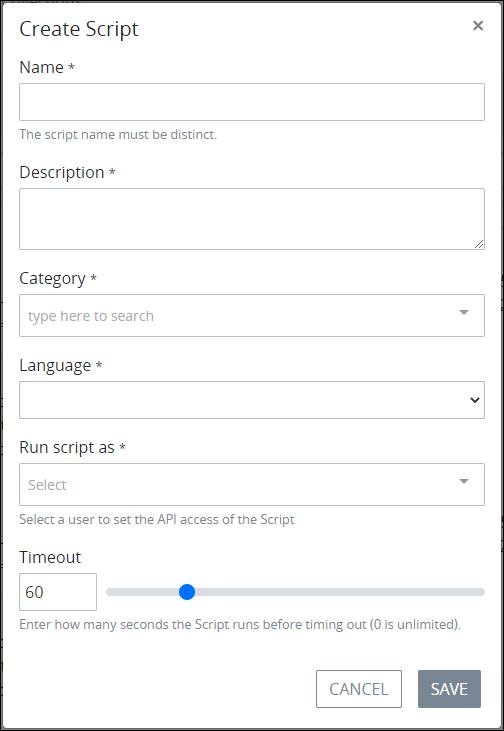

# Create a New Script

## Create a New ProcessMaker Script


Your ProcessMaker user account or group membership must have the following permissions to create a ProcessMaker Script unless your user account has the **Make this user a Super Admin** setting selected:

* Scripts: Create Scripts
* Scripts: View Scripts

See the ProcessMaker [Scripts](../../../processmaker-administration/permission-descriptions-for-users-and-groups.md#scripts) permissions or ask your ProcessMaker Administrator for assistance.


Follow these steps to create a new ProcessMaker Script:

1. [View your ProcessMaker Scripts](view-all-scripts.md). The **Scripts** page displays.
2. Click the **+Script** button. The **Create Script** screen displays.  

   

3. In the **Name** setting, enter the name of the ProcessMaker Script. ProcessMaker Script names must be unique in your organization and can only use apostrophe characters \(`'`\) and spaces. This is a required setting.
4. In the **Description** setting, enter the description of the ProcessMaker Script. This is a required setting.
5. From the **Category** drop-down menu, select one or more Script Categories to associate with this ProcessMaker Script. In doing so, [Script Categories](manage-script-categories/what-is-a-script-category.md) may be sorted from the [**Scripts** page](view-all-scripts.md#view-all-processmaker-scripts). To remove a Script Category that is currently selected, click theicon for that selection or press `Enter` when the drop-down is visible. This is a required setting.
6. From the **Language** drop-down menu, select the [ProcessMaker Script Executor](../../../processmaker-administration/script-executor-management/what-is-a-script-executor.md) from which to run the ProcessMaker Script for this Script's programming language. Your ProcessMaker Administrator may have created custom ProcessMaker Script Executors using ProcessMaker-supported languages to run sanctioned custom third-party code and/or [Docker commands](https://docs.docker.com/engine/reference/commandline/docker/) that allow Scripts to successfully call third-party Application Program Interfaces \(APIs\) and Software Development Kits \(SDKs\). Below are the ProcessMaker Script Executors ProcessMaker provides, though some require packages that are not available in the ProcessMaker open-source edition:

   * **csharp - C\# Executor:** This is the default ProcessMaker Script Executor to run Scripts developed using C\#. Note that if the [C\# package](../../../package-development-distribution/package-a-connector/c-package.md) is not installed in your ProcessMaker instance, this ProcessMaker Script Executor is not available.
   * **java - Java Executor:** This is the default ProcessMaker Script Executor to run Scripts developed using Java. Note that if the [Java package](../../../package-development-distribution/package-a-connector/java-package.md) is not installed in your ProcessMaker instance, this ProcessMaker Script Executor is not available.
   * **javascript - Node Executor:** This is the default ProcessMaker Script Executor to run Scripts developed using JavaScript.
   * **lua - LUA Executor:** This is the default ProcessMaker Script Executor to run Scripts developed using Lua.
   * **python - Python Executor:** This is the default ProcessMaker Script Executor to run Scripts developed using Python. Note that if the [Python package](../../../package-development-distribution/package-a-connector/python-package.md) is not installed in your ProcessMaker instance, this ProcessMaker Script Executor is not available.
   * **r - R Executor:** This is the default ProcessMaker Script Executor to run Scripts developed using R. Note that if the [R package](../../../package-development-distribution/package-a-connector/r-package.md) is not installed in your ProcessMaker instance, this ProcessMaker Script Executor is not available.

   This is a required setting.

7. From the **Run script as** drop-down menu, select which ProcessMaker user's API client token to use with the ProcessMaker REST API. Ensure that the selected ProcessMaker user's account has the appropriate API [permissions](../../../processmaker-administration/permission-descriptions-for-users-and-groups.md) to access the ProcessMaker REST API. This is a required setting.
8. In the **Timeout** setting, use the slider control or enter how many seconds the ProcessMaker Script is allowed to run before it times out. Use `0` to indicate that the ProcessMaker Script never times out. The default timeout is **60** seconds. This setting requires an integer.
9. Click **Save**. Scripts Editor displays so you can develop your ProcessMaker Script. See [Scripts Editor]().

## Related Topics





























