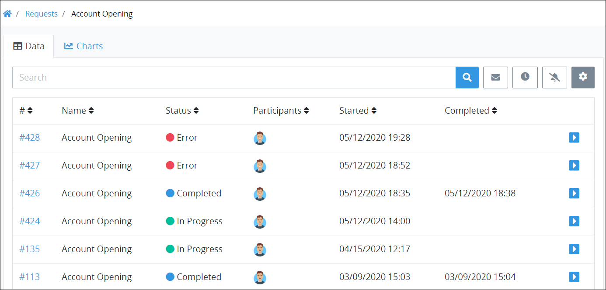

# Saved Searches Package

## Overview


The Saved Searches [package](../first-topic.md) is not available in the ProcessMaker open-source edition. Contact [ProcessMaker Sales](https://www.processmaker.com/contact/) or ask your ProcessMaker sales representative how the Saved Searches package can be installed in your ProcessMaker instance.


Use the Saved Searches package to save and share search parameters associated with [Requests](../../using-processmaker/requests/what-is-a-request.md), [Tasks](../../using-processmaker/task-management/what-is-a-task.md) and [ProcessMaker Collections](../../collections/what-is-a-collection.md). In doing so, you manage the search parameters for your Saved Searches. You may share your own Saved Searches with other ProcessMaker [users](../../processmaker-administration/add-users/what-is-a-user.md) and/or [groups](../../processmaker-administration/assign-groups-to-users/what-is-a-group.md). Recipients of your shared Saved Searches can only use your Saved Search to view its search results, but cannot modify your Saved Searches' parameter settings you configured. The name for a Saved Search does not need to be unique within your ProcessMaker instance. Therefore, multiple Saved Searches may have the same name when your own Saved Search and one shared with you have the same name.

Similar to [advanced Request searches](../../using-processmaker/requests/search-for-a-request.md#advanced-search-for-a-request), [advanced Task searches](../../using-processmaker/task-management/search-for-a-task.md#advanced-search-for-a-task), and [Collection record searches](../../collections/manage-records-in-a-collection/search-for-a-record-in-a-collection.md#search-records-in-a-processmaker-collection), filter the data that for a Saved Search using [ProcessMaker Query Language \(PMQL\)](../../using-processmaker/search-processmaker-data-using-pmql.md).

You may schedule a regular interval in which to email reports for either your own Saved Searches or those shared with you. See [Schedule an Interval to Email Reports](../../using-processmaker/save-and-share-request-and-task-related-searches/schedule-to-email-reports-of-saved-search-results/schedule-an-interval-to-email-reports.md#schedule-an-interval-to-email-reports).

Charts help visualize your Saved Search results. Though you can [customize in tabular format the data details for your Saved Searches](../../using-processmaker/save-and-share-request-and-task-related-searches/view-saved-searches-that-are-shared-with-you/configure-a-saved-search.md#configure-how-saved-search-results-display-in-tabular-format), nothing distills that data like a customized chart. Create and configure two-dimensional charts to visualize Saved Search results after selecting a Saved Search. You may create customized charts regardless of whether you created the Saved Search or if it was shared with you.

Charts use the data results from the Saved Search to visualize those results in a variety of chart types and styles. Chart data may be filtered by using an optional PMQL query that further filters the data from that Saved Search to visualize minute data.

The **Charts** tab displays charts created for a Saved Search. See [Overview of Saved Search Charts](../../using-processmaker/save-and-share-request-and-task-related-searches/create-charts-to-visualize-saved-search-results/overview-of-saved-search-charts.md).

[ProcessMaker Screen](../../designing-processes/design-forms/what-is-a-form.md) designers may also embed Saved Search charts into [Form](../../designing-processes/design-forms/screens-builder/types-for-screens.md#form)- and [Display](../../designing-processes/design-forms/screens-builder/types-for-screens.md#display)-type Screens using the [Saved Search Chart control](../../designing-processes/design-forms/screens-builder/control-descriptions/saved-search-chart-control-settings.md).

See [Saved Searches](../../using-processmaker/save-and-share-request-and-task-related-searches/).

## Related Topics

















