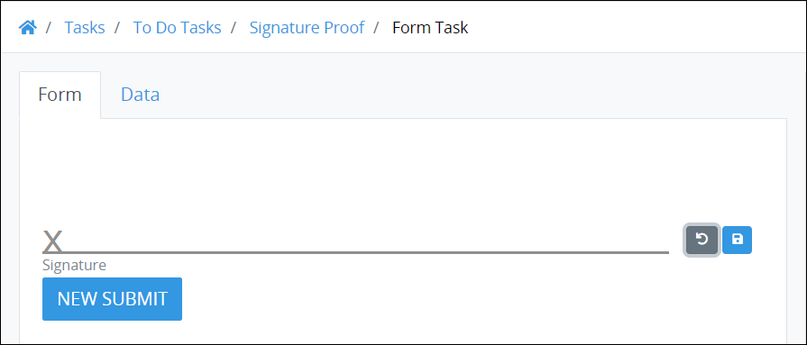
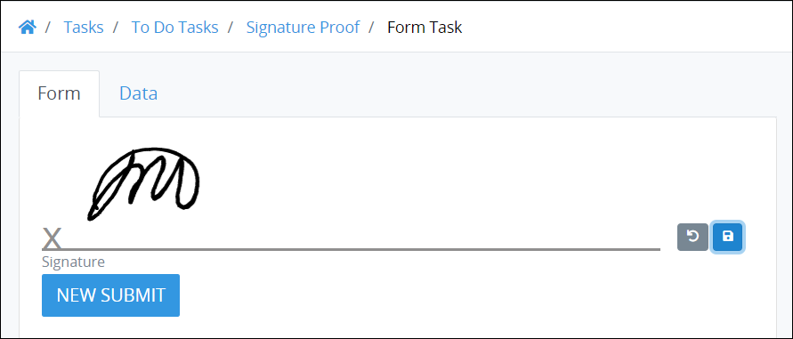

# Signature Package

## Overview


The Signature [package](../first-topic.md) is not available in the ProcessMaker open-source edition. Contact [ProcessMaker Sales](https://www.processmaker.com/contact/) or ask your ProcessMaker sales representative how the Signature package can be installed in your ProcessMaker instance.


Use the Signature package to include a digital signature within a created form in Screens.

This digital signature package is available providing the user has access to screen sensitivity. After the signature is produced, it is possible to save it in order to be used in further instances.

Please note that it is possible to **Redo** the signature entered using the Redo button .  

When the changes are satisfactory select the **Save** button  . 

See [Signature Control Settings](../../designing-processes/design-forms/screens-builder/control-descriptions/signature-control-settings.md).

