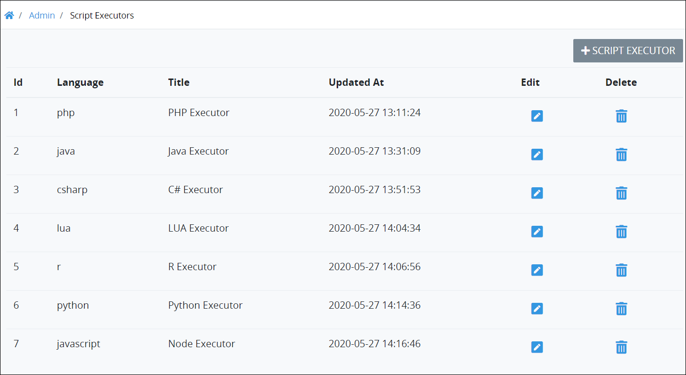

# View Script Executors

## View All ProcessMaker Script Executors

ProcessMaker displays all ProcessMaker Scripts in one location. Any ProcessMaker Script developed by any Process Owner or ProcessMaker Developer can be used in any Process model. This makes it easy to manage ProcessMaker Scripts.

Follow these steps to view all ProcessMaker Script Executors in your organization:

1. [Log on](../../../using-processmaker/log-in.md#log-in) to ProcessMaker.
2. Click the **Admin** option from the top menu. The **Users** page displays.
3. Click the **Script Executors** icon. The **Script Executors** page displays all ProcessMaker Script Executors.

The **Script Executors** page displays the following information in tabular format about ProcessMaker Script Executors:

* **Language:** The **Language** column displays for which ProcessMaker Scripts the ProcessMaker Script Executor runs based on its programming language.
* **Title:** The **Title** column displays the name of the ProcessMaker Script Executor.
* **Updated At:** The **Updated At** column displays the date and time the ProcessMaker Script Executor was last modified. The time zone setting to display the time is according to the ProcessMaker instance unless your [user profile's](../../../using-processmaker/profile-settings.md#change-your-profile-settings) **Time zone** setting is specified.

ProcessMaker provides the following ProcessMaker Script Executors. Note that specific ProcessMaker Script Executors require specific [packages](../../../package-development-distribution/first-topic.md) that are not available in the ProcessMaker open-source edition.

* **C\# Executor:** This is the default ProcessMaker Script Executor to run Scripts developed using C\#. Note that if the [C\# package](../../../package-development-distribution/package-a-connector/c-package.md) is not installed in your ProcessMaker instance, this ProcessMaker Script Executor is not available.
* **Java Executor:** This is the default ProcessMaker Script Executor to run Scripts developed using Java. Note that if the [Java package](../../../package-development-distribution/package-a-connector/java-package.md) is not installed in your ProcessMaker instance, this ProcessMaker Script Executor is not available.
* **Node Executor:** This is the default ProcessMaker Script Executor to run Scripts developed using JavaScript.
* **LUA Executor:** This is the default ProcessMaker Script Executor to run Scripts developed using Lua.
* **Python Executor:** This is the default ProcessMaker Script Executor to run Scripts developed using Python. Note that if the [Python package](../../../package-development-distribution/package-a-connector/python-package.md) is not installed in your ProcessMaker instance, this ProcessMaker Script Executor is not available.
* **R Executor:** This is the default ProcessMaker Script Executor to run Scripts developed using R. Note that if the [R package](../../../package-development-distribution/package-a-connector/r-package.md) is not installed in your ProcessMaker instance, this ProcessMaker Script Executor is not available.


### Create a ProcessMaker Script Executor

Click the **+Script Executor** button. See [Create a New Script Executor](create-a-new-script-executor.md#create-a-new-processmaker-script-executor).

### Edit a ProcessMaker Script Executor

Click the **Edit** icon. See [Edit a Script Executor](edit-a-script-executor.md#edit-a-processmaker-script-executor).

### Delete a ProcessMaker Script Executor

Click the **Delete** icon. See [Delete a Script Executor](delete-a-script-executor.md#delete-a-processmaker-script-executor).


## Related Topics











