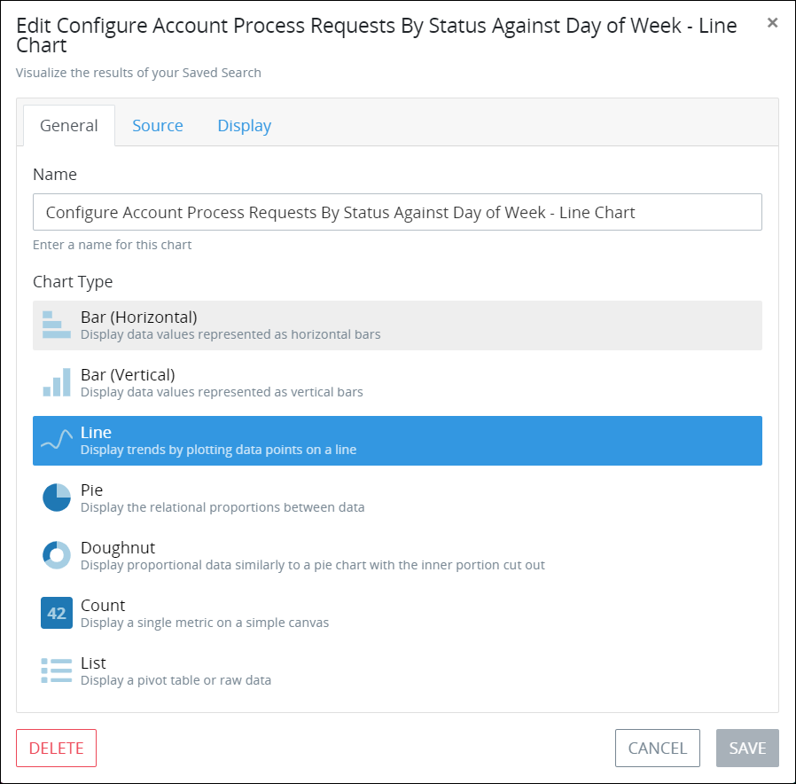
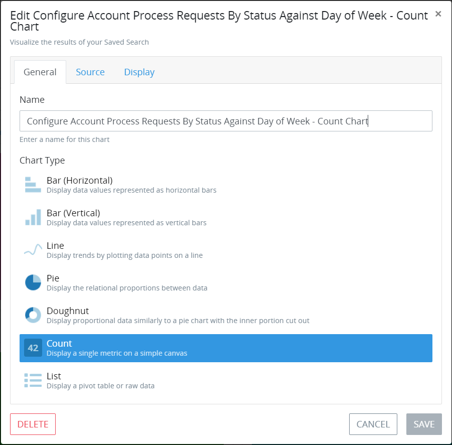
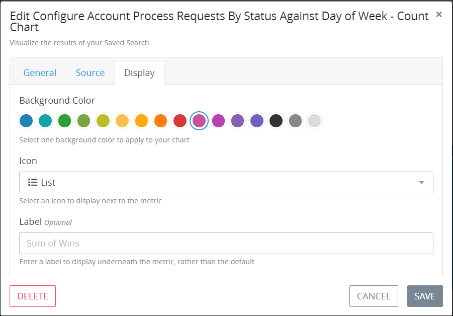
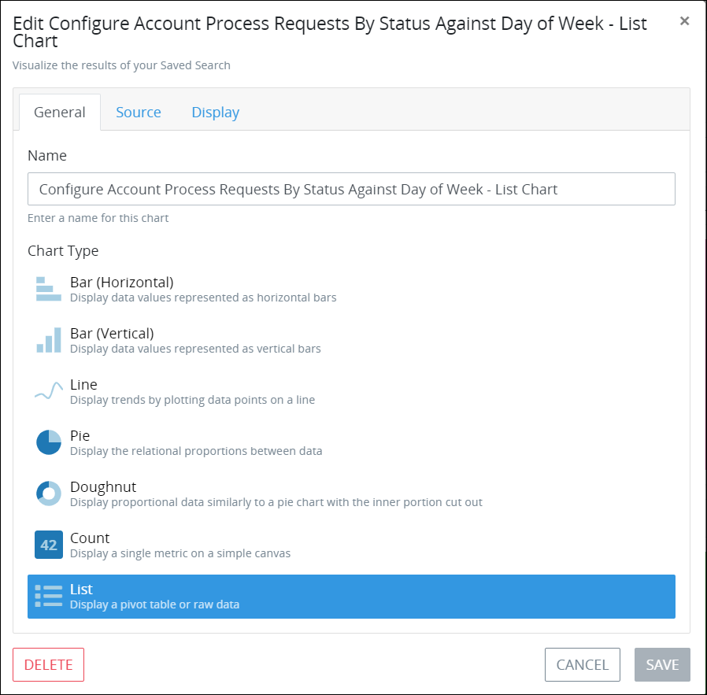
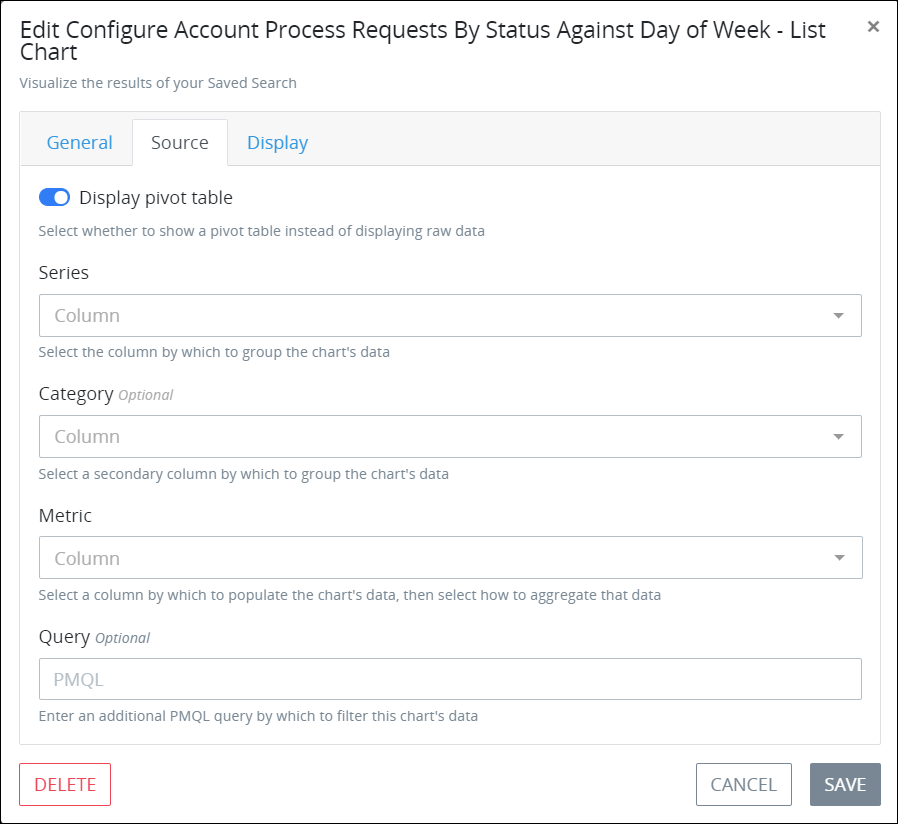

# Edit a Saved Search Chart

## Edit a Horizontal Bar, Vertical Bar, Line, Pie, or Doughnut Chart


### ProcessMaker Package Required

To edit a [Saved Search](../what-is-a-saved-search.md) chart, the [Saved Searches package](../../../package-development-distribution/package-a-connector/saved-searches-package.md) must be installed in your ProcessMaker instance. The Saved Searches package is not available in the ProcessMaker open-source edition. Contact [ProcessMaker Sales](mailto:sales@processmaker.com) or ask your ProcessMaker sales representative how the Saved Searches package can be installed in your ProcessMaker instance.

### Follow These Steps for Specific Chart Types

Follow the steps below only to edit a horizontal bar, vertical bar, line, pie, or doughnut chart types. Settings for the count and list chart types vary from the steps described below. See the following sections for steps to edit their chart types:

* [Edit a Count chart](configure-a-saved-search-chart.md#edit-a-count-chart)
* [Edit a List chart](configure-a-saved-search-chart.md#edit-a-list-chart)


Follow these steps to edit a horizontal bar, vertical bar, line, pie, or doughnut chart types for a Saved Search:

1. [View the search results for a Saved Search](../view-saved-searches-that-are-shared-with-you/view-search-results-for-a-saved-search.md) in which to view its charts. The **Data** tab displays the data details for that Saved Search.
2. Click the **Charts** tab. The **Charts** tab displays all charts created for this Saved Search.
3. Click the **Configure Chart** icon. The **General** tab displays the current settings for the Saved Search chart. 
4. Edit the following settings as necessary:
   * In the **Name** setting, edit the name of the chart. This is a required setting.
   * From the **Chart Type** group, select one of the following chart types to visualize the results of this Saved Search:

     * **Bar \(Horizontal\):** The horizontal-style bar chart visualizes Saved Search results in horizontal bars. See [chart example](overview-of-saved-search-charts.md#bar-chart-horizontal).
     * **Bar \(Vertical\):** The vertical-style bar chart visualizes Saved Search results in vertical bars. See [chart example](overview-of-saved-search-charts.md#bar-chart-vertical).
     * **Line:** The line chart visualizes Saved Search results as data points on a line to show how those results trend. See [chart example](overview-of-saved-search-charts.md#line-chart).
     * **Pie:** The pie chart visualizes Saved Search results as relational proportions between data. See [chart example](overview-of-saved-search-charts.md#pie-chart).
     * **Doughnut:** The doughnut chart visualizes Saved Search results as relational proportions between data similarly to the pie chart type but with the inner portion removed. See [chart example](overview-of-saved-search-charts.md#doughnut-chart).
     * **Count:** The count chart displays a single data metric on a canvas. See [chart example](overview-of-saved-search-charts.md#count). If you select the **Count** chart option, see [Edit a Count Chart](configure-a-saved-search-chart.md#edit-a-count-chart) for its specific settings.
     * **List:** The list chart displays chart data in tabular format. See [chart example](overview-of-saved-search-charts.md#list-chart). If you select the **List** chart option, see [Edit a List chart](configure-a-saved-search-chart.md#edit-a-list-chart) for its specific settings.

     **Bar \(Horizontal\)** is the default chart type.
5. Click the **Source** tab to configure from which Saved Search's results to visualize in the chart. The **Source** tab settings vary depending on the chart type selected from the **General** tab. 

   This step shows the settings for the Horizontal Bar, Vertical Bar, Line, Pie, or Doughnut chart.   
    

6. Edit the following settings as necessary:
   * From the **Series** setting, select how to group the chart data. The [series](overview-of-saved-search-charts.md#series) groups the chart content by the units of measurement in the X-axis for applicable chart types. See [chart example that references the series grouping](overview-of-saved-search-charts.md#example-chart). Options that display in the **Series** drop-down menu derive from the columns configured from the Saved Search tabular data as displayed from the **Data** tab of this Saved Search. The default configurable columns vary for each type of Saved Search. The **Recommended** indicator for Saved Search results represent dates, numbers, and/or unique text results and are recommended when configuring the chart series. This is a required setting for applicable charts.
   * From the **Category** setting, optionally select a secondary measurement by which to aggregate the chart series. See [chart example that references the category measurement](overview-of-saved-search-charts.md#example-chart). The **Category** setting does not apply to count charts. Options and their recommendations that display in the **Category** setting are the same as those in the **Series** setting.
   * From the **Metric** setting, select the chart contents from the Saved Search tabular-formatted results to aggregate as well as how to aggregate that data. The **Metric** setting options are numerically-based Saved Search results such as **\#** that represents the ID for the Request, Task, or ProcessMaker Collection record associated with that Saved Search. See [chart example that references how that chart data is aggregated](overview-of-saved-search-charts.md#example-chart).
   * Select from the following options how to aggregate the selected chart metric:

     * **Average:** The average is the arithmetic mean calculated by adding a group of values, and then dividing by the count of those items.
     * **Count:** The chart visualizes the number of values of the metric you select.
     * **Minimum:** The chart visualizes the minimum value of the metric you select.
     * **Maximum:** The chart visualizes the maximum value of the metric you select.
     * **Median:** The median is the middle value of a group of values that is calculated by sorting each of the values of the metric you select, then visualizing the middle value.
     * **Sum:** The sum is the arithmetic addition of each value of the metric you select. This is the default option.

     This is a required setting.

   * In the **Query** setting, optionally enter a ProcessMaker Query Language \(PMQL\) query from which to further filter the Saved Search's results. See the following topics for information how to use PMQL for Requests, Tasks, and ProcessMaker Collections:
     * [PMQL Syntax for Requests](../../search-processmaker-data-using-pmql.md#pmql-syntax-for-requests)
     * [PMQL Syntax for Tasks](../../search-processmaker-data-using-pmql.md#pmql-syntax-for-tasks)
     * [PMQL Syntax for ProcessMaker Collections](../../search-processmaker-data-using-pmql.md#pmql-syntax-for-processmaker-collections)
7. Click the **Display** tab to configure the appearance and style of the Saved Search chart. The **Display** tab settings vary depending on the chart type selected from the **General** tab. 

   This step shows the settings for the Horizontal Bar, Vertical Bar, Line, Pie, or Doughnut chart:

    

8. Edit the following settings as necessary:
   * From the **Color Scheme** setting, select the color palette from which to display the chart.
   * Enable the **Stacked** toggle key to stack the chart's data markers: overlay the data markers one another in the x- and y-axis. See [this chart as an example of stacked data markers](overview-of-saved-search-charts.md#bar-chart-vertical).
   * From the **Legend** setting, select where to place the legend in respect to the chart from the following options:
     * **None:** The chart legend does not display.
     * **Top:** The legend displays above the chart. This is the default option.
     * **Bottom:** The legend displays below the chart.
     * **Left:** The legend displays to the left of the chart.
     * **Right:** The legend displays to the right of the chart.
9. Click **Save**. If a required setting does not contain a value or selection, the following message displays: **The given data was invalid.**. Otherwise, the chart and the following message display: **Successfully Saved Chart**.

## Edit a Count Chart


### ProcessMaker Package Required

To edit a chart for a [Saved Search's](../what-is-a-saved-search.md) results, the [Saved Searches package](../../../package-development-distribution/package-a-connector/saved-searches-package.md) must be installed in your ProcessMaker instance. The Saved Searches package is not available in the ProcessMaker open-source edition. Contact [ProcessMaker Sales](mailto:sales@processmaker.com) or ask your ProcessMaker sales representative how the Saved Searches package can be installed in your ProcessMaker instance.

### Follow These Steps for a Specific Chart Type

Follow the steps below only to edit a count chart type. Settings for the other chart types vary from the steps described below.

See the following sections for steps to edit their chart types:

* [Edit a Horizontal Bar, Vertical Bar, Line, Pie, or Doughnut chart](configure-a-saved-search-chart.md#edit-a-horizontal-bar-vertical-bar-line-pie-or-doughnut-chart)
* [Edit a List chart](configure-a-saved-search-chart.md#edit-a-list-chart)


Follow these steps to edit a count chart type for a Saved Search:

1. [View the search results for a Saved Search](../view-saved-searches-that-are-shared-with-you/view-search-results-for-a-saved-search.md) in which to edit this chart type. The **Data** tab displays the data details for that Saved Search.
2. Click the **Charts** tab. The **Charts** tab displays all charts created for this Saved Search.
3. Click the **Configure Chart** icon. The **General** tab displays the current settings for the Saved Search chart. 

     

4. Edit the following settings as necessary:

   * In the **Name** setting, edit the name of the chart. This is a required setting.
   * From the **Chart Type** group, select the count chart type to visualize the results of this Saved Search. The **Count** chart displays a single data metric on a canvas. See [chart example](overview-of-saved-search-charts.md#count). 

     If you select the **Bar \(Horizontal\), Bar \(Vertical\), Line, Pie, Doughnut** chart option, see [Edit a Horizontal Bar, Vertical Bar, Line, Pie, or Doughnut Chart](configure-a-saved-search-chart.md#edit-a-horizontal-bar-vertical-bar-line-pie-or-doughnut-chart)  procedure for its specific settings.

     If you select the **List** chart option, see [Edit a List chart](configure-a-saved-search-chart.md#edit-a-list-chart) for its specific settings.

   **Bar \(Horizontal\)** is the default chart type.

5. Click the **Source** tab to configure from which Saved Search's results to visualize in the chart. 

   The **Source** tab settings vary depending on the chart type selected from the **General** tab. This step shows the settings for the Count chart.  
   

6. Edit the following settings as necessary:
   * From the **Metric** setting, select the chart contents from the Saved Search tabular-formatted results to aggregate as well as how to aggregate that data. The **Metric** setting options are numerically-based Saved Search results such as **\#** that represents the ID for the Request, Task, or ProcessMaker Collection record associated with that Saved Search. See [chart example that references how that chart data is aggregated](overview-of-saved-search-charts.md#example-chart).

     Select from the following options how to aggregate the selected chart metric:

     * **Average:** The average is the arithmetic mean calculated by adding a group of values, and then dividing by the count of those items.
     * **Count:** The chart visualizes the number of values of the metric you select.
     * **Minimum:** The chart visualizes the minimum value of the metric you select.
     * **Maximum:** The chart visualizes the maximum value of the metric you select.
     * **Median:** The median is the middle value of a group of values that is calculated by sorting each of the values of the metric you select, then visualizing the middle value.
     * **Sum:** The sum is the arithmetic addition of each value of the metric you select. This is the default option.

     This is a required setting.

   * In the **Query** setting, optionally enter a ProcessMaker Query Language \(PMQL\) query from which to further filter the Saved Search's results. See the following topics for information how to use PMQL for Requests, Tasks, and ProcessMaker Collections:
     * [PMQL Syntax for Requests](../../search-processmaker-data-using-pmql.md#pmql-syntax-for-requests)
     * [PMQL Syntax for Tasks](../../search-processmaker-data-using-pmql.md#pmql-syntax-for-tasks)
     * [PMQL Syntax for ProcessMaker Collections](../../search-processmaker-data-using-pmql.md#pmql-syntax-for-processmaker-collections)
7. Click the **Display** tab to configure the appearance and style of the Saved Search chart. The **Display** tab settings vary depending on the chart type selected from the **General** tab. This step shows the settings for the Count chart.

    

8. Edit the following settings as necessary:
   * From the **Background Color** setting, select a color as the background for the count chart canvas.
   * From the **Icon** setting, select an icon to display beside to the left of the count chart metric. The **Line Chart** icon is the default icon.
   * In the **Label** setting, optionally enter a label to describe the count chart metric instead of the metric's default label.
9. Click **Save**. If a required setting does not contain a value or selection, the following message displays: **The given data was invalid.**. Otherwise, the chart and the following message display: **Successfully Saved Chart**.

## Edit a List Chart


### ProcessMaker Package Required

To edit a chart for a [Saved Search's](../what-is-a-saved-search.md) results, the [Saved Searches package](../../../package-development-distribution/package-a-connector/saved-searches-package.md) must be installed in your ProcessMaker instance. The Saved Searches package is not available in the ProcessMaker open-source edition. Contact [ProcessMaker Sales](mailto:sales@processmaker.com) or ask your ProcessMaker sales representative how the Saved Searches package can be installed in your ProcessMaker instance.

### Follow These Steps for a Specific Chart Type

Follow the steps below only to edit a list chart type. Settings for the other chart types vary from the steps described below.

See the following sections for steps to edit their chart types:

* [Edit a Horizontal Bar, Vertical Bar, Line, Pie, or Doughnut chart](configure-a-saved-search-chart.md#edit-a-horizontal-bar-vertical-bar-line-pie-or-doughnut-chart)
* [Edit a Count chart](configure-a-saved-search-chart.md#edit-a-count-chart)


Follow these steps to edit a list chart type for a Saved Search:

1. [View the search results for a Saved Search](../view-saved-searches-that-are-shared-with-you/view-search-results-for-a-saved-search.md) in which to edit this chart type. The **Data** tab displays the data details for that Saved Search.
2. Click the **Charts** tab. The **Charts** tab displays all charts created for this Saved Search.
3. Click the **Configure Chart** icon. The **General** tab displays the current settings for the Saved Search chart. 

     

4. Edit the following settings as necessary:
   * In the **Name** setting, edit the name of the chart. This is a required setting.
   * From the **Chart Type** group, select the list chart type to visualize the results of this Saved Search.

     If you select the **Bar \(Horizontal\), Bar \(Vertical\), Line, Pie, Doughnut** chart option, see [Edit a Horizontal Bar, Vertical Bar, Line, Pie, or Doughnut Chart](configure-a-saved-search-chart.md#edit-a-horizontal-bar-vertical-bar-line-pie-or-doughnut-chart)  procedure for its specific settings.

     If you select the **Count** chart option, see [Edit a Count Chart](configure-a-saved-search-chart.md#edit-a-count-chart) for its specific settings. 

     **Bar \(Horizontal\)** is the default chart.
5. Click the **Source** tab to configure from which Saved Search's results to visualize in the chart. The **Source** tab settings vary depending on the chart type selected from the General tab. 

   This step shows the settings for the List chart.  
    

6. Edit the following settings as necessary:
   * Enable the **Select Pivot Table** toggle key to edit a list chart from which any column header in the chart may be selected to sort the raw data. 

     The **Select Pivot Table** is disabled by default. 

     If the **Select Pivot Table** toggle key is enabled, the following settings display:

   * From the **Series** setting, select how to group the chart data. The [series](overview-of-saved-search-charts.md#series) groups the chart content by the units of measurement in the X-axis for applicable chart types. See [chart example that references the series grouping](overview-of-saved-search-charts.md#example-chart). The **Series** setting does not apply to count charts. Options that display in the **Series** drop-down menu derive from the columns configured from the Saved Search tabular data as displayed from the **Data** tab of this Saved Search. The default configurable columns vary for each type of Saved Search. The **Recommended** indicator for Saved Search results represent dates, numbers, and/or unique text results and are recommended when configuring the chart series. This is a required setting for applicable charts.
   * From the **Category** setting, optionally select a secondary measurement by which to aggregate the chart series. See [chart example that references the category measurement](overview-of-saved-search-charts.md#example-chart). The **Category** setting does not apply to count charts. Options and their recommendations that display in the **Category** setting are the same as those in the **Series** setting.
   * From the **Metric** setting, select the chart contents from the Saved Search tabular-formatted results to aggregate as well as how to aggregate that data. The **Metric** setting options are numerically-based Saved Search results such as **\#** that represents the ID for the Request, Task, or ProcessMaker Collection record associated with that Saved Search. See [chart example that references how that chart data is aggregated](overview-of-saved-search-charts.md#example-chart).
   * Select from the following options how to aggregate the selected chart metric:

     * **Average:** The average is the arithmetic mean calculated by adding a group of values, and then dividing by the count of those items.
     * **Count:** The chart visualizes the number of values of the metric you select.
     * **Minimum:** The chart visualizes the minimum value of the metric you select.
     * **Maximum:** The chart visualizes the maximum value of the metric you select.
     * **Median:** The median is the middle value of a group of values that is calculated by sorting each of the values of the metric you select, then visualizing the middle value.
     * **Sum:** The sum is the arithmetic addition of each value of the metric you select. This is the default option.

     This is a required setting.

   * In the **Query** setting, optionally enter a ProcessMaker Query Language \(PMQL\) query from which to further filter the Saved Search's results. See the following topics for information how to use PMQL for Requests, Tasks, and ProcessMaker Collections:
     * [PMQL Syntax for Requests](../../search-processmaker-data-using-pmql.md#pmql-syntax-for-requests)
     * [PMQL Syntax for Tasks](../../search-processmaker-data-using-pmql.md#pmql-syntax-for-tasks)
     * [PMQL Syntax for ProcessMaker Collections](../../search-processmaker-data-using-pmql.md#pmql-syntax-for-processmaker-collections)
7. Click the **Display** tab to configure the appearance and style of the Saved Search chart. 

   This step shows the settings for the List chart.

   * Follow this step if the **Select Pivot Table** toggle key is enabled from the **Source** tab:
   * From the **Background Color** setting, select a color as the background for the list chart canvas.

   \*\*\*\* 

   * Follow these steps if the **Select Pivot Table** toggle key is disabled from the **Source** tab:
   * From the **Background Color** setting, select a color as the background for the list chart canvas.
   * Enable the **Display link** toggle key to display a link that, when clicked, redirects to the corresponding Request, Task or ProcessMaker Collection record depending from which type of Saved Search the list chart derives its data. The link displays as the **Open Record** iconat the end of each row. The **Display link** toggle key is enabled by default.
   * Enable the **Make rows clickable** toggle key to allow anywhere within a list chart row to redirect to the corresponding Request, Task or ProcessMaker Collection record depending from which type of Saved Search the list chart derives its data. The **Make rows clickable** toggle key is disabled by default.

   

8. Click **Save**. If a required setting does not contain a value or selection, the following message displays: **The given data was invalid.**. Otherwise, the chart and the following message display: **Successfully  Saved Chart**.

## Related Topics























