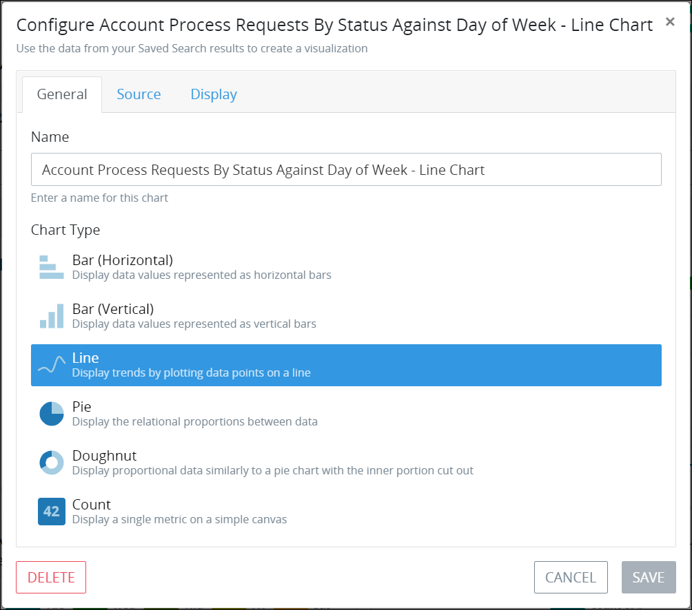
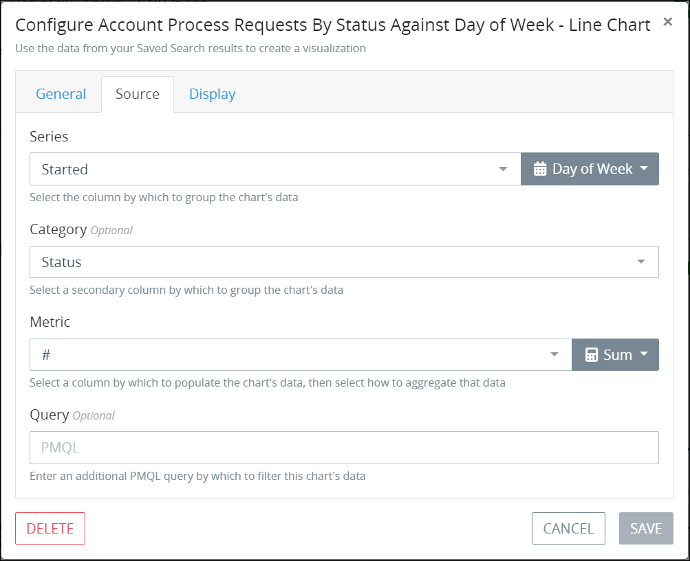
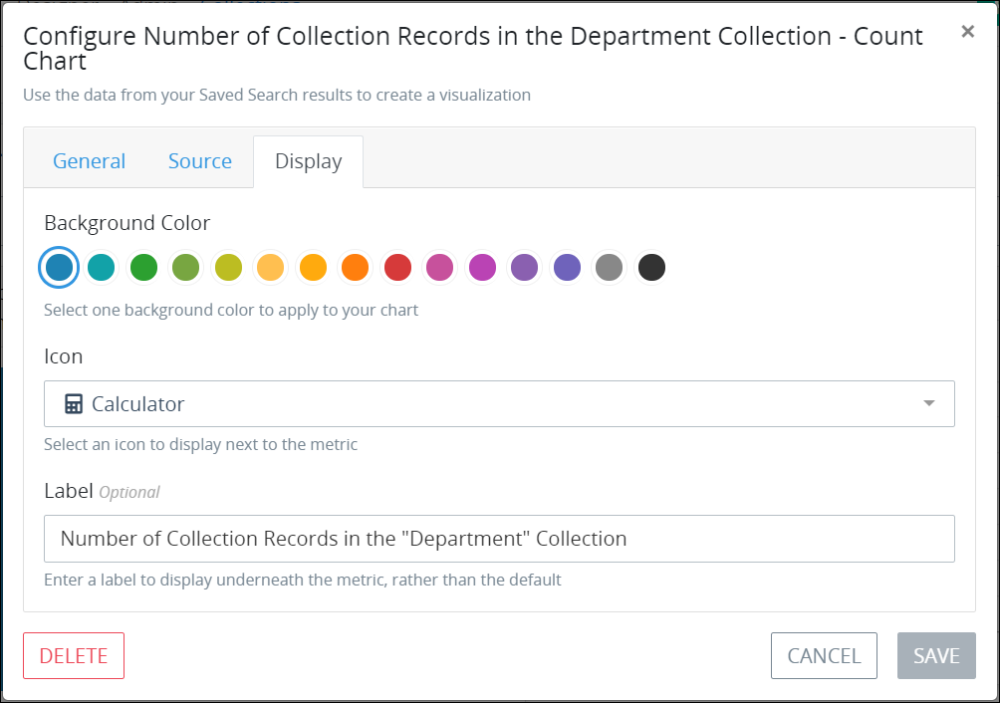
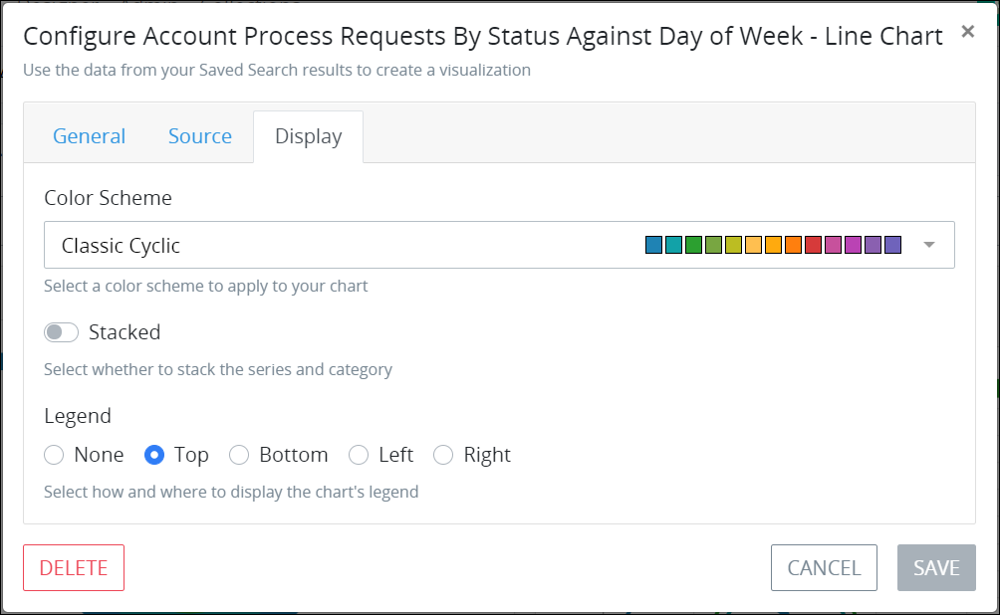

# Edit a Saved Search Chart

## Edit a Saved Search Chart


### ProcessMaker Package Required

To edit a [Saved Search](../what-is-a-saved-search.md) chart, the [Saved Searches package](../../../package-development-distribution/package-a-connector/saved-searches-package.md) must be installed in your ProcessMaker instance. The Saved Searches package is not available in the ProcessMaker open-source edition. Contact [ProcessMaker Sales](mailto:sales@processmaker.com) or ask your ProcessMaker sales representative how the Saved Searches package can be installed in your ProcessMaker instance.


Follow these steps to edit a Saved Search chart:

1. [View the search results for a Saved Search](../view-saved-searches-that-are-shared-with-you/view-search-results-for-a-saved-search.md) in which to view its charts. The **Data** tab displays the data details for that Saved Search.
2. Click the **Charts** tab. The **Charts** tab displays all charts created for this Saved Search.
3. Click the **Configure Chart** icon. The **General** tab displays the current settings for the Saved Search chart.  
4. Edit the following settings as necessary:
   * In the **Name** setting, edit the name of the chart. This is a required setting.
   * From the **Chart Type** group, select one of the following chart types to visualize the results of this Saved Search:
     * **Bar \(Horizontal\):** The horizontal-style bar chart visualizes Saved Search results in horizontal bars. See [chart example](overview-of-saved-search-charts.md#bar-chart-horizontal).
     * **Bar \(Vertical\):** The vertical-style bar chart visualizes Saved Search results in vertical bars. See [chart example](overview-of-saved-search-charts.md#bar-chart-vertical).
     * **Line:** The line chart visualizes Saved Search results as data points on a line to show how those results trend. See [chart example](overview-of-saved-search-charts.md#line-chart).
     * **Pie:** The pie chart visualizes Saved Search results as relational proportions between data. See [chart example](overview-of-saved-search-charts.md#pie-chart).
     * **Doughnut:** The doughnut chart visualizes Saved Search results as relational proportions between data similarly to the pie chart type but with the inner portion removed. See [chart example](overview-of-saved-search-charts.md#doughnut-chart).
     * **Count:** The count chart displays a single data metric on a canvas. See [chart example](overview-of-saved-search-charts.md#count).
   * Click the **Source** tab to configure from which Saved Search's results to visualize in the chart.  
   * From the **Series** setting, select how to group the chart data. The [series](overview-of-saved-search-charts.md#series) groups the chart content by the units of measurement in the X-axis for applicable chart types. See [chart example that references the series grouping](overview-of-saved-search-charts.md#example-chart). The **Series** setting does not apply to count charts. Options that display in the **Series** drop-down menu derive from the columns configured from the Saved Search tabular data as displayed from the **Data** tab of this Saved Search. The default configurable columns vary for each type of Saved Search. The **Recommended** indicator for Saved Search results represent dates, numbers, and/or unique text results and are recommended when configuring the chart series. This is a required setting for applicable charts.
   * From the **Category** setting, optionally select a secondary measurement by which to aggregate the chart series. See [chart example that references the category measurement](overview-of-saved-search-charts.md#example-chart). The **Category** setting does not apply to count charts. Options and their recommendations that display in the **Category** setting are the same as those in the **Series** setting.
   * From the **Metric** setting, select the chart contents from the Saved Search tabular-formatted results to aggregate as well as how to aggregate that data. The **Metric** setting options are numerically-based Saved Search results such as **\#** that represents the ID for the Request, Task, or ProcessMaker Collection record associated with that Saved Search. See [chart example that references how that chart data is aggregated](overview-of-saved-search-charts.md#example-chart).

     Select from the following options how to aggregate the selected chart metric:

     * **Average:** The average is the arithmetic mean calculated by adding a group of values, and then dividing by the count of those items.
     * **Count:** The chart visualizes the number of values of the metric you select.
     * **Minimum:** The chart visualizes the minimum value of the metric you select.
     * **Maximum:** The chart visualizes the maximum value of the metric you select.
     * **Median:** The median is the middle value of a group of values that is calculated by sorting each of the values of the metric you select, then visualizing the middle value.
     * **Sum:** The sum is the arithmetic addition of each value of the metric you select. This is the default option.

     This is a required setting.

   * In the **Query** setting, optionally enter a ProcessMaker Query Language \(PMQL\) query from which to further filter the Saved Search's results. See the following topics for information how to use PMQL for Requests, Tasks, and ProcessMaker Collections:
     * [PMQL Syntax for Requests](../../search-processmaker-data-using-pmql.md#pmql-syntax-for-requests)
     * [PMQL Syntax for Tasks](../../search-processmaker-data-using-pmql.md#pmql-syntax-for-tasks)
     * [PMQL Syntax for ProcessMaker Collections](../../search-processmaker-data-using-pmql.md#pmql-syntax-for-processmaker-collections)
   * Click the **Display** tab to configure the appearance and style of the Saved Search chart. The **Display** tab settings vary depending on the chart type selected from the **General** tab.

     **Display tab settings for the count chart type**  
      

     1. From the **Background Color** setting, select a color as the background for the count chart canvas.
     2. From the **Icon** setting, select an icon to display beside to the left of the count chart metric. The **Line Chart** icon is the default icon.
     3. In the **Label** setting, optionally enter or edit a label to describe the count chart metric instead of the metric's default label.

     **Display tab settings for all chart types except the count chart**  
      

     1. From the **Color Scheme** setting, select the color palette from which to display the chart.
     2. Enable the **Stacked** toggle key to stack the chart's data markers: overlay the data markers one another in the x- and y-axis. See [this chart as an example of stacked data markers](overview-of-saved-search-charts.md#bar-chart-vertical).
     3. From the **Legend** setting, select where to place the legend in respect to the chart from the following options:
        * **None:** The chart legend does not display.
        * **Top:** The legend displays above the chart. This is the default option.
        * **Bottom:** The legend displays below the chart.
        * **Left:** The legend displays to the left of the chart.
        * **Right:** The legend displays to the right of the chart.
5. Click **Save**. If a required setting does not contain a value or selection, the following message displays: **The given data was invalid.**. Otherwise, the chart and the following message display: **Successfully Created Chart**.

## Related Topics























