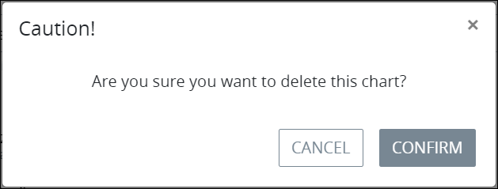

# Delete a Saved Search Chart

## Delete a Saved Search Chart


### ProcessMaker Package Required

To delete a [Saved Search](../what-is-a-saved-search.md) chart, the [Saved Searches package](../../../package-development-distribution/package-a-connector/saved-searches-package.md) must be installed in your ProcessMaker instance. The Saved Searches package is not available in the ProcessMaker open-source edition. Contact [ProcessMaker Sales](mailto:sales@processmaker.com) or ask your ProcessMaker sales representative how the Saved Searches package can be installed in your ProcessMaker instance.


Follow these steps to delete a Saved Search chart:

1. [View the search results for a Saved Search](../view-saved-searches-that-are-shared-with-you/view-search-results-for-a-saved-search.md) in which to view its charts. The **Data** tab displays the data details for that Saved Search.
2. Click the **Charts** tab. The **Charts** tab displays all charts created for this Saved Search.
3. Click the **Configure Chart** icon. The **General** tab displays.  
4. Click the **Delete** button. The **Caution** screen displays to confirm the deletion of the Saved Search chart.  
5. Click **Confirm**. The following message displays: **The chart was deleted.**

## Related Topics

