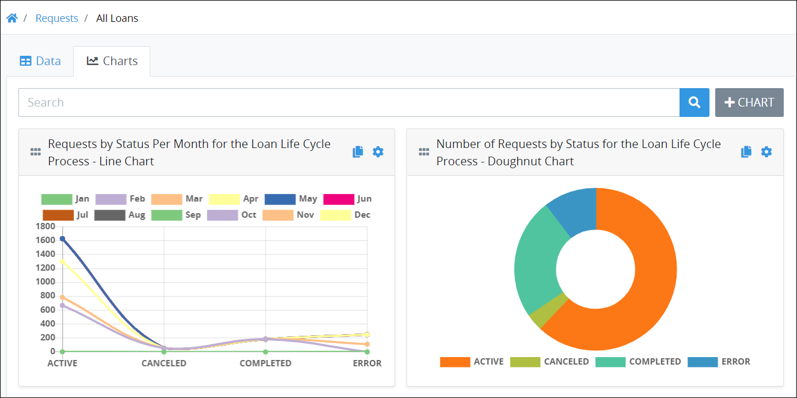
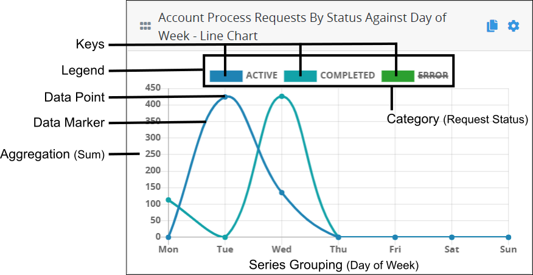
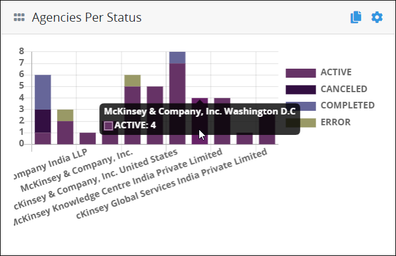
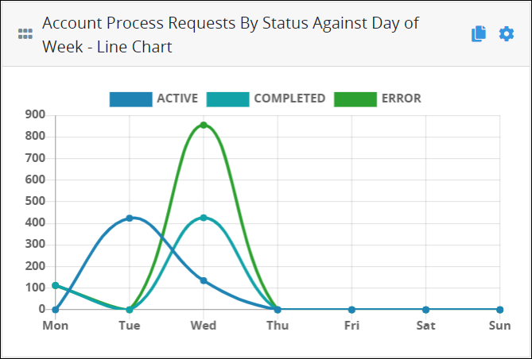
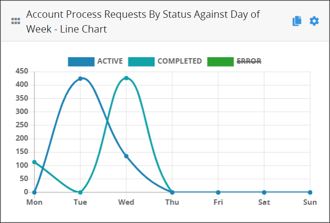
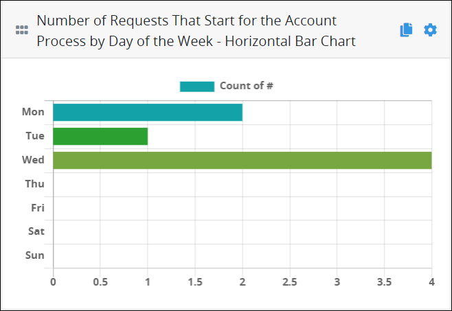
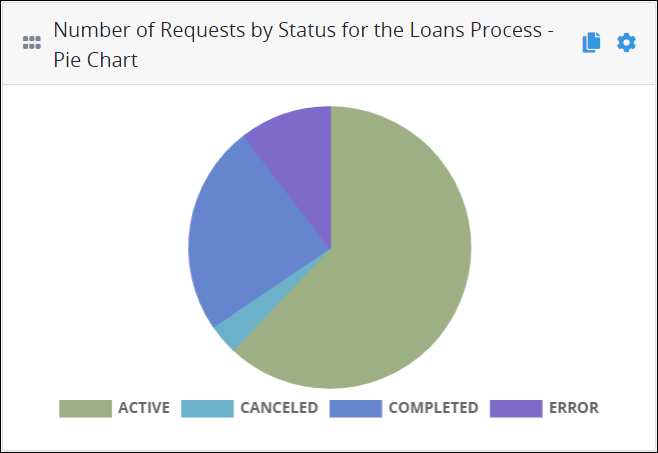
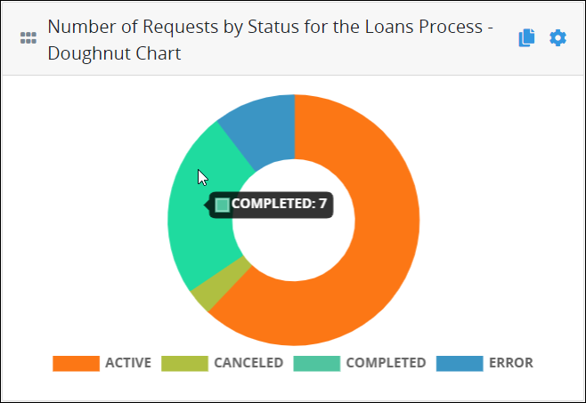
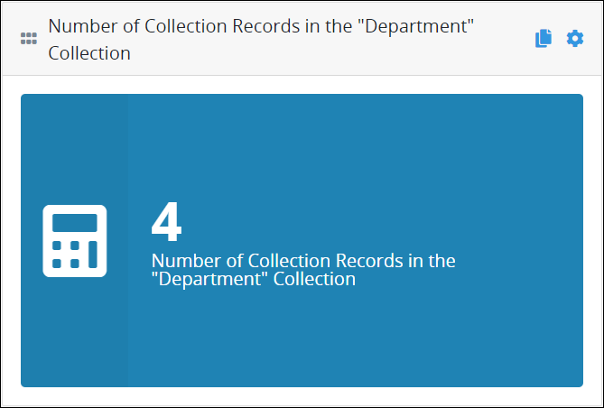

# Overview of Saved Search Charts

## Overview

Charts help visualize your Saved Search results. Though you can [customize in tabular format the data details for your Saved Searches](../view-saved-searches-that-are-shared-with-you/configure-a-saved-search.md#configure-how-saved-search-results-display-in-tabular-format), nothing distills that data like a customized chart. Create and configure two-dimensional charts to visualize Saved Search results after selecting a Saved Search. You may create customized charts regardless of whether you created the Saved Search or if it was shared with you.

Charts use the data results from the Saved Search to visualize those results in a variety of chart types and styles. Chart data may be filtered by using an optional [ProcessMaker Query Language \(PMQL\)](../../search-processmaker-data-using-pmql.md) query that further filters the data from that Saved Search to visualize minute data.

Customize charts to include the series and/or categories from the both PMQL query parameters and the columns configured in the detailed data view of that Saved Search. For example, if your Saved Search included a custom column called **Countries** to display how many Requests have started based on a Request variable value called `Countries`, that Request variable may also be used as a series or category in a chart in that Saved Search.

The **Charts** tab displays charts created for a Saved Search.

### Saved Search Chart Terminology

Understand how ProcessMaker defines components in a Saved Search chart. Note that Saved Search charts are visualizations of Saved Search results. The data and how that data presents in a Saved Search chart derive from the columns presented in the [data details view](../view-saved-searches-that-are-shared-with-you/view-search-results-for-a-saved-search.md) of that Saved Search.

See the following sections:

* [Example Chart](overview-of-saved-search-charts.md#example-chart)
* [Category](overview-of-saved-search-charts.md#category)
* [Data Marker](overview-of-saved-search-charts.md#data-marker)
* [Data Point](overview-of-saved-search-charts.md#data-point)
* [Key](overview-of-saved-search-charts.md#key)
* [Legend](overview-of-saved-search-charts.md#legend)
* [Metric](overview-of-saved-search-charts.md#metric)
* [Series](overview-of-saved-search-charts.md#series)

#### Example Chart

See the following example chart as reference for the following terms ProcessMaker uses in Saved Search charts:

* [Category](overview-of-saved-search-charts.md#category)
* [Data Marker](overview-of-saved-search-charts.md#data-marker)
* [Data Point](overview-of-saved-search-charts.md#data-point)
* [Key](overview-of-saved-search-charts.md#key)
* [Legend](overview-of-saved-search-charts.md#legend)
* [Metric](overview-of-saved-search-charts.md#metric)
* [Series](overview-of-saved-search-charts.md#series)

#### Category

A chart category optionally aggregates the chart [series](overview-of-saved-search-charts.md#series) by an additional measurement as indicated by the chart [legend](overview-of-saved-search-charts.md#legend). The chart category represents the column from the Saved Search tabular data for applicable chart types. In the [example chart above](overview-of-saved-search-charts.md#example-chart), the chart category additionally aggregates by Request status.

#### Data Marker

A data marker represents one visualization in the chart data. In the [example chart above](overview-of-saved-search-charts.md#example-chart), two data markers are visible. Data markers can be stacked: data markers overlay on one another in the x- and y-axis. The data markers in the [example chart above](overview-of-saved-search-charts.md#example-chart) are not stacked.

#### Data Point

A data point represents a point in a line chart's data that shows trending. Data points only apply to line charts. Each visible [data marker](overview-of-saved-search-charts.md#data-marker) in the [example chart above](overview-of-saved-search-charts.md#example-chart) has four \(4\) data points.

#### Key

A key is an item in the [chart legend](overview-of-saved-search-charts.md#legend-chart-legend). Each key in the chart legend represents a [data marker](overview-of-saved-search-charts.md#data-marker) in the visualized chart data. Keys that have strike-through text style are hidden in the visualized chart data. In the [example chart above](overview-of-saved-search-charts.md#example-chart), there are three keys in the chart legend. The data marker for the Error-status Requests is hidden.

#### Legend

The chart legend identifies how the [data markers](overview-of-saved-search-charts.md#data-marker) in the chart are represented. Chart legends may be displayed on the top, bottom, left, or right of the visualized data. In the [example chart above](overview-of-saved-search-charts.md#legend-chart-legend), the chart legend is at the top of the chart.

#### Metric

The chart metric indicates the chart contents from the Saved Search tabular-formatted results to aggregate as well as how to aggregate that data. Aggregation is represented by the Y-axis for applicable chart types. In the [example chart above](overview-of-saved-search-charts.md#example-chart), the chart metric is the Request ID as displayed in the **\#** column of Saved Search detailed data view, and then aggregated by the sum of all Requests by status.

#### Series

The chart series indicates how to group the Saved Search tabular-formatted results. The series groups the chart content by the units of measurement in the X-axis for applicable chart types. In the [example chart above](overview-of-saved-search-charts.md#example-chart), the series is "how many Requests start by day of the week."

### See What a Data Point or Marker Represents

Hover your cursor over a data point to see what that data represents.

### Filter Data That Displays in a Saved Search Chart

Filter data that displays in a chart by hiding attributes of that data via the chart's legend. Consider the following chart that shows the number of Requests by status type per day of the week to visualize how many Requests exist for the "Account Process".

This chart contains three keys in the legend that displays at the top of the chart. Each key in the chart legend represents a data marker in the visualized chart data.

To not display the Requests that have an error, click the **Error** key in the chart's legend. The strike-through text style displays over the **Error** key in the chart legend that indicates this data marker is hidden from the chart. The other data markers in the chart automatically adjust to show their data points using the chart's current units of measurement. Click the **Error** key again from the legend to show this chart data marker again.

### Types of Saved Search Charts

See the following Saved Search chart types:

* [Bar chart \(horizontal\)](overview-of-saved-search-charts.md#bar-chart-horizontal)
* [Bar chart \(vertical\)](overview-of-saved-search-charts.md#bar-chart-vertical)
* [Line chart](overview-of-saved-search-charts.md#line-chart)
* [Pie chart](overview-of-saved-search-charts.md#pie-chart)
* [Doughnut chart](overview-of-saved-search-charts.md#doughnut-chart)
* [Count](overview-of-saved-search-charts.md#count)

#### Bar Chart \(Horizontal\)

The horizontal-style bar chart visualizes Saved Search results in horizontal bars. The following horizontal-style bar chart shows the number of [Requests](../../requests/what-is-a-request.md) that start for the Account Process per day of the week.

#### Bar Chart \(Vertical\)

The vertical-style bar chart visualizes Saved Search results in vertical bars. The following vertical-style bar chart shows the number of Requests by status per agency. In this example, data markers are stacked: data markers overlay on one another in the x- and y-axis such that all Request status types display on each other for each agency. Furthermore, this example displays the data marker represents when hovering the cursor over that marker.

#### Line Chart

The line chart visualizes Saved Search results as data points on a line to show how those results trend. The following line chart shows the number of Requests by status type per day of the week.

#### Pie Chart

The pie chart visualizes Saved Search results as relational proportions between data. The following pie chart shows the number of Requests by status type for the Loan Process.

#### Doughnut Chart

The doughnut chart visualizes Saved Search results as relational proportions between data similarly to the [pie chart type](overview-of-saved-search-charts.md#pie-chart) but with the inner portion removed. The following doughnut chart shows the number of Requests by status type for the Loan Process.

#### Count

The count chart displays a single data metric on a canvas. The following count chart shows how many records are in the "Department" [ProcessMaker Collection](../../../collections/what-is-a-collection.md).

## Related Topics

