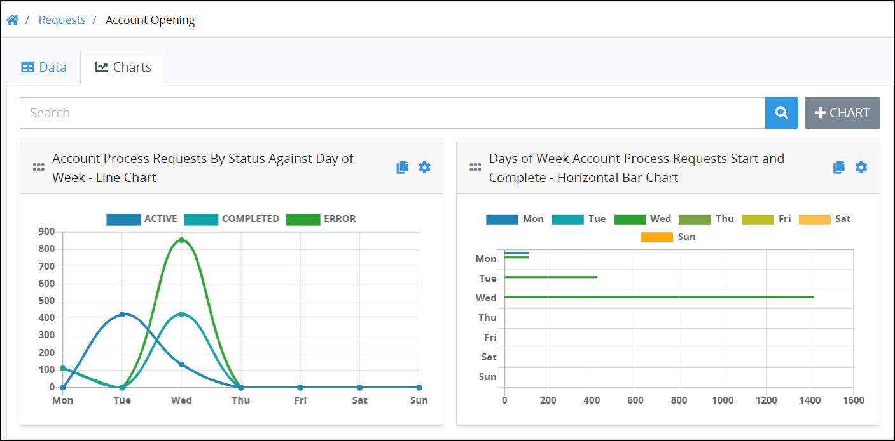

# Overview of Saved Search Charts

## Overview

Charts help visualize your Saved Search results. Though you can customize in tabular format the data details for your Saved Searches, nothing distills that data like a customized chart. Create and configure charts to visualize Saved Search results after selecting a Saved Search. Charts use the data results from the Saved Search to visualize those results in a variety of chart types and styles. Furthermore, customize charts regardless of whether you created the Saved Search or if it was shared with you. Create as many facets of the selected Saved Search as necessary.

### Filter Data That Displays in a Saved Search Chart

Filter data that displays in a chart by hiding attributes of that data via the chart's legend. Consider the chart below that shows how the number of Requests by Request status type versus the each day of the week to visualize how many Requests exist for the "Account Process". This chart contains three keys in the legend that displays at the top of the chart.

To not display the Requests that have an error, click the **Error** key in the chart's legend. The strike-through text style displays over the **Error** key in the chart legend that indicates this chart attribute is hidden from the chart. The other chart attributes automatically adjust to show their data using the chart's current units of measurement. Click the **Error** key again to show this chart attribute again.

### Types of Saved Search Charts

See the following Saved Search chart types:

* [Bar chart \(horizontal\)](overview-of-saved-search-charts.md#bar-chart-horizontal)
* [Bar chart \(vertical\)](overview-of-saved-search-charts.md#bar-chart-vertical)
* [Line chart](overview-of-saved-search-charts.md#line-chart)
* [Pie chart](overview-of-saved-search-charts.md#pie-chart)
* [Doughnut chart](overview-of-saved-search-charts.md#doughnut-chart)

#### Bar Chart \(Horizontal\)

#### Bar Chart \(Vertical\)

#### Line Chart

#### Pie Chart

#### Doughnut Chart

## Related Topics

