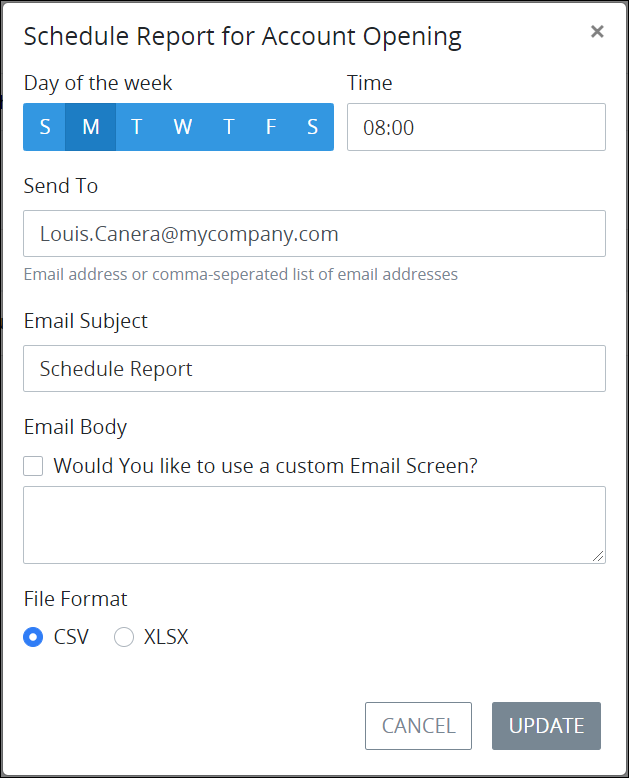

# Edit a Scheduled Interval to Email Reports

## Edit a Scheduled Interval to Email Reports


### ProcessMaker Package Required

To edit a scheduled interval to email reports of a [Saved Search's](../what-is-a-saved-search.md) results, the [Saved Searches package](../../../package-development-distribution/package-a-connector/saved-searches-package.md) must be installed in your ProcessMaker instance. The Saved Searches package is not available in the ProcessMaker open-source edition. Contact [ProcessMaker Sales](mailto:sales@processmaker.com) or ask your ProcessMaker sales representative how the Saved Searches package can be installed in your ProcessMaker instance.


Follow these steps to edit a scheduled interval to email reports of a Saved Search's search results:

1. [View the scheduled intervals to email reports of a Saved Search's results](../view-saved-searches-that-are-shared-with-you/view-search-results-for-a-saved-search.md). The **Scheduled Reports** page displays for that Saved Search.
2. Click the **Edit** iconfor the schedule in which to edit. The **Schedule Report** screen displays.  
3. Edit the following settings for the scheduled report as necessary:
   1. From the **Day of the week** setting, select the day of the week in which to email the report of the Saved Search's results. Only one day may be selected. If multiple days are required, then create another schedule that sends the report on a different day.
   2. In the **Time** setting, edit the time in 24-hour format in which to email the report.
   3. In the **Send To** setting, edit the email address\(es\) for the email recipients to receive the report. Separate multiple email recipients using commas.
   4. In the **Email Subject** setting, edit the email subject of your report to which the report will be attached.
   5. From the **Email Body** option, do one of the following:
      * In the **Email Body** setting, enter the email body content for your report.
      * Select the **Would you like to use a custom Email Screen?** option. A drop-down menu displays from which you can select an [Email](../../../designing-processes/design-forms/screens-builder/types-for-screens.md#email)-type [ProcessMaker Screen](../../../designing-processes/design-forms/what-is-a-form.md) that will display its contents as the email body. Note that the [Send Email package](../../../package-development-distribution/package-a-connector/email.md) must be installed in your ProcessMaker instance to have the Email-type ProcessMaker Screen and send emails of scheduled reports. 
   6. From the **File Format** option, select one of the following options to specify the format of the emailed report that is attached to the email:
      * **CSV:** Select the **CSV** option to email the report in `.CSV` format.
      * **XLSX:** Select the **XLSX** option to email the report in `.XLSX` format. 
4. Click **Update**.

## Related Topics





















