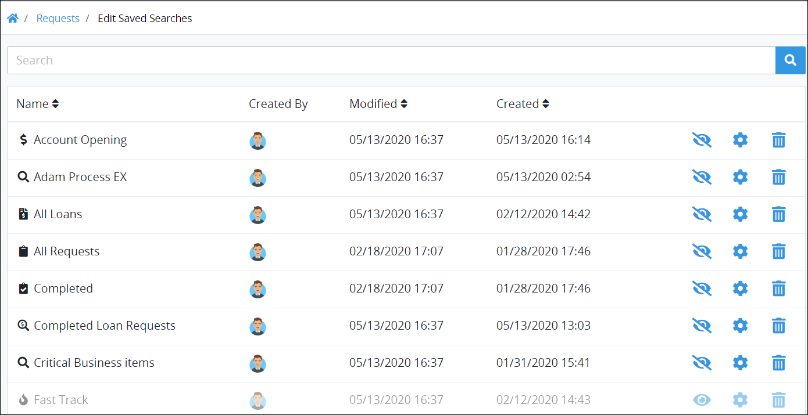

# Manage Your Own Saved Searches

## Manage Your Own Saved Searches


### ProcessMaker Package Required

To view [Saved Searches](../what-is-a-saved-search.md), the [Saved Searches package](../../../package-development-distribution/package-a-connector/saved-searches-package.md) must be installed in your ProcessMaker instance. The Saved Searches package is not available in the ProcessMaker open-source edition. Contact [ProcessMaker Sales](mailto:sales@processmaker.com) or ask your ProcessMaker sales representative how the Saved Searches package can be installed in your ProcessMaker instance.


You can view and manage your own Saved Searches. However, you cannot manage Saved Searches which have been shared with you. You can only manage those that you have [created](../create-and-share-a-saved-search.md). When a Saved Search is shared with you, you may only use it or ignore it.

Saved Searches are organized by type:

* [Request](../../requests/what-is-a-request.md)-related Saved Searches are accessed from **Requests** pages. See [View Request-Type Saved Search Results](view-search-results-for-a-saved-search.md#view-request-type-saved-search-results).
* [Task](../../task-management/what-is-a-task.md)-related Saved Searches are accessed from **Tasks** pages. See [View Task-Type Saved Search Results](view-search-results-for-a-saved-search.md#view-task-type-saved-search-results).
* Saved Searches for [ProcessMaker Collection](../../../collections/what-is-a-collection.md) records are accessed from the [**Collections** page](../../../collections/manage-collections/view-collections.md#view-all-collections). \(Your ProcessMaker user account or group membership must have the "Collections: View Collections" permission to view the list of ProcessMaker Collections unless your user account has the **Make this user a Super Admin** setting selected. See the ProcessMaker [Collections](../../../processmaker-administration/permission-descriptions-for-users-and-groups.md#collections) permissions or ask your ProcessMaker Administrator for assistance. Lastly, your ProcessMaker user account or group membership must have the **View** [record permission](../../../collections/manage-collections/configure-a-collection.md#configure-record-permissions-for-processmaker-users) from a Collection's configuration to view that Collection's records. See [Configure a Collection](../../../collections/manage-collections/configure-a-collection.md#configure-a-processmaker-collection) or ask the manager of that ProcessMaker Collection for assistance.\) See [View ProcessMaker Collection Record Saved Search Results](view-search-results-for-a-saved-search.md#view-processmaker-collection-record-saved-search-results).

Click the **Edit Saved Searches** iconfrom the left sidebar of pages associated with that type.

The **Edit Saved Searches** page displays all Saved Searches associated with its type. Below are Saved Searches for the Request type.


To quickly configure a specific Saved Search that you have created, follow these steps:

1. Click the image from the left sidebar that represents your Saved Search. The search results for that Saved Search displays.
2. Click the **Configure Saved Search** button. The configuration settings for your Saved Search displays. See [Configure a Saved Search](configure-a-saved-search.md).


The **Edit Saved Searches** page displays the following information in tabular format about your Saved Searches and those which have been shared with you for that Saved Search type:

* **Name:** The **Name** column displays the name of the Saved Search. The icon beside the Saved Search's name displays in the left sidebar for that Saved Search's type. For example, the icons that display in the image above display in Request-related pages. ProcessMaker users who have been shared a Saved Search click on that Saved Search's icon to view the search results of that Saved Search. The ProcessMaker user who [created the Saved Search](../create-and-share-a-saved-search.md#create-and-share-a-saved-search) selects the icon that displays for that Saved Search.
* **Created By:** The **Created By** column displays the ProcessMaker user's avatar who created the Saved Search. Hover your cursor over the ProcessMaker user's avatar to view that person's full name.
* **Modified:** The **Modified** column displays the date and time the Saved Search was last modified by the ProcessMaker user that created the Saved Search. A Saved Search can only be modified by the ProcessMaker user that created it. The time zone setting to display the time is according to the ProcessMaker instance unless your [user profile's](../../profile-settings.md#change-your-profile-settings) **Time zone** setting is specified.
* **Created:** The **Created** column displays the date and time the Saved Search was created. The time zone setting to display the time is according to the ProcessMaker instance unless your [user profile's](../../profile-settings.md#change-your-profile-settings) **Time zone** setting is specified.

Use the **Edit Saved Searches** page to manage your own Saved Searches. Saved Searches that do not have any options are those which have been shared with you. A Saved Search can only be managed by the ProcessMaker [user](../../../processmaker-administration/add-users/what-is-a-user.md) that creates it. Therefore, there are no options for Saved Searches shared with you. You may only use Saved Searches shared with you by [viewing their search results](./).


### Too Many of Your Own Saved Searches in Your Sidebar?

Toggle to hide or show your own Saved Searches by using the **Hide Saved Search**and **Show Saved Search**icons. Hidden Saved Searches do not display in the left sidebar specific to the context from which the **Edit Saved Searches** icon was selected. See [Hide or Show Your Own Saved Searches](hide-or-show-a-saved-search.md).

### Configure One of Your Own Saved Searches

Click the **Configure** icon. See [Configure a Saved Search](configure-a-saved-search.md).

### Delete One of Your Own Saved Searches

Click the **Delete** icon. See [Delete a Saved Search](delete-a-saved-search.md#delete-your-saved-search).

### Search for a Saved Search

Use the [Search](search-for-a-saved-searchs-search-result.md#search-for-a-saved-searchs-data-details) field to filter Saved Searches that display.

### No Saved Searches?

If there are no Saved Searches, the following message displays: **No Data Available**.

### Display Information the Way You Want It

[Control how tabular information displays](../../control-how-requests-display-in-a-tab.md), including how to sort columns or how many items display per page.


## Related Topics



















